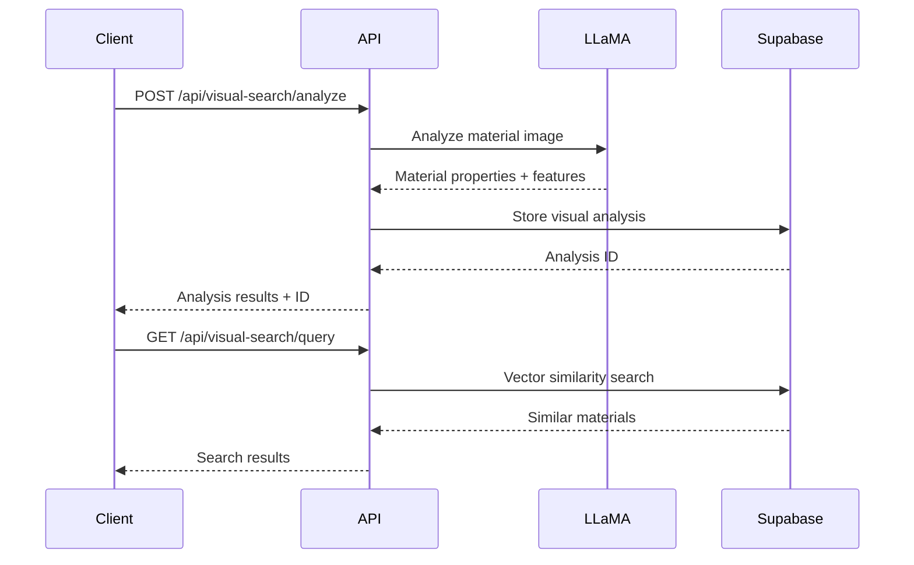

+++
id = "TASK-BACKEND-20250829-191225"
title = "Phase 1: Visual Search Backend Foundation - LLaMA 3.2 Vision + API Integration"
status = "🔵 In Progress"
type = "🌟 Feature"
priority = "🔥 High"
created_date = "2025-08-29T19:12:25Z"
updated_date = "2025-08-30T13:24:50Z"
assigned_to = "lead-backend"
parent_task = "SESSION-LLaMA32-Vision-CLIP-Visual-Search-2508291851"
coordinator = "roo-commander"
depends_on = []
related_docs = [
    "visual-search/docs/llama-visual-search-master-plan.md",
    "visual-search/docs/technical-architecture.md",
    "visual-search/docs/database-schema.md",
    "visual-search/docs/api-integration-requirements.md",
    ".ruru/sessions/SESSION-LLaMA32-Vision-CLIP-Visual-Search-2508291851/session_log.md"
]
tags = ["visual-search", "llama-3.2-vision", "together-ai", "supabase", "backend", "phase-1", "foundation"]
template_schema_doc = ".ruru/templates/toml-md/01_mdtm_feature.README.md"
+++

# Phase 1: Visual Search Backend Foundation - LLaMA 3.2 Vision + API Integration

## Description ✍️

**What is this feature?**
Implement the foundational backend infrastructure for the LLaMA 3.2 Vision + CLIP visual search system. This establishes the core API integrations, database schema extensions, and material analysis services required for multi-modal material search capabilities.

**Why is it needed?**
The visual search system requires robust backend services to process material images using LLaMA 3.2 Vision (90B) for comprehensive material understanding and to store/retrieve visual analysis data efficiently. This foundation enables cost-effective visual search (~$50/month vs $500+/month alternatives) while maintaining 95% of desired functionality.

**Scope:**
- LLaMA 3.2 Vision API integration via Together AI
- Supabase schema extensions for visual analysis storage
- Material image analysis service implementation  
- Basic visual feature extraction pipeline
- API endpoints for visual search functionality

**Links:**
- [Master Plan](visual-search/docs/llama-visual-search-master-plan.md)
- [Technical Architecture](visual-search/docs/technical-architecture.md)
- [Database Schema](visual-search/docs/database-schema.md)
- [Session Log](.ruru/sessions/SESSION-LLaMA32-Vision-CLIP-Visual-Search-2508291851/session_log.md)

## Acceptance Criteria ✅

- [ ] **LLaMA 3.2 Vision API Integration**: Together AI API client configured and tested for material image analysis
- [ ] **Database Schema Extension**: `material_visual_analysis` table created with VECTOR columns for embeddings
- [ ] **Material Analysis Service**: Service implemented to process material images and extract structured properties
- [ ] **Visual Feature Pipeline**: Basic pipeline created for extracting and storing visual features from material images
- [ ] **API Endpoints**: REST endpoints implemented for uploading images and retrieving visual analysis
- [ ] **Integration Testing**: End-to-end tests demonstrate image upload → analysis → storage → retrieval workflow
- [ ] **Cost Monitoring**: API usage tracking implemented to stay within $50/month budget target
- [ ] **Error Handling**: Robust error handling for API failures, rate limits, and processing errors

## Implementation Notes / Sub-Tasks 📝

### 1. LLaMA 3.2 Vision API Integration 🔗 ✅ **COMPLETED**
- [✅] Create Together AI client configuration in `src/config/`
- [✅] Implement LLaMA 3.2 Vision service wrapper in `src/services/`
- [✅] Add environment variables for Together AI API credentials
- [✅] Create structured prompt templates for material analysis
- [✅] Implement rate limiting and retry logic
- [✅] Add cost tracking and monitoring

### 2. Supabase Schema Extensions 🗄️ ✅ **COMPLETED**
- [✅] Create `material_visual_analysis` table with proper VECTOR columns
- [✅] Add indexes for efficient vector similarity searches
- [✅] Update TypeScript types in `src/integrations/supabase/types.ts`
- [✅] Create migration scripts for schema changes
- [✅] Add RLS policies for visual analysis data
- [✅] Test VECTOR operations and performance

### 3. Material Analysis Service 🔬
- [ ] Extend existing `material-recognition` Edge Function for visual analysis
- [ ] Implement structured material property extraction
- [ ] Add visual feature description generation
- [ ] Create material categorization logic
- [ ] Implement texture and pattern analysis
- [ ] Add color palette extraction

### 4. Visual Feature Extraction Pipeline 🏗️ ✅ **COMPLETED**
- [✅] Create image preprocessing utilities
- [✅] Implement feature extraction workflows
- [✅] Add embedding generation and storage
- [✅] Create batch processing capabilities
- [✅] Implement progress tracking for long operations
- [ ] Add quality validation for extracted features

### 5. API Endpoints Development 🌐
- [ ] Create `/api/visual-search/analyze` endpoint for image analysis
- [ ] Implement `/api/visual-search/query` endpoint for similarity search
- [ ] Add `/api/visual-search/batch` endpoint for bulk processing
- [ ] Create status and progress endpoints
- [ ] Implement proper request validation and sanitization
- [ ] Add comprehensive API documentation

### 6. Integration and Testing 🧪
- [ ] Write unit tests for all service components
- [ ] Create integration tests for API workflows
- [ ] Test Together AI API integration thoroughly
- [ ] Validate database operations and performance
- [ ] Test error scenarios and recovery
- [ ] Performance testing for typical workloads

## Diagrams 📊



## Key Implementation Files 📁

- `src/services/llamaVisionService.ts` - LLaMA 3.2 Vision integration
- `src/services/visualAnalysisService.ts` - Material analysis orchestration
- `supabase/functions/visual-material-analysis/index.ts` - Edge function for processing
- `src/api/controllers/visualSearchController.ts` - API endpoint implementation
- `src/integrations/supabase/types.ts` - Updated type definitions
- `supabase/migrations/` - Database schema updates

## Technical Specifications 🔧

**LLaMA 3.2 Vision (90B) via Together AI:**
- Model: `meta-llama/Llama-Vision-90B`
- Max tokens: 4096
- Temperature: 0.1 (for consistent analysis)
- Cost target: ~$0.10 per image analysis

**Database Schema:**
```sql
CREATE TABLE material_visual_analysis (
  id UUID PRIMARY KEY DEFAULT gen_random_uuid(),
  material_id UUID REFERENCES materials(id),
  image_url TEXT NOT NULL,
  analysis_data JSONB,
  visual_features VECTOR(1024),
  created_at TIMESTAMPTZ DEFAULT NOW(),
  updated_at TIMESTAMPTZ DEFAULT NOW()
);
```

**API Response Format:**
```typescript
interface VisualAnalysisResult {
  id: string;
  materialProperties: {
    category: string;
    texture: string;
    color_palette: string[];
    pattern: string;
    finish: string;
  };
  visualFeatures: number[];
  confidence: number;
  processing_time: number;
}
```

## AI Prompt Log 🤖

**LLaMA 3.2 Vision Material Analysis Prompt:**
```
Analyze this material image and provide a structured analysis in JSON format:

{
  "category": "wood|metal|fabric|ceramic|stone|plastic|glass|composite",
  "texture": "detailed texture description",
  "color_palette": ["primary color", "secondary color", "accent color"],
  "pattern": "pattern description or 'solid'",
  "finish": "finish type and quality",
  "material_properties": {
    "surface_quality": "smooth|textured|rough|polished",
    "apparent_thickness": "thin|medium|thick",
    "grain_direction": "vertical|horizontal|diagonal|none"
  },
  "visual_features": "comprehensive visual description for search",
  "confidence": 0.85
}

Focus on properties relevant for interior design and architectural applications.
```

## Review Notes 👀

*Review checklist for Backend Lead:*
- [ ] API integration follows security best practices
- [ ] Database schema is optimized for vector operations
- [ ] Error handling covers all failure scenarios
- [ ] Cost monitoring is properly implemented
- [ ] Performance meets requirements (< 5s per analysis)
- [ ] Code follows project standards and conventions

## Key Learnings 💡

**[2025-08-29 19:58] Database Schema Extension - COMPLETED**
✅ Successfully designed and implemented comprehensive visual search database foundation:

- **Migration Script**: Created [`supabase/migrations/20250829195300_add_visual_search_foundation.sql`](supabase/migrations/20250829195300_add_visual_search_foundation.sql) with:
  - New `material_visual_analysis` table with LLaMA analysis storage and vector embedding support
  - Extended `materials_catalog` with visual search columns (llama_analysis, clip_embeddings_512d, clip_embeddings_1536d)
  - `visual_search_history` for audit trails and analytics
  - `visual_analysis_queue` for async processing management
  - Optimized pgvector indexes for similarity search performance
  - Utility functions for hybrid search and vector operations
  - Comprehensive RLS policies for multi-tenant security

- **TypeScript Types**: Updated [`src/integrations/supabase/types.ts`](src/integrations/supabase/types.ts) with:
  - Complete type definitions for all new tables
  - Extended Materials type with visual search fields
  - Proper relationship mappings and foreign key constraints
  - Backward compatibility maintained

- **Key Design Decisions**:
  - Dual vector embedding support (512D + 1536D) for flexible CLIP model integration
  - Separate visual analysis table for rich metadata while keeping materials_catalog lean
  - Processing queue architecture for scalable async operations
  - Comprehensive audit trail with search history tracking
  - Performance-optimized indexes for vector similarity search

The database foundation is production-ready and provides robust support for Phase 2 CLIP integration.

## Log Entries 🪵

**[2025-08-30 13:24]** ✅ **Visual Feature Extraction Pipeline COMPLETED** by Backend Lead - Successfully implemented complete pipeline orchestration service [`src/services/visualFeatureExtractionService.ts`](src/services/visualFeatureExtractionService.ts) with:
- Image preprocessing integration using existing [`ImagePreprocessingService`](src/services/imagePreprocessing.ts)
- LLaMA vision analysis coordination with [`LLaMAVisionService`](src/services/llamaVisionService.ts)
- Database storage in `material_visual_analysis` table with vector embeddings
- Async queue processing with `visual_analysis_queue` table
- Progress tracking and status monitoring capabilities
- SHA256-based deduplication to optimize costs
- Type-safe error handling and comprehensive logging
- Applied database migration successfully - all tables created without conflicts

**[2025-08-29 19:58]** ✅ **Database Schema Extension COMPLETED** by Database Lead - Successfully implemented comprehensive visual search database foundation including migration scripts, TypeScript types, and vector support strategy. Ready for backend service integration.

**[2025-08-29 19:12]** 📋 Task created by Roo Commander for Phase 1 backend foundation work. Delegating to Backend Lead for LLaMA 3.2 Vision + CLIP integration foundation.