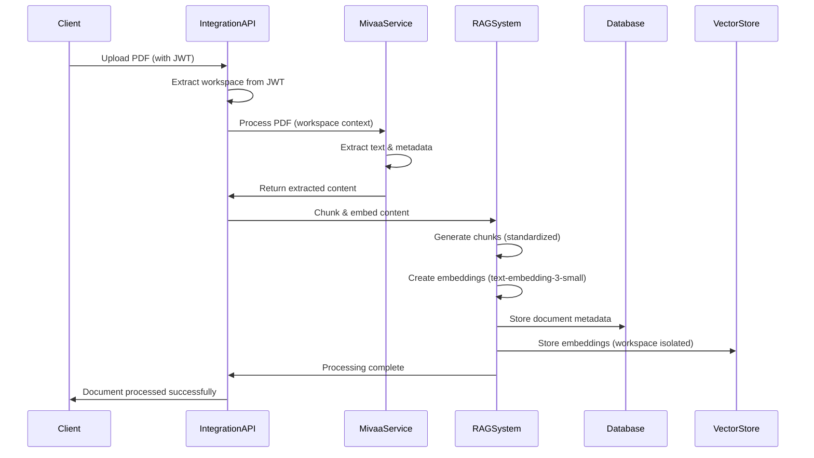
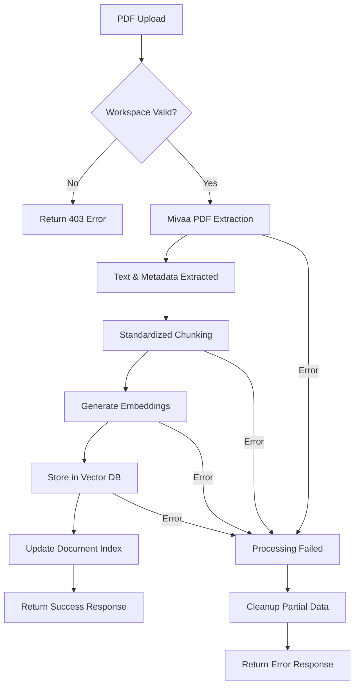

+++
id = "TASK-BACKEND-20250805-103850"
title = "Phase 3: Mivaa-JWT Service Integration Implementation"
status = "🟡 To Do"
type = "🌟 Feature"
priority = "🔥 High"
created_date = "2025-08-05"
updated_date = "2025-08-05"
assigned_to = "dev-python"
coordinator = "lead-backend"
parent_task = ""
depends_on = ["TASK-BACKEND-20250805-103810"]
related_docs = [
    "docs/mivaa_jwt_integration_implementation_roadmap_2025.md",
    "docs/jwt_mivaa_integration_architecture_2025.md",
    "mivaa-pdf-extractor/app/middleware/jwt_auth.py",
    "src/middleware/jwtAuthMiddleware.ts"
]
tags = ["mivaa", "jwt", "service-integration", "api", "python", "fastapi", "phase3", "data-flow"]
template_schema_doc = ".ruru/templates/toml-md/01_mdtm_feature.README.md"
+++

# Phase 3: Mivaa-JWT Service Integration Implementation

## Description ✍️

**What is this feature?**
Implementation of Phase 3 (Service Integration) of the Mivaa-JWT Integration Implementation Roadmap. This phase focuses on creating the integration service layer that bridges Mivaa PDF extractor with the existing RAG system, implementing unified data flow and workspace-aware document processing.

**Why is it needed?**
- Current Mivaa service operates in isolation from existing RAG system
- No unified PDF processing pipeline between Mivaa and existing document processing
- Missing workspace-aware document processing workflow
- Need seamless data flow integration for consistent user experience
- Standardized document chunking and embedding generation required

**Scope:**
- Create integration service layer bridging Mivaa and existing RAG system
- Implement unified PDF processing pipeline
- Standardize document chunking and embedding generation across platform
- Implement workspace-aware document processing workflow
- Create API endpoints for seamless integration
- Ensure data consistency and error handling across integrated services

**Links:**
- [Mivaa-JWT Integration Roadmap](docs/mivaa_jwt_integration_implementation_roadmap_2025.md)
- [JWT-Mivaa Integration Architecture](docs/jwt_mivaa_integration_architecture_2025.md)

## Acceptance Criteria ✅

- [ ] **Integration Service Created:** New service layer created to bridge Mivaa and existing RAG system
- [ ] **Unified PDF Pipeline:** Single PDF processing pipeline handles both Mivaa and existing document flows
- [ ] **Workspace-Aware Processing:** Document processing respects workspace isolation and JWT context
- [ ] **Standardized Chunking:** Consistent document chunking strategy across all PDF processing
- [ ] **Unified Embedding Generation:** All documents use standardized embedding model (text-embedding-3-small, 768 dimensions)
- [ ] **API Integration Points:** Clear API endpoints for document upload, processing, and retrieval
- [ ] **Error Handling:** Robust error handling and rollback mechanisms for failed processing
- [ ] **Performance Optimization:** Processing pipeline optimized for concurrent document handling
- [ ] **Integration Testing:** End-to-end testing of integrated document processing workflow

## Implementation Notes / Sub-Tasks 📝

### Integration Service Layer
- [ ] **Design Service Architecture:** Design integration service to bridge Mivaa and existing RAG system
- [ ] **Create Integration APIs:** Develop API endpoints for document processing coordination
- [ ] **Implement Data Flow Logic:** Create logic to route documents through appropriate processing pipelines
- [ ] **Add Workspace Context:** Ensure all processing respects workspace isolation from JWT

### Unified PDF Processing Pipeline
- [ ] **Analyze Current Pipelines:** Document existing PDF processing in both Mivaa and RAG system
- [ ] **Design Unified Pipeline:** Create single pipeline that handles both processing flows
- [ ] **Implement Pipeline Logic:** Develop unified processing logic with configurable stages
- [ ] **Add Processing Metadata:** Track processing stages and metadata for debugging

### Document Chunking Standardization
- [ ] **Standardize Chunking Strategy:** Implement consistent chunking across all document types
- [ ] **Configure Chunk Parameters:** Set optimal chunk size, overlap, and splitting strategies
- [ ] **Handle Different Document Types:** Ensure chunking works for various PDF structures
- [ ] **Preserve Document Context:** Maintain document hierarchy and context in chunks

### Embedding Integration
- [ ] **Implement Unified Embedding:** Use text-embedding-3-small for all document processing
- [ ] **Batch Processing:** Implement efficient batch embedding generation
- [ ] **Vector Storage Integration:** Ensure embeddings are stored with proper workspace isolation
- [ ] **Similarity Search Optimization:** Optimize vector similarity search across integrated data

### API Development
- [ ] **Document Upload API:** Create endpoint for workspace-aware document upload
- [ ] **Processing Status API:** Implement endpoints to track document processing status
- [ ] **Document Retrieval API:** Create endpoints for retrieving processed documents and chunks
- [ ] **Search Integration API:** Implement unified search across all processed documents

### Error Handling & Resilience
- [ ] **Processing Error Handling:** Implement robust error handling for document processing failures
- [ ] **Rollback Mechanisms:** Create rollback procedures for failed processing attempts
- [ ] **Retry Logic:** Implement intelligent retry mechanisms for transient failures
- [ ] **Monitoring & Alerting:** Add monitoring for processing pipeline health

## Diagrams 📊

## AI Prompt Log 🤖

*Phase 3 task created by Backend Lead based on Mivaa-JWT Integration Implementation Roadmap analysis*

## Review Notes 👀

*Space for reviewer feedback on service integration architecture and API design*

## Key Learnings 💡

*To be filled upon completion - document insights about service integration patterns and performance optimizations*

## Log Entries 🪵

*Logs will be appended here when no active session log is specified*