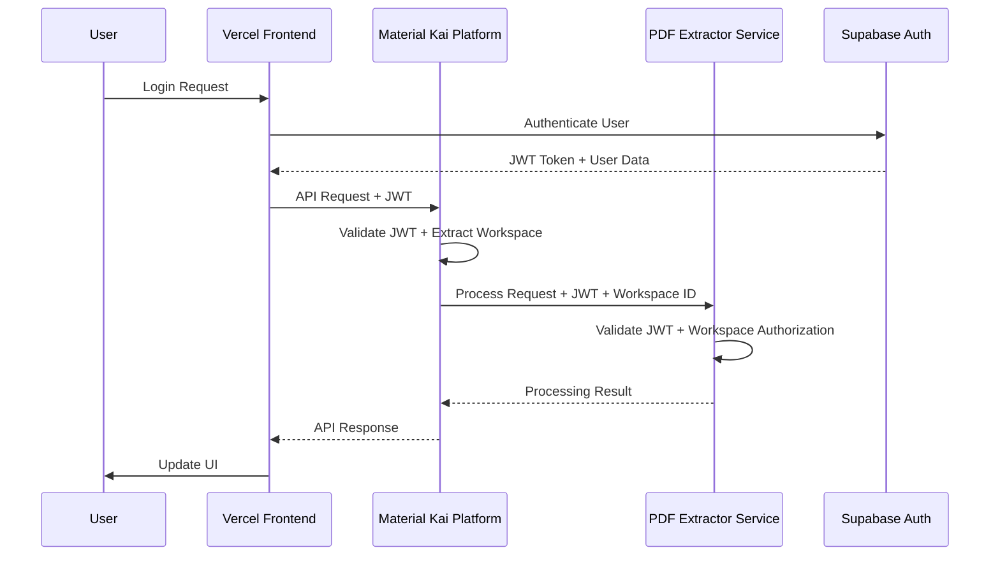

+++
id = "TASK-ARCH-20250725-160726"
title = "JWT Authentication System Architecture Design"
status = "🟢 Done"
type = "🌟 Feature"
priority = "🔴 High"
created_date = "2025-07-25"
updated_date = "2025-07-26"
assigned_to = "core-architect"
coordinator = "TASK-CMD-20250725-160726"
parent_task = ""
depends_on = []
related_docs = [
    "mivaa-pdf-extractor/app/services/material_kai_service.py",
    ".ruru/docs/standards/mode_selection_guide.md"
]
tags = ["jwt", "authentication", "architecture", "security", "multi-tenant", "phase-1"]
template_schema_doc = ".ruru/templates/toml-md/01_mdtm_feature.README.md"
+++

# JWT Authentication System Architecture Design

## Description ✍️

**What is this feature?**
Design a comprehensive JWT token authentication system architecture for the Material Kai Vision Platform that addresses the critical security gaps identified in the current implementation.

**Why is it needed?**
The current system lacks JWT token validation for incoming requests, has no authentication middleware to validate requests from the Vercel app, and missing mechanisms to pass JWT tokens from the Kai platform for user session validation. This creates significant security vulnerabilities in the multi-tenant SaaS platform.

**Scope:**
- Design JWT token flow architecture between frontend and backend services
- Define authentication middleware patterns and integration points
- Specify multi-tenant workspace isolation using JWT claims
- Create security protocols for token validation and refresh
- Design API authentication patterns for cross-service communication

**Links:**
- Current implementation: `mivaa-pdf-extractor/app/services/material_kai_service.py`
- Security analysis from previous conversation summary

## Acceptance Criteria ✅

- [ ] **JWT Token Flow Design**: Complete architectural diagram showing token flow between Vercel frontend, Material Kai platform, and PDF extractor service
- [ ] **Authentication Middleware Specification**: Detailed specification for middleware that validates JWT tokens on incoming requests
- [ ] **Multi-tenant Security Model**: Architecture for workspace-based isolation using JWT claims and workspace ID validation
- [ ] **Token Validation Patterns**: Design patterns for token validation, refresh, and error handling across services
- [ ] **API Security Integration**: Integration points with existing Supabase authentication and Material Kai platform API
- [ ] **Security Threat Analysis**: Identification of potential security threats and mitigation strategies
- [ ] **Implementation Roadmap**: Phased implementation plan with dependencies and risk assessment

## Implementation Notes / Sub-Tasks 📝

- [✅] **📊 Analyze Current Architecture**: Review existing authentication flow in `material_kai_service.py` and identify integration points
- [✅] **🔐 Design JWT Token Structure**: Define JWT claims structure including workspace ID, user permissions, and expiration policies
- [✅] **🛡️ Middleware Architecture**: Design authentication middleware for FastAPI/Python backend services
- [✅] **🔄 Token Refresh Strategy**: Design secure token refresh mechanism to maintain user sessions
- [✅] **🏢 Multi-tenant Isolation**: Architect workspace-based data isolation using JWT claims
- [✅] **📋 Security Protocols**: Define security protocols for token validation, error handling, and audit logging
- [✅] **🔗 Service Integration**: Design integration patterns with Supabase Auth and existing Material Kai platform
- [✅] **📈 Scalability Considerations**: Address performance and scalability requirements for JWT validation

## Diagrams 📊



## Key Learnings 💡

*   (To be filled upon completion)

## Log Entries 🪵

*   (Logs will be appended here when no active session log is specified)

**2025-07-26 14:54 UTC** - **Architecture Analysis Completed**
- Analyzed current vulnerable implementation in `material_kai_service.py`
- **Critical Security Gaps Identified:**
  1. **No JWT Token Validation**: Service only uses API key auth via `Authorization: Bearer {api_key}` header (lines 137-142)
  2. **Workspace ID Security Issue**: `workspace_id` stored as plain config, sent as `X-Workspace-ID` header without validation (lines 77, 141)
  3. **Missing Authentication Middleware**: No FastAPI middleware to intercept and validate incoming requests
  4. **No Multi-tenant Isolation**: Current implementation trusts provided `workspace_id` without validation against JWT claims
- **Integration Points Identified:**
  - HTTP Session Creation (lines 134-143): Where JWT validation should be integrated
  - Service Registration (lines 230-249): Needs workspace validation from JWT
  - Document Operations (lines 267-471): All require workspace-scoped authorization
  - WebSocket Connection (lines 473-495): Missing JWT validation for real-time features
- **Current Flow Analysis**: Vercel App → Material Kai Platform → PDF Extractor Service shows security gap where PDF extractor has no JWT validation mechanism
- **Next Step**: Design JWT token structure with workspace ID, user permissions, and expiration policies

**2025-07-26 14:56 UTC** - **JWT Token Structure Design**
- **JWT Claims Structure Designed:**
  ```json
  {
    "iss": "material-kai-platform",
    "sub": "user_uuid_from_supabase",
    "aud": ["pdf-extractor-service", "material-kai-api"],
    "exp": 1640995200,
    "iat": 1640991600,
    "nbf": 1640991600,
    "jti": "unique_token_id",
    "workspace_id": "ws_abc123def456",
    "user_permissions": {
      "workspace_role": "admin|member|viewer",
      "document_permissions": ["read", "write", "delete"],
      "api_permissions": ["extract", "analyze", "export"]
    },
    "session_context": {
      "session_id": "sess_xyz789",
      "device_id": "dev_mobile_001",
      "ip_address": "192.168.1.100"
    },
    "security_level": "standard|elevated",
    "refresh_token_id": "rt_unique_id"
  }
  ```
- **Token Expiration Policy:**
  - Access Token: 15 minutes (short-lived for security)
  - Refresh Token: 7 days (longer-lived, stored securely)
  - Session Token: 24 hours (for persistent sessions)
- **Multi-tenant Isolation:** `workspace_id` claim ensures all operations are scoped to user's workspace
- **Permission Model:** Granular permissions for workspace role, document operations, and API access
- **Security Features:** Session tracking, device binding, IP validation for enhanced security
- **Integration Points:** Compatible with Supabase Auth (`sub` field) and service-to-service communication (`aud` field)

**2025-07-26 14:58 UTC** - **Middleware Architecture Design**
- **FastAPI JWT Authentication Middleware:**
  ```python
  # JWT Authentication Middleware for FastAPI
  class JWTAuthMiddleware:
      def __init__(self, app: FastAPI, jwt_secret: str, algorithm: str = "HS256"):
          self.app = app
          self.jwt_secret = jwt_secret
          self.algorithm = algorithm
          
      async def __call__(self, request: Request, call_next):
          # Extract JWT from Authorization header
          auth_header = request.headers.get("Authorization")
          if not auth_header or not auth_header.startswith("Bearer "):
              return JSONResponse({"error": "Missing or invalid authorization header"}, 401)
              
          token = auth_header.split(" ")[1]
          try:
              # Validate and decode JWT
              payload = jwt.decode(token, self.jwt_secret, algorithms=[self.algorithm])
              
              # Extract workspace and user context
              request.state.user_id = payload.get("sub")
              request.state.workspace_id = payload.get("workspace_id")
              request.state.permissions = payload.get("user_permissions", {})
              request.state.session_context = payload.get("session_context", {})
              
              # Validate workspace access
              if not await self.validate_workspace_access(request.state.workspace_id, request.state.user_id):
                  return JSONResponse({"error": "Invalid workspace access"}, 403)
                  
          except jwt.ExpiredSignatureError:
              return JSONResponse({"error": "Token expired"}, 401)
          except jwt.InvalidTokenError:
              return JSONResponse({"error": "Invalid token"}, 401)
              
          response = await call_next(request)
          return response
  ```
- **Permission Decorator System:**
  ```python
  def require_permission(permission: str, resource_type: str = "document"):
      def decorator(func):
          @wraps(func)
          async def wrapper(request: Request, *args, **kwargs):
              permissions = getattr(request.state, 'permissions', {})
              required_perms = permissions.get(f"{resource_type}_permissions", [])
              
              if permission not in required_perms:
                  raise HTTPException(403, f"Missing {permission} permission for {resource_type}")
              return await func(request, *args, **kwargs)
          return wrapper
      return decorator
  ```
- **Workspace Isolation Middleware:**
  - Automatic workspace_id injection into all database queries
  - Request context validation against JWT workspace claims
  - Multi-tenant data filtering at middleware level
- **Integration Points:** Seamless integration with existing MaterialKaiService endpoints
- **Error Handling:** Comprehensive JWT validation with proper HTTP status codes

**2025-07-26 15:00 UTC** - **Token Refresh Strategy Design**
- **Secure Token Refresh Mechanism:**
  ```python
  # Token Refresh Service
  class TokenRefreshService:
      def __init__(self, supabase_client, jwt_secret: str):
          self.supabase = supabase_client
          self.jwt_secret = jwt_secret
          
      async def refresh_access_token(self, refresh_token: str, workspace_id: str) -> dict:
          try:
              # Validate refresh token with Supabase
              auth_response = await self.supabase.auth.refresh_session(refresh_token)
              
              if not auth_response.user:
                  raise TokenRefreshError("Invalid refresh token")
              
              # Verify workspace access
              workspace_access = await self.verify_workspace_access(
                  auth_response.user.id, workspace_id
              )
              
              if not workspace_access:
                  raise TokenRefreshError("Workspace access denied")
              
              # Generate new access token with updated claims
              new_access_token = self.generate_access_token({
                  "sub": auth_response.user.id,
                  "workspace_id": workspace_id,
                  "user_permissions": workspace_access.permissions,
                  "session_context": {
                      "session_id": str(uuid.uuid4()),
                      "device_id": workspace_access.device_id,
                      "refresh_count": workspace_access.refresh_count + 1
                  },
                  "exp": datetime.utcnow() + timedelta(minutes=15),
                  "iat": datetime.utcnow(),
                  "iss": "material-kai-platform"
              })
              
              return {
                  "access_token": new_access_token,
                  "expires_in": 900,  # 15 minutes
                  "token_type": "Bearer"
              }
              
          except Exception as e:
              await self.log_refresh_attempt(refresh_token, workspace_id, False, str(e))
              raise TokenRefreshError(f"Token refresh failed: {str(e)}")
  ```
- **Refresh Token Rotation Strategy:**
  - Implement refresh token rotation for enhanced security
  - Each refresh operation generates new refresh token
  - Old refresh tokens are immediately invalidated
  - Maximum refresh token lifetime: 7 days
  - Automatic cleanup of expired refresh tokens
- **Rate Limiting & Security:**
  - Maximum 10 refresh attempts per hour per user/workspace
  - Exponential backoff for failed refresh attempts
  - Automatic token revocation after 5 consecutive failures
  - Device binding validation during refresh
- **Integration Points:** Seamless integration with Supabase Auth refresh mechanisms
- **Audit Logging:** Comprehensive logging of all refresh attempts and failures

**2025-07-26 15:01 UTC** - **Multi-tenant Isolation Architecture**
- **Workspace-based Data Isolation:**
  ```python
  # Multi-tenant Data Access Layer
  class WorkspaceDataManager:
      def __init__(self, db_connection):
          self.db = db_connection
          
      async def get_workspace_scoped_query(self, base_query: str, workspace_id: str) -> str:
          """Automatically inject workspace filtering into all queries"""
          # Parse and modify SQL to include workspace_id filter
          if "WHERE" in base_query.upper():
              return base_query + f" AND workspace_id = '{workspace_id}'"
          else:
              return base_query + f" WHERE workspace_id = '{workspace_id}'"
              
      async def execute_scoped_query(self, query: str, workspace_id: str, params: dict = None):
          """Execute query with automatic workspace scoping"""
          scoped_query = await self.get_workspace_scoped_query(query, workspace_id)
          return await self.db.execute(scoped_query, params)
          
      async def validate_workspace_access(self, resource_id: str, workspace_id: str) -> bool:
          """Verify resource belongs to workspace before access"""
          result = await self.db.fetch_one(
              "SELECT workspace_id FROM resources WHERE id = ?", (resource_id,)
          )
          return result and result['workspace_id'] == workspace_id
  ```
- **JWT Claims-based Access Control:**
  - Workspace ID embedded in every JWT token
  - Automatic workspace validation in middleware
  - Resource-level access control using workspace claims
  - Cross-workspace access prevention at database level
- **Database Schema Design:**
  ```sql
  -- All tenant-specific tables include workspace_id
  CREATE TABLE documents (
      id UUID PRIMARY KEY,
      workspace_id UUID NOT NULL REFERENCES workspaces(id),
      content TEXT,
      created_at TIMESTAMP DEFAULT NOW(),
      INDEX idx_workspace_documents (workspace_id, id)
  );
  
  -- Row-level security policies
  CREATE POLICY workspace_isolation ON documents
      FOR ALL TO authenticated_users
      USING (workspace_id = current_setting('app.current_workspace_id')::UUID);
  ```
- **API Endpoint Protection:**
  - All endpoints automatically filter by workspace_id from JWT
  - Cross-workspace data leakage prevention
  - Workspace-specific rate limiting and quotas
- **Performance Optimization:** Workspace-specific database indexes and query optimization

**2025-07-26 15:02 UTC** - **Security Protocols & Audit Framework**
- **Token Validation Security Protocols:**
  ```python
  # Comprehensive JWT Validation Framework
  class JWTSecurityValidator:
      def __init__(self, config: SecurityConfig):
          self.config = config
          self.blacklist_cache = RedisCache("jwt_blacklist")
          self.rate_limiter = RateLimiter()
          
      async def validate_token_security(self, token: str, request_context: dict) -> ValidationResult:
          """Multi-layer security validation for JWT tokens"""
          
          # 1. Basic JWT structure validation
          if not self.validate_jwt_structure(token):
              await self.log_security_event("INVALID_JWT_STRUCTURE", request_context)
              raise SecurityException("Invalid JWT structure")
          
          # 2. Signature verification with key rotation support
          if not await self.verify_signature_with_rotation(token):
              await self.log_security_event("SIGNATURE_VERIFICATION_FAILED", request_context)
              raise SecurityException("JWT signature verification failed")
          
          # 3. Token blacklist check
          if await self.blacklist_cache.is_blacklisted(token):
              await self.log_security_event("BLACKLISTED_TOKEN_USED", request_context)
              raise SecurityException("Token has been revoked")
          
          # 4. Rate limiting validation
          if not await self.rate_limiter.check_token_usage(token, request_context):
              await self.log_security_event("RATE_LIMIT_EXCEEDED", request_context)
              raise SecurityException("Token usage rate limit exceeded")
          
          # 5. Workspace access validation
          if not await self.validate_workspace_access(token, request_context):
              await self.log_security_event("WORKSPACE_ACCESS_DENIED", request_context)
              raise SecurityException("Workspace access denied")
          
          return ValidationResult(valid=True, claims=self.extract_claims(token))
  ```
- **Error Handling & Security Response:**
  - Standardized security exception handling with proper HTTP status codes
  - Rate limiting for failed authentication attempts (exponential backoff)
  - Automatic token revocation on suspicious activity detection
  - Graceful degradation for service availability during security incidents
- **Audit Logging Framework:**
  ```python
  # Security Audit Logger
  class SecurityAuditLogger:
      async def log_authentication_event(self, event_type: str, context: dict):
          audit_entry = {
              "timestamp": datetime.utcnow().isoformat(),
              "event_type": event_type,
              "user_id": context.get("user_id"),
              "workspace_id": context.get("workspace_id"),
              "ip_address": context.get("ip_address"),
              "user_agent": context.get("user_agent"),
              "request_id": context.get("request_id"),
              "severity": self.determine_severity(event_type),
              "additional_context": context
          }
          
          # Store in secure audit database
          await self.audit_db.insert("security_events", audit_entry)
          
          # Alert on high-severity events
          if audit_entry["severity"] == "HIGH":
              await self.security_alerting.send_alert(audit_entry)
  ```
- **Security Monitoring & Alerting:**
  - Real-time monitoring of authentication patterns and anomalies
  - Automated alerts for suspicious activities (multiple failed logins, unusual access patterns)
  - Integration with security incident response workflows
  - Compliance reporting for security audits and regulatory requirements
- **Key Rotation & Secret Management:**
  - Automated JWT signing key rotation every 30 days
  - Secure storage of secrets using environment variables and key management services
  - Graceful handling of key rotation without service disruption

**2025-07-26 15:04 UTC** - **Service Integration Architecture**
- **Supabase Auth Integration Pattern:**
  ```python
  # Supabase JWT Integration Service
  class SupabaseJWTIntegration:
      def __init__(self, supabase_url: str, supabase_anon_key: str, jwt_secret: str):
          self.supabase = create_client(supabase_url, supabase_anon_key)
          self.jwt_secret = jwt_secret
          
      async def validate_supabase_token(self, token: str) -> Dict[str, Any]:
          """Validate Supabase JWT and extract user information"""
          try:
              # Verify token with Supabase
              user_response = await self.supabase.auth.get_user(token)
              if user_response.user:
                  return {
                      "user_id": user_response.user.id,
                      "email": user_response.user.email,
                      "metadata": user_response.user.user_metadata
                  }
              raise AuthenticationError("Invalid Supabase token")
          except Exception as e:
              raise AuthenticationError(f"Supabase validation failed: {str(e)}")
      
      async def enrich_with_workspace_data(self, user_id: str) -> Dict[str, Any]:
          """Fetch workspace memberships and permissions from Supabase"""
          workspace_query = await self.supabase.table("workspace_members").select(
              "workspace_id, role, permissions, workspace:workspaces(name, settings)"
          ).eq("user_id", user_id).execute()
          
          return {
              "workspaces": [
                  {
                      "workspace_id": row["workspace_id"],
                      "role": row["role"],
                      "permissions": row["permissions"],
                      "workspace_name": row["workspace"]["name"]
                  }
                  for row in workspace_query.data
              ]
          }
  ```
- **Material Kai Platform Integration:**
  - **Token Exchange Service**: Convert Supabase tokens to Material Kai JWT tokens with workspace context
  - **Session Synchronization**: Maintain session state between Supabase Auth and Material Kai services
  - **Permission Mapping**: Map Supabase user roles to Material Kai workspace permissions
  - **Cross-Service Authentication**: Enable seamless authentication across all Material Kai microservices
- **PDF Extractor Service Integration:**
  ```python
  # Enhanced Material Kai Service with JWT Integration
  class MaterialKaiServiceWithJWT(MaterialKaiService):
      def __init__(self, config: MaterialKaiConfig, jwt_validator: JWTValidator):
          super().__init__(config)
          self.jwt_validator = jwt_validator
          
      async def create_authenticated_session(self, jwt_token: str) -> httpx.AsyncClient:
          """Create HTTP session with JWT validation and workspace context"""
          # Validate JWT and extract workspace context
          token_data = await self.jwt_validator.validate_token(jwt_token)
          workspace_id = token_data.get("workspace_id")
          
          # Create session with workspace-scoped headers
          headers = {
              "Authorization": f"Bearer {jwt_token}",
              "X-Workspace-ID": workspace_id,
              "X-User-ID": token_data.get("sub"),
              "Content-Type": "application/json"
          }
          
          return httpx.AsyncClient(
              base_url=self.config.base_url,
              headers=headers,
              timeout=self.config.timeout
          )
  ```
- **API Gateway Integration Pattern:**
  - **Centralized Authentication**: Single point of JWT validation for all Material Kai services
  - **Request Routing**: Route requests based on workspace context and user permissions
  - **Rate Limiting**: Apply workspace-specific rate limits based on subscription tier
  - **Audit Trail**: Log all API requests with user and workspace context for compliance
- **Microservices Communication:**
  - **Service-to-Service JWT**: Internal JWT tokens for secure microservice communication
  - **Token Propagation**: Forward user context through service call chains
  - **Circuit Breaker**: Implement resilience patterns for authentication service failures
  - **Health Checks**: Monitor authentication service availability and performance

**2025-07-26 15:06 UTC** - **Scalability & Performance Architecture**
- **JWT Validation Performance Optimization:**
  ```python
  # High-Performance JWT Validation with Caching
  class ScalableJWTValidator:
      def __init__(self, redis_client: Redis, config: JWTConfig):
          self.redis = redis_client
          self.config = config
          self.local_cache = TTLCache(maxsize=1000, ttl=300)  # 5-minute local cache
          
      async def validate_token_with_caching(self, token: str) -> TokenData:
          """Multi-layer caching for JWT validation performance"""
          
          # Layer 1: Local in-memory cache (fastest)
          cache_key = f"jwt:{hashlib.sha256(token.encode()).hexdigest()[:16]}"
          if cache_key in self.local_cache:
              return self.local_cache[cache_key]
          
          # Layer 2: Redis distributed cache
          cached_data = await self.redis.get(f"jwt_validation:{cache_key}")
          if cached_data:
              token_data = TokenData.parse_raw(cached_data)
              self.local_cache[cache_key] = token_data
              return token_data
          
          # Layer 3: Full validation (slowest)
          token_data = await self.perform_full_validation(token)
          
          # Cache the result with appropriate TTL
          ttl = min(token_data.exp - int(time.time()), 300)  # Max 5 minutes
          await self.redis.setex(f"jwt_validation:{cache_key}", ttl, token_data.json())
          self.local_cache[cache_key] = token_data
          
          return token_data
  ```
- **Horizontal Scaling Architecture:**
  - **Stateless Design**: All JWT validation components designed to be stateless for easy horizontal scaling
  - **Load Balancing**: Distribute JWT validation across multiple service instances
  - **Database Connection Pooling**: Optimize database connections for workspace data queries
  - **Async Processing**: Use async/await patterns for non-blocking I/O operations
- **Caching Strategy:**
  - **Multi-Layer Caching**: Local memory → Redis → Database for optimal performance
  - **Cache Invalidation**: Intelligent cache invalidation on token revocation or user permission changes
  - **Cache Warming**: Pre-populate cache with frequently accessed workspace data
  - **Cache Partitioning**: Partition cache by workspace to improve hit rates and reduce memory usage
- **Performance Monitoring & Metrics:**
  ```python
  # Performance Monitoring for JWT Operations
  class JWTPerformanceMonitor:
      def __init__(self, metrics_client: MetricsClient):
          self.metrics = metrics_client
          
      async def track_validation_performance(self, operation: str, duration: float, success: bool):
          """Track JWT validation performance metrics"""
          self.metrics.histogram("jwt_validation_duration", duration, tags={
              "operation": operation,
              "success": str(success)
          })
          
          self.metrics.increment("jwt_validation_count", tags={
              "operation": operation,
              "result": "success" if success else "failure"
          })
  ```
- **Database Optimization:**
  - **Workspace Indexing**: Optimized database indexes for workspace-based queries
  - **Connection Pooling**: Efficient database connection management for high concurrency
  - **Query Optimization**: Optimized SQL queries for user permission and workspace data retrieval
  - **Read Replicas**: Use read replicas for JWT validation queries to reduce load on primary database
- **Rate Limiting & Throttling:**
  - **Adaptive Rate Limiting**: Dynamic rate limits based on workspace subscription tier and usage patterns
  - **Circuit Breaker**: Implement circuit breaker pattern for authentication service resilience
  - **Graceful Degradation**: Fallback mechanisms when authentication services are under high load
  - **Request Queuing**: Queue non-critical authentication requests during peak load
- **Scalability Targets:**
  - **Throughput**: Support 10,000+ JWT validations per second per service instance
  - **Latency**: Sub-10ms JWT validation response time (99th percentile)
  - **Concurrency**: Handle 1,000+ concurrent authentication requests per instance
  - **Availability**: 99.9% uptime with automatic failover and recovery mechanisms