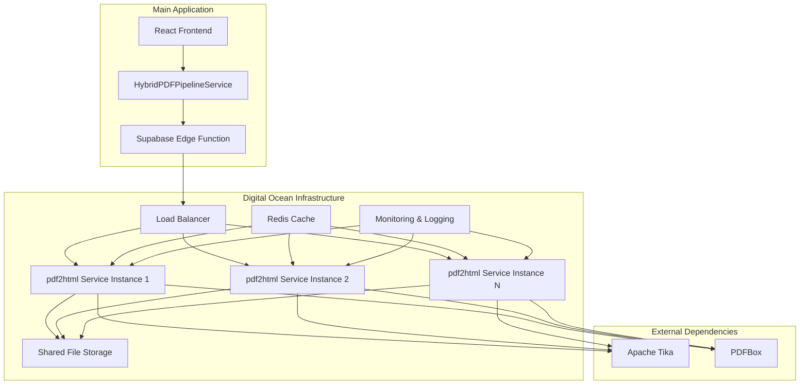

+++
id = "ARCH-PDF2HTML-MICROSERVICE-V1"
title = "pdf2html Microservice Architecture Design"
context_type = "architecture"
scope = "External microservice design for PDF processing using pdf2html"
target_audience = ["core-architect", "lead-backend", "lead-devops", "dev-nodejs"]
granularity = "detailed"
status = "draft"
created_date = "2025-07-20"
updated_date = "2025-07-20"
version = "1.0"
tags = ["microservice", "pdf2html", "architecture", "nodejs", "docker", "digital-ocean", "api-design"]
related_docs = [".ruru/decisions/ADR-001_PDF_Processing_Solution_Evaluation.md"]
template_schema_doc = ".ruru/templates/toml-md/09_documentation.README.md"
+++

# pdf2html Microservice Architecture Design

## Overview 🎯

This document defines the comprehensive architecture for the pdf2html microservice that will replace the current ConvertAPI integration. The microservice will be deployed as an external service on Digital Ocean, providing PDF-to-HTML conversion capabilities for the main application.

## System Architecture 🏗️

### High-Level Architecture



### Component Architecture

#### 1. Core Service Layer

**pdf2html Service Container**
- **Base Image**: `node:18-alpine`
- **Runtime**: Node.js 18+ with Express.js framework
- **Core Dependencies**:
  - `pdf2html` npm package
  - `express` for HTTP server
  - `multer` for file upload handling
  - `helmet` for security headers
  - `cors` for cross-origin requests
  - `winston` for logging
  - `prometheus-client` for metrics

**Service Structure**:
```
pdf2html-service/
├── src/
│   ├── controllers/
│   │   ├── conversionController.js
│   │   ├── healthController.js
│   │   └── statusController.js
│   ├── middleware/
│   │   ├── auth.js
│   │   ├── validation.js
│   │   ├── rateLimit.js
│   │   └── errorHandler.js
│   ├── services/
│   │   ├── pdfProcessor.js
│   │   ├── fileManager.js
│   │   └── cacheManager.js
│   ├── utils/
│   │   ├── logger.js
│   │   ├── metrics.js
│   │   └── config.js
│   └── app.js
├── tests/
├── docker/
│   └── Dockerfile
├── k8s/
│   ├── deployment.yaml
│   ├── service.yaml
│   └── configmap.yaml
└── package.json
```

#### 2. Infrastructure Components

**Load Balancer (Digital Ocean Load Balancer)**
- **Type**: Application Load Balancer (Layer 7)
- **Features**:
  - SSL termination
  - Health checks
  - Session affinity (if needed)
  - Request routing based on path
- **Configuration**:
  - Health check endpoint: `/health`
  - Timeout: 30 seconds
  - Retry attempts: 3

**Container Orchestration (Kubernetes)**
- **Platform**: Digital Ocean Kubernetes (DOKS)
- **Deployment Strategy**: Rolling updates
- **Scaling**: Horizontal Pod Autoscaler (HPA)
- **Resource Limits**:
  - CPU: 500m - 2000m
  - Memory: 1Gi - 4Gi
  - Storage: 10Gi persistent volume

**Shared Storage (Digital Ocean Spaces)**
- **Purpose**: Temporary file storage for large PDF processing
- **Configuration**:
  - Bucket lifecycle: 24-hour auto-deletion
  - Access control: Service-specific IAM roles
  - Encryption: AES-256 at rest

**Caching Layer (Redis)**
- **Purpose**: Cache conversion results and metadata
- **Configuration**:
  - Memory: 2GB initially, scalable
  - Persistence: RDB snapshots
  - TTL: 1 hour for conversion results
  - Cluster mode for high availability

## API Design 📡

### Core Endpoints

#### 1. PDF Conversion Endpoint

```http
POST /api/v1/convert
Content-Type: multipart/form-data
Authorization: Bearer <api-key>

Parameters:
- file: PDF file (required, max 50MB)
- options: JSON object (optional)
  - maxBuffer: number (default: 10485760)
  - extractImages: boolean (default: true)
  - preserveLayout: boolean (default: true)
```

**Response Format**:
```json
{
  "success": true,
  "jobId": "uuid-v4-job-id",
  "status": "completed|processing|failed",
  "data": {
    "html": "<html>...</html>",
    "images": [
      {
        "id": "img_001",
        "url": "https://storage.url/images/img_001.png",
        "width": 800,
        "height": 600
      }
    ],
    "metadata": {
      "pageCount": 5,
      "processingTime": 1250,
      "fileSize": 2048576
    }
  },
  "error": null
}
```

#### 2. Health Check Endpoint

```http
GET /health
```

**Response**:
```json
{
  "status": "healthy",
  "timestamp": "2025-07-20T05:47:00Z",
  "version": "1.0.0",
  "dependencies": {
    "pdf2html": "healthy",
    "redis": "healthy",
    "storage": "healthy"
  },
  "metrics": {
    "uptime": 86400,
    "memoryUsage": "45%",
    "cpuUsage": "23%"
  }
}
```

#### 3. Job Status Endpoint

```http
GET /api/v1/status/{jobId}
Authorization: Bearer <api-key>
```

**Response**:
```json
{
  "jobId": "uuid-v4-job-id",
  "status": "processing",
  "progress": 65,
  "estimatedCompletion": "2025-07-20T05:48:30Z",
  "error": null
}
```

#### 4. Image Retrieval Endpoint

```http
GET /api/v1/images/{imageId}
Authorization: Bearer <api-key>
```

**Response**: Binary image data with appropriate Content-Type headers

### Authentication & Security

**API Key Authentication**:
- Bearer token format
- Scoped permissions (read, write, admin)
- Rate limiting per API key
- Request signing for sensitive operations

**Security Headers**:
```javascript
{
  "X-Content-Type-Options": "nosniff",
  "X-Frame-Options": "DENY",
  "X-XSS-Protection": "1; mode=block",
  "Strict-Transport-Security": "max-age=31536000",
  "Content-Security-Policy": "default-src 'self'"
}
```

## Deployment Architecture 🚀

### Container Configuration

**Dockerfile**:
```dockerfile
FROM node:18-alpine

# Install system dependencies for pdf2html
RUN apk add --no-cache \
    openjdk11-jre \
    fontconfig \
    ttf-dejavu

# Create app directory
WORKDIR /usr/src/app

# Copy package files
COPY package*.json ./

# Install dependencies
RUN npm ci --only=production

# Copy application code
COPY src/ ./src/

# Create non-root user
RUN addgroup -g 1001 -S nodejs
RUN adduser -S nodejs -u 1001
USER nodejs

# Expose port
EXPOSE 3000

# Health check
HEALTHCHECK --interval=30s --timeout=3s --start-period=5s --retries=3 \
  CMD node src/utils/healthcheck.js

# Start application
CMD ["node", "src/app.js"]
```

### Kubernetes Deployment

**deployment.yaml**:
```yaml
apiVersion: apps/v1
kind: Deployment
metadata:
  name: pdf2html-service
  labels:
    app: pdf2html-service
spec:
  replicas: 3
  selector:
    matchLabels:
      app: pdf2html-service
  template:
    metadata:
      labels:
        app: pdf2html-service
    spec:
      containers:
      - name: pdf2html
        image: pdf2html-service:latest
        ports:
        - containerPort: 3000
        env:
        - name: NODE_ENV
          value: "production"
        - name: REDIS_URL
          valueFrom:
            secretKeyRef:
              name: pdf2html-secrets
              key: redis-url
        - name: STORAGE_ACCESS_KEY
          valueFrom:
            secretKeyRef:
              name: pdf2html-secrets
              key: storage-access-key
        resources:
          requests:
            memory: "1Gi"
            cpu: "500m"
          limits:
            memory: "4Gi"
            cpu: "2000m"
        livenessProbe:
          httpGet:
            path: /health
            port: 3000
          initialDelaySeconds: 30
          periodSeconds: 10
        readinessProbe:
          httpGet:
            path: /health
            port: 3000
          initialDelaySeconds: 5
          periodSeconds: 5
---
apiVersion: v1
kind: Service
metadata:
  name: pdf2html-service
spec:
  selector:
    app: pdf2html-service
  ports:
    - protocol: TCP
      port: 80
      targetPort: 3000
  type: ClusterIP
```

### Auto-Scaling Configuration

**HPA (Horizontal Pod Autoscaler)**:
```yaml
apiVersion: autoscaling/v2
kind: HorizontalPodAutoscaler
metadata:
  name: pdf2html-hpa
spec:
  scaleTargetRef:
    apiVersion: apps/v1
    kind: Deployment
    name: pdf2html-service
  minReplicas: 2
  maxReplicas: 10
  metrics:
  - type: Resource
    resource:
      name: cpu
      target:
        type: Utilization
        averageUtilization: 70
  - type: Resource
    resource:
      name: memory
      target:
        type: Utilization
        averageUtilization: 80
```

## Performance & Scalability 📈

### Performance Targets

**Response Time SLAs**:
- Small PDFs (< 1MB): < 2 seconds
- Medium PDFs (1-10MB): < 10 seconds
- Large PDFs (10-50MB): < 30 seconds

**Throughput Targets**:
- Concurrent requests: 100+
- Daily processing volume: 10,000+ documents
- Peak load handling: 5x normal capacity

### Optimization Strategies

**1. Processing Optimization**:
- Parallel processing for multi-page documents
- Streaming for large file handling
- Memory-efficient buffer management
- Process pooling for pdf2html instances

**2. Caching Strategy**:
- Redis cache for frequently accessed conversions
- CDN integration for image delivery
- ETag-based client-side caching
- Intelligent cache invalidation

**3. Resource Management**:
- CPU and memory limits per container
- Graceful degradation under load
- Circuit breaker pattern for external dependencies
- Request queuing with priority levels

## Monitoring & Observability 📊

### Metrics Collection

**Application Metrics**:
- Request rate and response times
- Error rates by endpoint
- Conversion success/failure rates
- Queue depth and processing times
- Memory and CPU utilization

**Business Metrics**:
- Document processing volume
- Average file sizes processed
- User adoption rates
- Cost per conversion

### Logging Strategy

**Structured Logging**:
```json
{
  "timestamp": "2025-07-20T05:47:00Z",
  "level": "info",
  "service": "pdf2html",
  "jobId": "uuid-v4-job-id",
  "userId": "user-123",
  "action": "conversion_started",
  "metadata": {
    "fileSize": 2048576,
    "fileName": "document.pdf",
    "processingOptions": {
      "extractImages": true,
      "preserveLayout": true
    }
  }
}
```

**Log Aggregation**:
- Centralized logging with ELK stack
- Log retention: 30 days for application logs
- Error tracking with Sentry integration
- Real-time alerting for critical errors

### Health Monitoring

**Health Check Levels**:
1. **Shallow**: Basic HTTP response
2. **Deep**: Database connectivity, external dependencies
3. **Functional**: End-to-end conversion test

**Alerting Rules**:
- Response time > 10 seconds (Warning)
- Error rate > 5% (Critical)
- Memory usage > 90% (Warning)
- Service unavailable (Critical)

## Security Considerations 🔒

### Input Validation

**File Upload Security**:
- File type validation (PDF only)
- File size limits (50MB max)
- Virus scanning integration
- Content sanitization

**Request Validation**:
- Input parameter validation
- SQL injection prevention
- XSS protection
- CSRF token validation

### Network Security

**Infrastructure Security**:
- VPC isolation
- Security groups with minimal access
- TLS 1.3 for all communications
- Regular security updates

**API Security**:
- Rate limiting per client
- API key rotation policies
- Request signing for sensitive operations
- Audit logging for all API calls

## Disaster Recovery & Backup 🛡️

### Backup Strategy

**Data Backup**:
- Redis snapshots every 6 hours
- Configuration backups daily
- Container image versioning
- Infrastructure as Code (IaC) backup

**Recovery Procedures**:
- RTO (Recovery Time Objective): 15 minutes
- RPO (Recovery Point Objective): 1 hour
- Multi-region deployment capability
- Automated failover procedures

### Business Continuity

**Fallback Mechanisms**:
- Graceful degradation to ConvertAPI
- Queue-based processing for resilience
- Circuit breaker for external dependencies
- Manual processing procedures

## Cost Optimization 💰

### Resource Optimization

**Infrastructure Costs**:
- Right-sizing based on usage patterns
- Spot instances for non-critical workloads
- Auto-scaling to match demand
- Reserved instances for baseline capacity

**Operational Costs**:
- Automated deployment and scaling
- Efficient resource utilization
- Monitoring-driven optimization
- Regular cost reviews and adjustments

### Cost Monitoring

**Cost Tracking**:
- Per-request cost calculation
- Resource utilization metrics
- Comparison with ConvertAPI costs
- ROI tracking and reporting

## Migration Strategy 🔄

### Phased Rollout

**Phase 1: Development & Testing**
- Deploy to staging environment
- Performance testing and optimization
- Security testing and validation
- Integration testing with main application

**Phase 2: Limited Production**
- Deploy to production with 10% traffic
- Monitor performance and error rates
- Gradual traffic increase to 50%
- Rollback procedures validated

**Phase 3: Full Migration**
- Complete traffic migration
- ConvertAPI deprecation
- Performance monitoring and optimization
- Post-migration validation

### Rollback Plan

**Rollback Triggers**:
- Error rate > 10%
- Response time > 2x baseline
- Service availability < 99%
- Critical security issues

**Rollback Procedures**:
- Immediate traffic routing to ConvertAPI
- Service instance shutdown
- Issue investigation and resolution
- Controlled re-deployment

## Related Links 🔗

- **ADR**: [PDF Processing Solution Evaluation](.ruru/decisions/ADR-001_PDF_Processing_Solution_Evaluation.md)
- **Current Implementation**: [`HybridPDFPipelineService`](src/services/hybridPDFPipeline.ts)
- **ConvertAPI Integration**: [`convertapi-pdf-processor`](supabase/functions/convertapi-pdf-processor/index.ts)
- **pdf2html Repository**: [https://github.com/shebinleo/pdf2html](https://github.com/shebinleo/pdf2html)
- **Digital Ocean Kubernetes**: [https://docs.digitalocean.com/products/kubernetes/](https://docs.digitalocean.com/products/kubernetes/)

## Digital Ocean Deployment Strategy 🌊

### 5.1 Infrastructure Overview

**Digital Ocean Services Used:**
- **Kubernetes (DOKS)**: Managed Kubernetes cluster for container orchestration
- **Spaces**: Object storage for PDF files and extracted assets
- **Managed Databases**: PostgreSQL for job metadata and Redis for caching
- **Load Balancers**: Application load balancer for traffic distribution
- **Container Registry**: Private Docker image registry
- **Monitoring**: Integrated monitoring and alerting

### 5.2 Cluster Configuration

**DOKS Cluster Specifications:**
```yaml
# cluster-config.yaml
apiVersion: v1
kind: Config
clusters:
- cluster:
    server: https://your-cluster-id.k8s.ondigitalocean.com
  name: pdf2html-cluster
contexts:
- context:
    cluster: pdf2html-cluster
    user: pdf2html-admin
  name: pdf2html-context
current-context: pdf2html-context

# Node Pool Configuration
node_pools:
  - name: pdf2html-workers
    size: s-4vcpu-8gb
    count: 3
    auto_scale: true
    min_nodes: 2
    max_nodes: 10
    tags:
      - pdf2html
      - production
```

**Resource Allocation:**
- **Minimum Cluster**: 3 nodes (s-4vcpu-8gb) = $144/month
- **Auto-scaling**: 2-10 nodes based on demand
- **Storage**: 100GB SSD per node
- **Network**: Private networking enabled

### 5.3 Storage Configuration

**Digital Ocean Spaces Setup:**
```yaml
# spaces-config.yaml
apiVersion: v1
kind: Secret
metadata:
  name: spaces-credentials
type: Opaque
data:
  access-key: <base64-encoded-access-key>
  secret-key: <base64-encoded-secret-key>
  endpoint: <base64-encoded-endpoint>
  bucket: <base64-encoded-bucket-name>

---
apiVersion: v1
kind: ConfigMap
metadata:
  name: storage-config
data:
  SPACES_ENDPOINT: "https://nyc3.digitaloceanspaces.com"
  SPACES_BUCKET: "pdf2html-storage"
  SPACES_REGION: "nyc3"
  CDN_ENDPOINT: "https://pdf2html-storage.nyc3.cdn.digitaloceanspaces.com"
```

**Storage Structure:**
```
pdf2html-storage/
├── uploads/
│   ├── pending/
│   ├── processing/
│   └── completed/
├── assets/
│   ├── images/
│   ├── fonts/
│   └── stylesheets/
├── cache/
│   └── converted/
└── backups/
    └── metadata/
```

### 5.4 Database Configuration

**Managed PostgreSQL:**
```yaml
# database-config.yaml
apiVersion: v1
kind: Secret
metadata:
  name: postgres-credentials
type: Opaque
data:
  host: <base64-encoded-host>
  port: <base64-encoded-port>
  database: <base64-encoded-database>
  username: <base64-encoded-username>
  password: <base64-encoded-password>
  ssl-mode: require

---
apiVersion: v1
kind: ConfigMap
metadata:
  name: database-config
data:
  DB_POOL_SIZE: "20"
  DB_TIMEOUT: "30000"
  DB_RETRY_ATTEMPTS: "3"
```

**Managed Redis:**
```yaml
# redis-config.yaml
apiVersion: v1
kind: Secret
metadata:
  name: redis-credentials
type: Opaque
data:
  host: <base64-encoded-host>
  port: <base64-encoded-port>
  password: <base64-encoded-password>
  tls: "true"

---
apiVersion: v1
kind: ConfigMap
metadata:
  name: redis-config
data:
  REDIS_MAX_RETRIES: "3"
  REDIS_RETRY_DELAY: "1000"
  REDIS_CONNECT_TIMEOUT: "10000"
```

### 5.5 Networking & Security

**Load Balancer Configuration:**
```yaml
# load-balancer.yaml
apiVersion: v1
kind: Service
metadata:
  name: pdf2html-lb
  annotations:
    service.beta.kubernetes.io/do-loadbalancer-name: "pdf2html-lb"
    service.beta.kubernetes.io/do-loadbalancer-protocol: "http"
    service.beta.kubernetes.io/do-loadbalancer-healthcheck-path: "/health"
    service.beta.kubernetes.io/do-loadbalancer-healthcheck-protocol: "http"
    service.beta.kubernetes.io/do-loadbalancer-size-unit: "1"
    service.beta.kubernetes.io/do-loadbalancer-sticky-sessions-type: "cookies"
    service.beta.kubernetes.io/do-loadbalancer-sticky-sessions-cookie-name: "pdf2html-session"
    service.beta.kubernetes.io/do-loadbalancer-sticky-sessions-cookie-ttl: "300"
spec:
  type: LoadBalancer
  selector:
    app: pdf2html-service
  ports:
    - name: http
      protocol: TCP
      port: 80
      targetPort: 3000
    - name: https
      protocol: TCP
      port: 443
      targetPort: 3000
```

**SSL/TLS Configuration:**
```yaml
# tls-config.yaml
apiVersion: cert-manager.io/v1
kind: Certificate
metadata:
  name: pdf2html-tls
spec:
  secretName: pdf2html-tls-secret
  issuerRef:
    name: letsencrypt-prod
    kind: ClusterIssuer
  dnsNames:
    - pdf2html.yourdomain.com
    - api.pdf2html.yourdomain.com

---
apiVersion: networking.k8s.io/v1
kind: Ingress
metadata:
  name: pdf2html-ingress
  annotations:
    kubernetes.io/ingress.class: nginx
    cert-manager.io/cluster-issuer: letsencrypt-prod
    nginx.ingress.kubernetes.io/ssl-redirect: "true"
    nginx.ingress.kubernetes.io/proxy-body-size: "100m"
    nginx.ingress.kubernetes.io/proxy-read-timeout: "300"
    nginx.ingress.kubernetes.io/proxy-send-timeout: "300"
spec:
  tls:
    - hosts:
        - pdf2html.yourdomain.com
      secretName: pdf2html-tls-secret
  rules:
    - host: pdf2html.yourdomain.com
      http:
        paths:
          - path: /
            pathType: Prefix
            backend:
              service:
                name: pdf2html-service
                port:
                  number: 80
```

### 5.6 CI/CD Pipeline

**GitHub Actions Workflow:**
```yaml
# .github/workflows/deploy.yml
name: Deploy to Digital Ocean

on:
  push:
    branches: [main]
  pull_request:
    branches: [main]

env:
  REGISTRY: registry.digitalocean.com/pdf2html
  IMAGE_NAME: pdf2html-service

jobs:
  build-and-deploy:
    runs-on: ubuntu-latest
    steps:
      - name: Checkout code
        uses: actions/checkout@v3

      - name: Install doctl
        uses: digitalocean/action-doctl@v2
        with:
          token: ${{ secrets.DIGITALOCEAN_ACCESS_TOKEN }}

      - name: Build container image
        run: |
          docker build -t $REGISTRY/$IMAGE_NAME:$GITHUB_SHA .
          docker build -t $REGISTRY/$IMAGE_NAME:latest .

      - name: Log in to DO Container Registry
        run: doctl registry login --expiry-seconds 1200

      - name: Push image to DO Container Registry
        run: |
          docker push $REGISTRY/$IMAGE_NAME:$GITHUB_SHA
          docker push $REGISTRY/$IMAGE_NAME:latest

      - name: Save DigitalOcean kubeconfig
        run: doctl kubernetes cluster kubeconfig save pdf2html-cluster

      - name: Deploy to DigitalOcean Kubernetes
        run: |
          kubectl set image deployment/pdf2html-service pdf2html=$REGISTRY/$IMAGE_NAME:$GITHUB_SHA
          kubectl rollout status deployment/pdf2html-service

      - name: Verify deployment
        run: |
          kubectl get services
          kubectl get pods
```

### 5.7 Monitoring & Observability

**Prometheus & Grafana Setup:**
```yaml
# monitoring-stack.yaml
apiVersion: v1
kind: Namespace
metadata:
  name: monitoring

---
apiVersion: helm.cattle.io/v1
kind: HelmChart
metadata:
  name: prometheus
  namespace: monitoring
spec:
  chart: prometheus
  repo: https://prometheus-community.github.io/helm-charts
  targetNamespace: monitoring
  valuesContent: |-
    server:
      persistentVolume:
        size: 20Gi
        storageClass: do-block-storage
    alertmanager:
      persistentVolume:
        size: 5Gi
        storageClass: do-block-storage

---
apiVersion: helm.cattle.io/v1
kind: HelmChart
metadata:
  name: grafana
  namespace: monitoring
spec:
  chart: grafana
  repo: https://grafana.github.io/helm-charts
  targetNamespace: monitoring
  valuesContent: |-
    persistence:
      enabled: true
      size: 10Gi
      storageClassName: do-block-storage
    adminPassword: ${{ secrets.GRAFANA_ADMIN_PASSWORD }}
```

**Custom Dashboards:**
- PDF Processing Metrics
- System Resource Utilization
- Error Rate Tracking
- Queue Depth Monitoring
- Cost Analysis Dashboard

### 5.8 Backup & Disaster Recovery

**Database Backup Strategy:**
```yaml
# backup-cronjob.yaml
apiVersion: batch/v1
kind: CronJob
metadata:
  name: postgres-backup
spec:
  schedule: "0 2 * * *"  # Daily at 2 AM
  jobTemplate:
    spec:
      template:
        spec:
          containers:
          - name: postgres-backup
            image: postgres:13
            env:
            - name: PGPASSWORD
              valueFrom:
                secretKeyRef:
                  name: postgres-credentials
                  key: password
            command:
            - /bin/bash
            - -c
            - |
              pg_dump -h $DB_HOST -U $DB_USER -d $DB_NAME | \
              gzip > /backup/backup-$(date +%Y%m%d-%H%M%S).sql.gz
              # Upload to Spaces
              s3cmd put /backup/*.sql.gz s3://pdf2html-storage/backups/
            volumeMounts:
            - name: backup-storage
              mountPath: /backup
          volumes:
          - name: backup-storage
            emptyDir: {}
          restartPolicy: OnFailure
```

**Disaster Recovery Plan:**
1. **RTO (Recovery Time Objective)**: 4 hours
2. **RPO (Recovery Point Objective)**: 24 hours
3. **Backup Retention**: 30 days
4. **Cross-region Replication**: Enabled for critical data
5. **Automated Failover**: Kubernetes health checks and auto-restart

### 5.9 Cost Optimization

**Resource Optimization:**
```yaml
# resource-optimization.yaml
apiVersion: v1
kind: LimitRange
metadata:
  name: pdf2html-limits
spec:
  limits:
  - default:
      cpu: "1000m"
      memory: "2Gi"
    defaultRequest:
      cpu: "500m"
      memory: "1Gi"
    type: Container

---
apiVersion: policy/v1
kind: PodDisruptionBudget
metadata:
  name: pdf2html-pdb
spec:
  minAvailable: 2
  selector:
    matchLabels:
      app: pdf2html-service
```

**Cost Monitoring:**
- **Estimated Monthly Cost**: $300-800 (depending on usage)
  - DOKS Cluster: $144-720
  - Managed Databases: $60-120
  - Load Balancer: $12
  - Storage: $20-50
  - Bandwidth: $10-50

### 5.10 Security Hardening

**Network Policies:**
```yaml
# network-policy.yaml
apiVersion: networking.k8s.io/v1
kind: NetworkPolicy
metadata:
  name: pdf2html-network-policy
spec:
  podSelector:
    matchLabels:
      app: pdf2html-service
  policyTypes:
  - Ingress
  - Egress
  ingress:
  - from:
    - namespaceSelector:
        matchLabels:
          name: ingress-nginx
    ports:
    - protocol: TCP
      port: 3000
  egress:
  - to:
    - namespaceSelector:
        matchLabels:
          name: kube-system
  - to: []
    ports:
    - protocol: TCP
      port: 5432  # PostgreSQL
    - protocol: TCP
      port: 6379  # Redis
    - protocol: TCP
      port: 443   # HTTPS outbound
```

**Pod Security Standards:**
```yaml
# pod-security.yaml
apiVersion: v1
kind: Pod
metadata:
  name: pdf2html-service
spec:
  securityContext:
    runAsNonRoot: true
    runAsUser: 1001
    fsGroup: 1001
    seccompProfile:
      type: RuntimeDefault
  containers:
  - name: pdf2html
    securityContext:
      allowPrivilegeEscalation: false
      readOnlyRootFilesystem: true
      capabilities:
        drop:
        - ALL
    volumeMounts:
    - name: tmp
      mountPath: /tmp
    - name: var-tmp
      mountPath: /var/tmp
  volumes:
  - name: tmp
    emptyDir: {}
  - name: var-tmp
    emptyDir: {}
```

## Implementation Roadmap 🗺️

### Phase 1: Foundation (Week 1-2)
- [ ] Set up Digital Ocean infrastructure
- [ ] Configure DOKS cluster
- [ ] Set up managed databases (PostgreSQL, Redis)
- [ ] Configure Spaces storage
- [ ] Implement basic CI/CD pipeline

### Phase 2: Core Service (Week 3-4)
- [ ] Deploy pdf2html microservice
- [ ] Implement comprehensive API endpoints
- [ ] Set up monitoring and logging
- [ ] Configure auto-scaling
- [ ] Implement security measures

### Phase 3: Integration (Week 5-6)
- [ ] Update main application to use new microservice
- [ ] Implement gradual migration strategy
- [ ] Set up A/B testing framework
- [ ] Performance testing and optimization
- [ ] Documentation and training

### Phase 4: Production (Week 7-8)
- [ ] Full production deployment
- [ ] Monitor performance and costs
- [ ] Implement backup and disaster recovery
- [ ] Fine-tune auto-scaling parameters
- [ ] Post-deployment optimization

## Migration Strategy 🔄

### 6.1 Gradual Migration Approach

**Phase 1: Parallel Deployment**
- Deploy pdf2html microservice alongside ConvertAPI
- Route 10% of traffic to new service
- Monitor performance and error rates
- Gradual increase to 50% traffic

**Phase 2: Feature Parity**
- Ensure all ConvertAPI features are replicated
- Implement comprehensive testing suite
- Performance benchmarking
- User acceptance testing

**Phase 3: Full Migration**
- Route 100% traffic to pdf2html service
- Deprecate ConvertAPI integration
- Monitor for 30 days before decommissioning
- Cost analysis and optimization

### 6.2 Rollback Strategy

**Immediate Rollback Triggers:**
- Error rate > 5%
- Response time > 200% of baseline
- Service availability < 99%
- Critical functionality failures

**Rollback Procedure:**
1. Switch traffic back to ConvertAPI (< 5 minutes)
2. Investigate and fix issues
3. Deploy fixes to staging environment
4. Re-test before attempting migration again

## Conclusion 🎯

This comprehensive architecture design provides a robust, scalable, and cost-effective solution for migrating from ConvertAPI to a self-hosted pdf2html microservice on Digital Ocean. The design emphasizes:

- **Scalability**: Auto-scaling Kubernetes deployment
- **Reliability**: High availability with disaster recovery
- **Security**: Comprehensive security measures and compliance
- **Cost Efficiency**: Optimized resource usage and monitoring
- **Maintainability**: Clear deployment and monitoring procedures

The migration strategy ensures minimal risk with gradual rollout and comprehensive rollback procedures. The estimated cost savings of 60-80% compared to ConvertAPI, combined with increased control and customization capabilities, make this a compelling architectural decision.

**Next Steps:**
1. Review and approve this architectural design
2. Begin Phase 1 implementation
3. Set up development and staging environments
4. Start building the core pdf2html service
5. Implement comprehensive testing strategy

---

**Document Status**: Draft v1.0  
**Last Updated**: 2025-07-20  
**Review Required**: Technical Lead, DevOps Lead, Product Owner