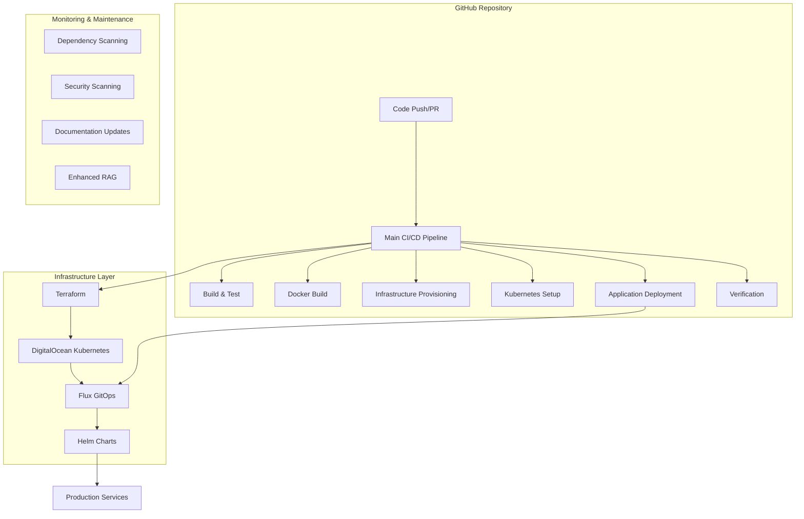

+++
id = "automated-workflows-explanation"
title = "Automated Workflows Explanation - KAI Platform"
context_type = "documentation"
scope = "Complete explanation of all automated workflows and their interconnections"
target_audience = ["developers", "devops", "project-managers"]
granularity = "comprehensive"
status = "active"
last_updated = "2025-01-08"
version = "1.0"
tags = ["automation", "workflows", "ci-cd", "github-actions", "deployment", "infrastructure"]
related_context = [
    ".ruru/docs/deployment/comprehensive-deployment-guide.md",
    ".ruru/docs/deployment/quick-start-commands.md",
    ".github/workflows/",
    "flux/",
    "helm-charts/"
]
template_schema_doc = ".ruru/templates/toml-md/15_documentation.README.md"
relevance = "Critical: Explains the complete automation ecosystem"
+++

# Automated Workflows Explanation - KAI Platform

## Overview

The KAI Platform employs a sophisticated multi-layered automation ecosystem that orchestrates everything from code commits to production deployments. This document explains how all automated workflows interconnect and operate to provide a seamless, reliable deployment pipeline.

## 🏗️ Architecture Overview



## 🔄 Core Workflow Categories

### 1. **Primary CI/CD Pipeline** (`deploy.yml`)

**Purpose**: Orchestrates the complete deployment lifecycle from code to production.

**Triggers**:
- Push to `main`, `staging`, or `development` branches
- Pull requests to these branches
- Manual workflow dispatch with environment selection

**Workflow Sequence**:
```
Code Push → Build & Test → Docker Images → Infrastructure → Kubernetes → Application → Verification
```

**Key Features**:
- **Environment-aware**: Automatically detects target environment based on branch
- **Conditional execution**: Only runs relevant steps for each environment
- **Reusable workflows**: Modular design for maintainability
- **Secret management**: Comprehensive secret handling for all environments

### 2. **Infrastructure Automation**

#### **Terraform Provisioning** (`provision-infrastructure.yml`)
- **Purpose**: Creates and manages DigitalOcean Kubernetes clusters
- **Scope**: Infrastructure as Code (IaC) for cloud resources
- **Features**:
  - Cluster creation with auto-scaling (1-5 nodes)
  - Region-specific deployment (Amsterdam - ams3)
  - Conditional cluster creation based on input parameters

#### **Kubernetes Setup** (`setup-kubernetes.yml`)
- **Purpose**: Configures Kubernetes cluster with essential services
- **Components Installed**:
  - **Flux GitOps**: Continuous deployment system
  - **NGINX Ingress**: Load balancing and routing
  - **Cert-Manager**: SSL certificate automation
  - **Argo Workflows**: Workflow orchestration
  - **Monitoring stack**: Observability tools

### 3. **Application Deployment Automation**

#### **Docker Build Pipeline** (`docker-build.yml`)
- **Purpose**: Builds and publishes container images
- **Registry**: GitHub Container Registry (GHCR)
- **Features**:
  - Multi-service builds (API, Coordinator, Frontend)
  - Tag management (latest, staging, SHA-based)
  - Security scanning integration
  - Automated image updates in deployment manifests

#### **Application Deployment** (`deploy-application.yml`)
- **Purpose**: Deploys applications to Kubernetes using Helm
- **Process**:
  1. Updates Helm chart values with new image tags
  2. Deploys via Helm with environment-specific configurations
  3. Configures ingress and SSL certificates
  4. Runs database migrations if needed
  5. Deploys frontend applications to DigitalOcean App Platform

### 4. **GitOps Continuous Deployment**

#### **Flux Integration**
- **Location**: `flux/clusters/production/`
- **Purpose**: Declarative, Git-driven deployments
- **Components**:
  - **Sources**: Git repositories and Helm repositories
  - **Releases**: HelmRelease configurations for each service
  - **Kustomizations**: Environment-specific customizations

**Flux Workflow**:
```
Git Commit → Flux Detects Changes → Pulls Helm Charts → Applies to Kubernetes → Monitors Health
```

### 5. **Quality Assurance Automation**

#### **Build & Test Pipeline** (`build-test.yml`)
- **Purpose**: Ensures code quality before deployment
- **Scope**:
  - Unit tests for all services
  - Integration tests
  - Code quality checks
  - Security vulnerability scanning

#### **Deployment Verification** (`verify-deployment.yml`)
- **Purpose**: Validates successful deployments
- **Checks**:
  - Service health endpoints
  - Database connectivity
  - API functionality
  - Frontend accessibility
  - SSL certificate validation

### 6. **Maintenance & Security Automation**

#### **Dependency Management**
- **Scheduled Scanning** (`scheduled-dependency-scan.yml`): Daily security scans
- **Dependency Updates** (`dependency-update-testing.yml`): Automated dependency updates
- **Build Scanner** (`build-dependency-scanner.yml`): Container image security scanning

#### **Documentation Automation**
- **Docs PR Creator** (`docs-pr-creator.yml`): Automated documentation updates
- **Docusaurus Deploy** (`docusaurus-deploy.yml`): Documentation site deployment
- **Changelog Updates** (`changelog-pr-updates.yml`): Automated changelog generation

#### **Enhanced RAG System** (`enhanced-rag.yml`)
- **Purpose**: Continuous learning and knowledge management
- **Features**:
  - Automated knowledge base updates
  - ML model training pipeline
  - Context-aware documentation generation

## 🔗 Workflow Interconnections

### **Sequential Dependencies**

1. **Code → Build → Deploy Chain**:
   ```
   Code Push → build-test.yml → docker-build.yml → deploy.yml → verify-deployment.yml
   ```

2. **Infrastructure → Application Chain**:
   ```
   provision-infrastructure.yml → setup-kubernetes.yml → deploy-application.yml
   ```

### **Parallel Executions**

- **Multi-environment deployments**: Staging and production pipelines run in parallel
- **Service builds**: Multiple Docker images build simultaneously
- **Verification checks**: Health checks run concurrently across services

### **Event-Driven Triggers**

- **Git Events**: Push, PR, tag creation
- **Schedule Events**: Daily dependency scans, weekly security audits
- **Manual Events**: Workflow dispatch for emergency deployments
- **External Events**: Webhook triggers from monitoring systems

## 🎯 Environment-Specific Workflows

### **Development Environment**
- **Triggers**: Push to `development` branch
- **Features**: Fast feedback, comprehensive testing, staging deployments
- **Automation**: Full CI/CD with staging infrastructure

### **Staging Environment** (Currently Removed)
- **Status**: Removed for security and cost optimization
- **Previous Function**: Pre-production testing environment
- **Current Approach**: Direct development → production with enhanced testing

### **Production Environment**
- **Triggers**: Push to `main` branch or manual production deployment
- **Features**: Blue-green deployments, comprehensive monitoring, rollback capabilities
- **Security**: Enhanced security scanning, secret management, audit logging

## 🛡️ Security & Compliance Automation

### **Secret Management**
- **GitHub Secrets**: Centralized secret storage
- **Kubernetes Secrets**: Runtime secret injection
- **Rotation**: Automated secret rotation workflows

### **Security Scanning**
- **Container Images**: Vulnerability scanning before deployment
- **Dependencies**: Daily security audits
- **Code**: Static analysis security testing (SAST)
- **Infrastructure**: Terraform security validation

### **Compliance**
- **Audit Logging**: All deployment activities logged
- **Change Tracking**: Git-based change management
- **Approval Workflows**: Manual approval gates for production

## 📊 Monitoring & Observability

### **Deployment Monitoring**
- **Health Checks**: Automated service health validation
- **Performance Metrics**: Response time and throughput monitoring
- **Error Tracking**: Automated error detection and alerting

### **Infrastructure Monitoring**
- **Cluster Health**: Kubernetes cluster monitoring
- **Resource Usage**: CPU, memory, and storage tracking
- **Cost Monitoring**: Cloud resource cost tracking

### **Notification Systems**
- **Slack Integration**: Real-time deployment notifications
- **Email Alerts**: Critical issue notifications
- **Dashboard Updates**: Automated status page updates

## 🚀 Workflow Execution Examples

### **Typical Production Deployment**

1. **Developer pushes to main branch**
2. **deploy.yml triggers automatically**
3. **build-and-test job executes**:
   - Runs unit tests
   - Performs code quality checks
   - Validates security requirements
4. **build-docker-images job executes**:
   - Builds container images
   - Pushes to GitHub Container Registry
   - Updates deployment manifests
5. **provision-infrastructure-production job executes**:
   - Validates Terraform configuration
   - Applies infrastructure changes if needed
6. **setup-kubernetes-production job executes**:
   - Ensures cluster configuration is current
   - Updates Kubernetes resources
7. **deploy-application-production job executes**:
   - Deploys via Helm charts
   - Configures ingress and SSL
   - Runs database migrations
8. **verify-deployment-production job executes**:
   - Validates service health
   - Checks API endpoints
   - Confirms SSL certificates
9. **Flux GitOps takes over**:
   - Monitors for configuration drift
   - Ensures desired state maintenance
   - Handles automatic reconciliation

### **Emergency Hotfix Deployment**

1. **Manual workflow dispatch triggered**
2. **Environment selection**: Production
3. **Accelerated pipeline**:
   - Skip non-critical tests
   - Fast-track security approval
   - Direct deployment to production
4. **Enhanced monitoring**:
   - Real-time health checks
   - Immediate rollback capability
   - Stakeholder notifications

## 🔧 Maintenance Workflows

### **Daily Operations**
- **Dependency scanning**: Automated security vulnerability checks
- **Health monitoring**: Continuous service health validation
- **Log aggregation**: Centralized logging and analysis

### **Weekly Operations**
- **Security audits**: Comprehensive security reviews
- **Performance analysis**: System performance evaluation
- **Capacity planning**: Resource usage analysis

### **Monthly Operations**
- **Infrastructure review**: Cost optimization and scaling analysis
- **Security updates**: Major security patch deployments
- **Documentation updates**: Automated documentation refresh

## 🎛️ Control & Management

### **Manual Overrides**
- **Workflow dispatch**: Manual trigger capability for all workflows
- **Environment selection**: Choose specific deployment targets
- **Feature flags**: Enable/disable specific automation features

### **Rollback Procedures**
- **Automated rollback**: Triggered by health check failures
- **Manual rollback**: Emergency rollback procedures
- **State recovery**: Infrastructure and application state restoration

### **Configuration Management**
- **Environment variables**: Centralized configuration management
- **Feature toggles**: Runtime feature control
- **A/B testing**: Automated testing framework integration

## 📈 Performance & Optimization

### **Pipeline Optimization**
- **Parallel execution**: Concurrent job execution where possible
- **Caching strategies**: Build cache optimization
- **Resource allocation**: Efficient runner resource usage

### **Deployment Optimization**
- **Blue-green deployments**: Zero-downtime deployments
- **Rolling updates**: Gradual service updates
- **Canary releases**: Risk-minimized feature rollouts

## 🔮 Future Enhancements

### **Planned Improvements**
- **AI-driven deployment decisions**: Machine learning for deployment optimization
- **Advanced monitoring**: Predictive failure detection
- **Multi-cloud support**: Cloud provider diversification
- **Enhanced security**: Zero-trust security model implementation

### **Scalability Considerations**
- **Microservices architecture**: Service decomposition strategies
- **Auto-scaling**: Dynamic resource allocation
- **Global deployment**: Multi-region deployment capabilities

---

## Summary

The KAI Platform's automated workflow ecosystem provides:

✅ **Complete automation** from code commit to production deployment  
✅ **Multi-environment support** with environment-specific optimizations  
✅ **Security-first approach** with comprehensive scanning and compliance  
✅ **GitOps-driven deployments** for declarative infrastructure management  
✅ **Comprehensive monitoring** with real-time health checks and alerting  
✅ **Maintenance automation** for ongoing system health and security  
✅ **Scalable architecture** designed for growth and evolution  

This interconnected system ensures reliable, secure, and efficient software delivery while maintaining high availability and performance standards.