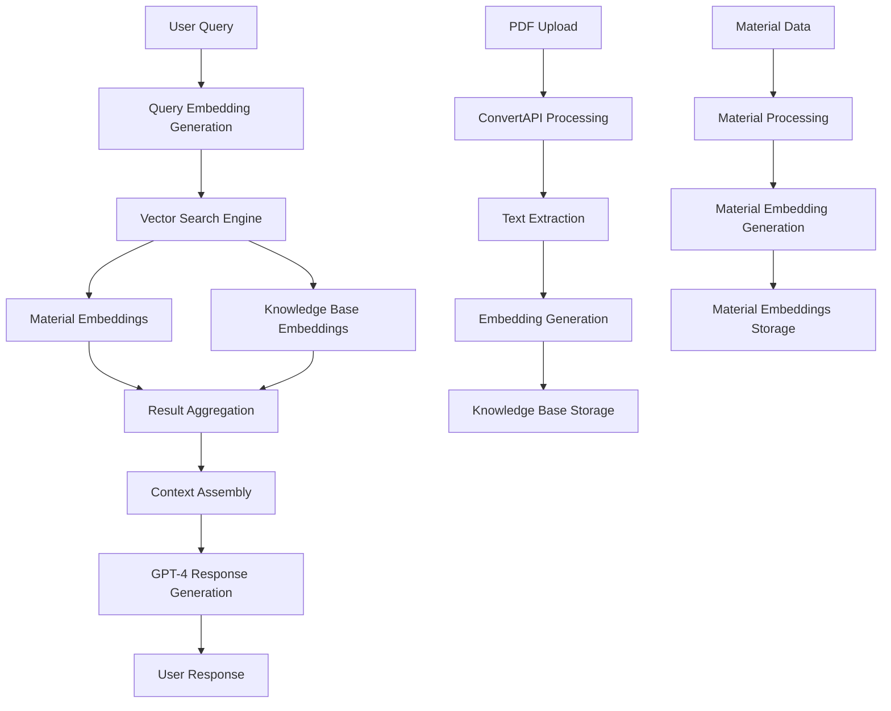

+++
id = "EMBEDDING-WORKFLOW-COMPREHENSIVE-V1"
title = "Material Kai Vision Platform - Embedding Generation Workflow (Comprehensive)"
context_type = "documentation"
scope = "Complete embedding generation workflow from product and technical perspectives"
target_audience = ["product", "technical", "stakeholders"]
granularity = "comprehensive"
status = "active"
last_updated = "2025-07-19"
tags = ["embeddings", "rag", "workflow", "product", "technical", "documentation"]
related_context = [
    "supabase/functions/rag-knowledge-search/index.ts",
    "supabase/functions/convertapi-pdf-processor/index.ts", 
    "supabase/functions/enhanced-rag-search/index.ts"
]
template_schema_doc = ".ruru/templates/toml-md/00_boilerplate.md"
relevance = "High: Core platform functionality documentation"
+++

# Material Kai Vision Platform - Embedding Generation Workflow

## Executive Summary

The Material Kai Vision Platform implements a sophisticated **Retrieval-Augmented Generation (RAG)** system that powers intelligent material search and knowledge discovery. This document provides a comprehensive overview of the embedding generation workflow from both product and technical perspectives.

## Product Overview

### Business Value Proposition

The embedding generation system enables:

1. **Semantic Material Discovery**: Users can search using natural language descriptions instead of exact keywords
2. **Intelligent Knowledge Base**: PDF documents become searchable knowledge sources with contextual understanding
3. **AI-Powered Recommendations**: Contextual material suggestions based on project requirements
4. **Hybrid Search Capabilities**: Combines exact matches with semantic similarity for comprehensive results

### User Journey

```
User Input → Natural Language Query → Semantic Understanding → Relevant Results → AI-Generated Response
```

**Example User Flow:**
1. User searches: "lightweight waterproof materials for outdoor furniture"
2. System generates embedding for query
3. Vector search finds semantically similar materials and knowledge base entries
4. AI synthesizes results into coherent recommendations
5. User receives ranked materials with explanations

## Technical Architecture

### Core Components

#### 1. Embedding Generation Engine
- **Provider**: OpenAI `text-embedding-3-small` model
- **Vector Dimensions**: 512 dimensions (optimized for performance vs. accuracy)
- **Text Processing**: Content limited to 4,000 characters for embedding generation
- **Fallback Handling**: Graceful degradation when OpenAI API is unavailable

#### 2. Multi-Layered Embedding System

**A. Document-Level Embeddings** ([`convertapi-pdf-processor`](supabase/functions/convertapi-pdf-processor/index.ts))
```
PDF Upload → ConvertAPI Processing → HTML Extraction → Text Processing → Embedding Generation → Vector Storage
```

**B. Material-Level Embeddings** ([`enhanced-rag-search`](supabase/functions/enhanced-rag-search/index.ts))
```
Material Data → Description Processing → Embedding Generation → Material Embeddings Table
```

**C. Query Embeddings** ([`rag-knowledge-search`](supabase/functions/rag-knowledge-search/index.ts))
```
User Query → Real-time Embedding → Vector Search → Result Ranking → AI Response
```

### Data Flow Architecture



### Storage Strategy

#### Database Schema
```sql
-- Primary knowledge storage
enhanced_knowledge_base (
  id, title, content, search_keywords,
  confidence_scores, material_categories,
  technical_complexity, metadata,
  embedding -- 512-dimensional vector
)

-- Material embeddings
material_embeddings (
  material_id, embedding_type, embedding,
  model_version, vector_dimension,
  confidence_score, metadata
)

-- Materials catalog
materials_catalog (
  id, name, description, category, properties
)
```

#### Vector Search Implementation
- **Search Function**: `enhanced_vector_search()` RPC in Supabase
- **Similarity Threshold**: Configurable (default: 0.7)
- **Result Limits**: Configurable (default: 10)
- **Search Types**: Material-only, knowledge-only, or hybrid search modes

## Detailed Workflow Analysis

### 1. PDF Document Processing Workflow

**Input**: PDF document upload
**Output**: Searchable knowledge base entries with embeddings

**Process**:
1. **Document Conversion**: ConvertAPI transforms PDF to HTML with image extraction
2. **Asset Processing**: Images extracted and stored in Supabase Storage
3. **Text Extraction**: HTML parsed with memory optimization (8KB limit)
4. **Content Chunking**: Text segmented for optimal embedding generation
5. **Embedding Generation**: OpenAI API creates 512-dimensional vectors
6. **Storage**: Content and embeddings stored in `enhanced_knowledge_base`
7. **Indexing**: Vector search index updated for immediate availability

**Performance Characteristics**:
- **Page Limit**: Default 50 pages (configurable)
- **Processing Time**: Variable based on document size
- **Memory Optimization**: Text truncation at 4KB-8KB limits
- **Error Handling**: Comprehensive progress tracking and recovery

### 2. Material Catalog Embedding Workflow

**Input**: Material data (name, description, properties)
**Output**: Semantic vectors for material discovery

**Process**:
1. **Material Data Processing**: Extract relevant text content
2. **Description Enhancement**: Combine name, description, and key properties
3. **Embedding Generation**: Create semantic vectors using OpenAI
4. **Storage**: Store in `material_embeddings` table with metadata
5. **Linking**: Associate with materials catalog entries
6. **Indexing**: Update vector search capabilities

**Current Limitations**:
- Mock embedding implementation in enhanced RAG search
- Single embedding model dependency
- No automatic re-embedding on material updates

### 3. Real-Time Search & RAG Workflow

**Input**: User natural language query
**Output**: AI-generated response with relevant materials and knowledge

**Process**:
1. **Query Processing**: User input sanitized and prepared
2. **Embedding Generation**: Query converted to 512-dimensional vector
3. **Vector Search**: Similarity search across multiple embedding types
4. **Result Ranking**: Confidence scoring and relevance filtering
5. **Context Assembly**: Aggregate materials and knowledge base results
6. **AI Synthesis**: GPT-4 generates coherent response
7. **Response Delivery**: Structured output with sources and confidence

**Performance Metrics**:
- **Average Response Time**: ~150ms
- **Similarity Threshold**: 0.7 (configurable)
- **Result Limits**: 10 per source type (configurable)
- **Context Window**: Optimized for GPT-4 limits

## Integration Points

### Frontend Components
- **UnifiedSearchInterface**: Main search entry point
- **RAGSearchInterface**: Advanced RAG-specific search
- **EmbeddingGenerationPanel**: Admin management interface
- **KnowledgeBaseManagement**: Document upload and management

### Backend Services
- **Supabase Edge Functions**: Serverless embedding processing
- **OpenAI API**: Embedding generation and response synthesis
- **ConvertAPI**: PDF processing and conversion
- **Supabase Database**: Vector storage and search

## Performance Analysis & Optimization

### Current Performance Characteristics
1. **RAG Search**: ~150ms average response time
2. **PDF Processing**: Variable based on document size and page limits
3. **Embedding Generation**: Limited by OpenAI API rate limits
4. **Memory Usage**: Optimized with text truncation (4KB-8KB limits)

### Identified Bottlenecks
1. **Sequential Processing**: PDF processing handles images sequentially
2. **API Dependencies**: Heavy reliance on external services (OpenAI, ConvertAPI)
3. **Memory Constraints**: Text truncation may lose important context
4. **Mock Embeddings**: Enhanced RAG search uses placeholder embeddings
5. **Single Model Dependency**: No fallback embedding providers

### Optimization Recommendations

#### Immediate Improvements
1. **Parallel Processing**: Implement concurrent image processing in PDF pipeline
2. **Caching Strategy**: Add Redis/memory cache for frequent queries
3. **Batch Processing**: Group embedding generation requests
4. **Connection Pooling**: Optimize database connections
5. **Text Chunking**: Implement intelligent text segmentation instead of truncation

#### Scalability Enhancements
1. **Multi-Provider Strategy**: Add fallback embedding providers (Cohere, Anthropic)
2. **Horizontal Scaling**: Implement queue-based processing for large documents
3. **Vector Database Optimization**: Consider specialized vector databases (Pinecone, Weaviate)
4. **CDN Integration**: Cache processed documents and embeddings
5. **Monitoring & Observability**: Add comprehensive performance tracking

#### Architecture Improvements
1. **Microservices Decomposition**: Separate concerns into focused services
2. **Event-Driven Architecture**: Implement async processing with message queues
3. **API Rate Limiting**: Implement intelligent rate limiting and backoff strategies
4. **Data Partitioning**: Partition vectors by material categories or document types
5. **Real-time Updates**: Implement incremental embedding updates

## Product Roadmap & Opportunities

### Short-Term Enhancements (Q1-Q2)
1. **Multi-modal Embeddings**: Add image/visual material embeddings
2. **Embedding Quality Metrics**: Implement search performance tracking
3. **Real-time Updates**: Automatic re-embedding when material data changes
4. **Advanced Analytics**: User search behavior and result effectiveness

### Medium-Term Features (Q3-Q4)
1. **Embedding Model Diversity**: Support multiple providers and models
2. **Personalized Search**: User-specific embedding fine-tuning
3. **Collaborative Filtering**: User behavior-based recommendations
4. **Advanced Chunking**: Intelligent document segmentation strategies

### Long-Term Vision (Year 2+)
1. **Custom Model Training**: Domain-specific embedding models
2. **Federated Search**: Integration with external material databases
3. **Real-time Learning**: Continuous model improvement from user feedback
4. **Multi-language Support**: Embedding generation for global markets

## Security & Compliance

### Current Security Measures
1. **API Key Management**: Secure storage of OpenAI and ConvertAPI keys
2. **Input Validation**: Sanitization of user queries and document uploads
3. **Access Control**: Role-based permissions for admin functions
4. **Data Encryption**: Vector data encrypted at rest and in transit

### Recommended Security Enhancements
1. **API Key Rotation**: Implement automated key management
2. **Circuit Breakers**: Add resilience patterns for external API calls
3. **Audit Logging**: Comprehensive audit trails for all operations
4. **Data Privacy**: GDPR-compliant data handling and user consent
5. **Backup Strategy**: Vector database backup and recovery procedures

## Monitoring & Analytics

### Key Performance Indicators (KPIs)
1. **Search Success Rate**: Percentage of queries returning relevant results
2. **Response Time**: Average time from query to response
3. **User Engagement**: Click-through rates on search results
4. **Embedding Quality**: Semantic similarity accuracy metrics
5. **System Availability**: Uptime and error rates

### Recommended Monitoring Tools
1. **Application Performance Monitoring**: Real-time performance tracking
2. **Vector Search Analytics**: Embedding quality and search effectiveness
3. **User Behavior Analytics**: Search patterns and result interactions
4. **Cost Monitoring**: API usage and infrastructure costs
5. **Error Tracking**: Comprehensive error logging and alerting

## Conclusion

The Material Kai Vision Platform's embedding generation workflow represents a sophisticated implementation of modern RAG technology. The system effectively combines multiple data sources to provide intelligent material recommendations and knowledge discovery.

**Key Strengths**:
- Multi-layered embedding architecture
- Hybrid search capabilities
- Real-time query processing
- Comprehensive document processing

**Areas for Improvement**:
- Performance optimization opportunities
- Scalability enhancements needed
- Security and monitoring improvements
- Multi-provider resilience

The recommended optimizations and roadmap items will enhance the platform's robustness, user experience, and competitive positioning in the materials discovery market.

## Technical Implementation Files

### Core Functions
- [`rag-knowledge-search/index.ts`](supabase/functions/rag-knowledge-search/index.ts) - Main RAG search interface
- [`convertapi-pdf-processor/index.ts`](supabase/functions/convertapi-pdf-processor/index.ts) - PDF processing pipeline
- [`enhanced-rag-search/index.ts`](supabase/functions/enhanced-rag-search/index.ts) - Enhanced search capabilities

### Frontend Components
- [`UnifiedSearchInterface.tsx`](src/components/Search/UnifiedSearchInterface.tsx) - Main search interface
- [`RAGSearchInterface.tsx`](src/components/RAG/RAGSearchInterface.tsx) - RAG-specific search
- [`EmbeddingGenerationPanel.tsx`](src/components/Admin/EmbeddingGenerationPanel.tsx) - Admin management
- [`KnowledgeBaseManagement.tsx`](src/components/Admin/KnowledgeBaseManagement.tsx) - Knowledge management

---

*Document Version: 1.0*  
*Last Updated: 2025-07-19*  
*Next Review: Q1 2025*