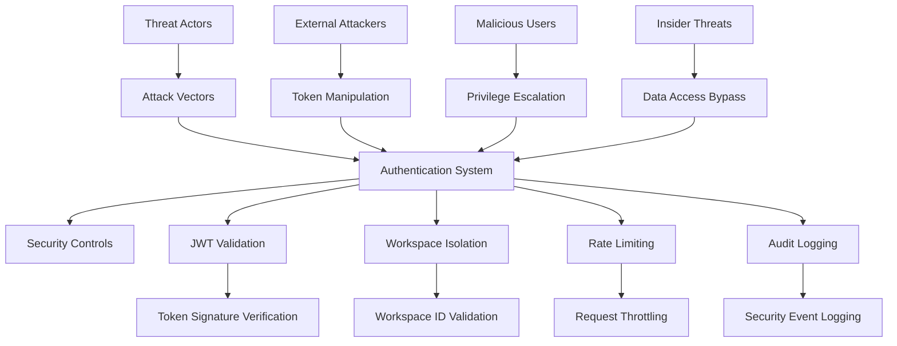

+++
id = "TASK-SEC-20250725-160840"
title = "JWT Security Coordination & Threat Modeling"
status = "🟡 To Do"
type = "🌟 Feature"
priority = "🔴 High"
created_date = "2025-07-25"
updated_date = "2025-07-25"
assigned_to = "lead-security"
coordinator = "TASK-CMD-20250725-160726"
parent_task = ""
depends_on = ["TASK-ARCH-20250725-160726"]
related_docs = [
    "mivaa-pdf-extractor/app/services/material_kai_service.py",
    ".ruru/docs/standards/mode_selection_guide.md"
]
tags = ["jwt", "security", "threat-modeling", "coordination", "multi-tenant", "phase-1"]
template_schema_doc = ".ruru/templates/toml-md/01_mdtm_feature.README.md"
+++

# JWT Security Coordination & Threat Modeling

## Description ✍️

**What is this feature?**
Lead security coordination for the JWT authentication system implementation, focusing on threat modeling, security requirements definition, and coordination with architecture and implementation specialists.

**Why is it needed?**
The current system has critical security gaps including missing JWT token validation, no authentication middleware, and inadequate multi-tenant isolation. A comprehensive security approach is essential to protect the Material Kai Vision Platform from authentication bypass, privilege escalation, and data leakage vulnerabilities.

**Scope:**
- Conduct comprehensive threat modeling for JWT authentication system
- Define security requirements and acceptance criteria for implementation phases
- Coordinate security reviews with architecture and implementation teams
- Establish security testing and validation protocols
- Define incident response procedures for authentication failures

**Links:**
- Current vulnerable implementation: `mivaa-pdf-extractor/app/services/material_kai_service.py`
- Architecture task dependency: `TASK-ARCH-20250725-160726`

## Acceptance Criteria ✅

- [ ] **Threat Model Documentation**: Complete threat model identifying attack vectors, threat actors, and security controls for JWT authentication system
- [ ] **Security Requirements Matrix**: Detailed security requirements mapped to implementation phases with acceptance criteria
- [ ] **Multi-tenant Security Analysis**: Security analysis of workspace isolation mechanisms and potential privilege escalation vectors
- [ ] **Authentication Flow Security Review**: Security assessment of proposed JWT token flows between services
- [ ] **Security Testing Strategy**: Comprehensive security testing plan including penetration testing scenarios
- [ ] **Incident Response Procedures**: Documented procedures for handling authentication failures and security incidents
- [ ] **Compliance Assessment**: Analysis of security compliance requirements (if applicable) and implementation guidance

## Implementation Notes / Sub-Tasks 📝

- [✅] **🔍 Current Vulnerability Assessment**: Analyze existing security gaps in `material_kai_service.py` and document attack vectors
- [✅] **👥 Threat Actor Analysis**: Identify potential threat actors and their capabilities/motivations
- [✅] **🎯 Attack Surface Mapping**: Map all authentication touchpoints and potential attack surfaces
- [ ] **🛡️ Security Controls Design**: Define required security controls for each identified threat
- [ ] **🏢 Multi-tenant Security Model**: Design security model for workspace-based data isolation
- [ ] **🔐 Token Security Requirements**: Define JWT token security requirements (encryption, signing, expiration)
- [ ] **📊 Security Metrics Definition**: Define security metrics and monitoring requirements
- [ ] **🚨 Incident Response Planning**: Create incident response procedures for authentication security events

## Diagrams 📊

## Key Learnings 💡

*   (To be filled upon completion)

## Log Entries 🪵

**2025-07-26 23:25 - Security Lead Assessment Started**
- Initiated JWT Security Coordination & Threat Modeling task
- Completed vulnerability assessment of material_kai_service.py
- **CRITICAL FINDINGS IDENTIFIED:**

**🚨 CRITICAL VULNERABILITIES IN material_kai_service.py:**

1. **NO JWT TOKEN VALIDATION** (Lines 138-142)
   - Service accepts any Bearer token without validation
   - No signature verification, expiration checks, or claims validation
   - **Attack Vector**: Token manipulation, replay attacks, privilege escalation

2. **MISSING AUTHENTICATION MIDDLEWARE**
   - No centralized authentication layer
   - Each service method trusts provided credentials blindly
   - **Attack Vector**: Authentication bypass, unauthorized API access

3. **INADEQUATE WORKSPACE ISOLATION** (Lines 141, 283, 324, 373, 411, 451)
   - Workspace ID passed as header without verification
   - No validation that user has access to specified workspace
   - **Attack Vector**: Cross-tenant data access, privilege escalation

4. **INSECURE API KEY HANDLING** (Lines 76, 99, 138)
   - API keys stored in plain configuration
   - No rotation mechanism or secure storage
   - **Attack Vector**: Credential theft, long-term compromise

5. **NO RATE LIMITING OR THROTTLING**
   - Service lacks protection against abuse
   - **Attack Vector**: DoS attacks, resource exhaustion

6. **INSUFFICIENT INPUT VALIDATION**
   - Document and workflow data not properly sanitized
   - **Attack Vector**: Injection attacks, data corruption

7. **MISSING AUDIT LOGGING**
   - No security event logging for authentication failures
   - **Attack Vector**: Undetected breaches, compliance violations

**RISK ASSESSMENT**: These vulnerabilities create a **CRITICAL** security exposure allowing:
- Complete authentication bypass
- Cross-tenant data access
- Privilege escalation to any workspace
- Undetected malicious activity

**IMMEDIATE ACTION REQUIRED**: JWT authentication system implementation is essential before production deployment.

**2025-07-26 23:27 - Threat Actor & Attack Surface Analysis Completed**

**🎯 THREAT ACTOR ANALYSIS:**

**1. External Attackers (High Threat)**
- **Capabilities**: Advanced persistent threat (APT) groups, cybercriminals, script kiddies
- **Motivations**: Data theft, financial gain, intellectual property theft, system disruption
- **Attack Vectors**: 
  - Token manipulation and forgery (no JWT validation)
  - API endpoint enumeration and abuse
  - Credential stuffing and brute force attacks
  - Man-in-the-middle attacks on unencrypted tokens

**2. Malicious Authenticated Users (Critical Threat)**
- **Capabilities**: Valid system access, knowledge of internal workflows
- **Motivations**: Data exfiltration, privilege escalation, competitive advantage
- **Attack Vectors**:
  - Workspace ID manipulation for cross-tenant access
  - Token replay attacks for session hijacking
  - API abuse for unauthorized document access
  - Workflow manipulation for data corruption

**3. Insider Threats (High Threat)**
- **Capabilities**: System administration access, code repository access
- **Motivations**: Financial gain, revenge, espionage, accidental exposure
- **Attack Vectors**:
  - Direct database access bypassing authentication
  - API key theft from configuration files
  - Code injection through development access
  - Social engineering for credential theft

**4. Compromised Service Accounts (Medium-High Threat)**
- **Capabilities**: Automated system access, service-to-service communication
- **Motivations**: Lateral movement, persistent access, data harvesting
- **Attack Vectors**:
  - Service account credential compromise
  - Inter-service authentication bypass
  - Automated data exfiltration
  - System resource abuse

**🗺️ ATTACK SURFACE MAPPING:**

**Primary Attack Surfaces:**
1. **HTTP Headers** (Lines 138-142, 141, 483-486)
   - Authorization: Bearer [token] - NO VALIDATION
   - X-Workspace-ID - NO VERIFICATION
   - X-Service-Name - TRUSTED WITHOUT VALIDATION

2. **API Endpoints** (All service methods)
   - /health - Unauthenticated exposure
   - /services/register - Service registration bypass
   - /documents/* - Document access without proper authz
   - /workflows/* - Workflow manipulation
   - WebSocket connections - Real-time attack vector

3. **Configuration Files** (Lines 76, 99)
   - API keys in plain text
   - Workspace IDs in configuration
   - Service credentials exposed

4. **Network Communications**
   - HTTP/HTTPS endpoints without proper validation
   - WebSocket connections without authentication
   - Inter-service communication channels

**Secondary Attack Surfaces:**
1. **Error Messages** - Information disclosure
2. **Logging Systems** - Credential exposure in logs
3. **Development/Debug Endpoints** - Potential backdoors
4. **Third-party Dependencies** - Supply chain attacks

**ATTACK SCENARIOS IDENTIFIED:**
- **Scenario 1**: Attacker intercepts Bearer token, replays with different Workspace-ID
- **Scenario 2**: Malicious user enumerates workspace IDs for cross-tenant access
- **Scenario 3**: Insider extracts API keys from config, establishes persistent access
- **Scenario 4**: External attacker bypasses authentication entirely via missing validation
