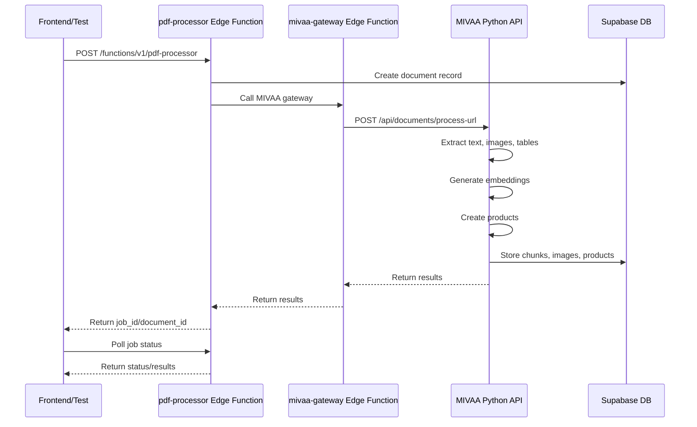

# MIVAA Deployment & E2E Testing Plan

## Current Status Analysis

### 3-Layer Architecture
1. **Frontend (Vercel)** ✅ Deployed
   - React/TypeScript application
   - Uses `consolidatedPDFWorkflowService.ts` for PDF processing
   - Calls Supabase Edge Functions

2. **Supabase Edge Functions** ✅ Deployed
   - `pdf-processor` - Main PDF processing orchestrator
   - `mivaa-gateway` - Gateway to MIVAA Python API
   - Both deployed and accessible

3. **MIVAA Python API** ❌ NOT RUNNING
   - FastAPI service should run on port 8000
   - Located in `/root/mivaa-pdf-extractor` (empty directory)
   - **CRITICAL**: MIVAA is NOT deployed on the server

## Issues Found

### 1. MIVAA Python API Missing
- Directory `/root/mivaa-pdf-extractor` is empty
- No Python process running
- Health check fails: `curl http://localhost:8000/api/health` returns nothing
- **Impact**: PDF processing will fail at the MIVAA gateway layer

### 2. Server Has Uncommitted Changes
- Thousands of cache files staged for commit
- Some Python test files untracked
- Need to clean up before deploying MIVAA

### 3. Test Script Issues
- Current test script (`harmony-pdf-complete-e2e-test.js`) calls wrong endpoints
- Uses `pdf-processor` edge function which expects MIVAA to be running
- Will fail immediately without MIVAA

## Deployment Plan

### Phase 1: Deploy MIVAA Python API (CRITICAL)

**Step 1.1: Find MIVAA Source Code**
```bash
# Check if MIVAA code exists in repo
cd /root
find . -name "*.py" -path "*/mivaa*" -o -name "main.py" -path "*/app/*" | head -20
```

**Step 1.2: Deploy MIVAA**
```bash
# If code exists in repo
cd /root/mivaa-pdf-extractor
# Copy from repo or redeploy

# Install dependencies
pip install -r requirements.txt

# Start MIVAA service
uvicorn app.main:app --host 0.0.0.0 --port 8000 --reload &

# Verify
curl http://localhost:8000/api/health
```

**Step 1.3: Make MIVAA Persistent**
```bash
# Create systemd service or use PM2
# Ensure MIVAA starts on server reboot
```

### Phase 2: Update Test Script

**Current Flow (WRONG)**:
```
Frontend → pdf-processor → mivaa-gateway → MIVAA (NOT RUNNING) ❌
```

**Correct Flow**:
```
Test Script → pdf-processor Edge Function → mivaa-gateway → MIVAA Python API → Processing
```

**Required Changes to Test Script**:
1. Add MIVAA health check FIRST
2. Use correct endpoint: `/functions/v1/pdf-processor`
3. Handle async job-based processing
4. Poll for completion properly

### Phase 3: End-to-End Testing

**Test Sequence**:
1. ✅ Check MIVAA health (`http://localhost:8000/api/health`)
2. ✅ Check mivaa-gateway health
3. ✅ Upload Harmony PDF via pdf-processor
4. ✅ Monitor job status
5. ✅ Validate chunks (real data, no fake)
6. ✅ Validate embeddings (proper dimensions)
7. ✅ Validate images (CLIP + Anthropic)
8. ✅ Validate products (14+ expected)
9. ✅ Test search functionality
10. ✅ Test admin-kb endpoints

## Complete PDF Processing Flow



## Action Items

### Immediate (Before Testing)
1. [ ] Deploy MIVAA Python API to server
2. [ ] Verify MIVAA health endpoint responds
3. [ ] Test mivaa-gateway can reach MIVAA
4. [ ] Update test script with correct endpoints

### Testing
5. [ ] Run comprehensive E2E test
6. [ ] Fix any issues found
7. [ ] Validate all data is real (no fake/mock data)
8. [ ] Verify 14+ products extracted from Harmony PDF

### Deployment
9. [ ] Ensure MIVAA runs persistently (systemd/PM2)
10. [ ] Set up monitoring for MIVAA service
11. [ ] Document deployment process

## Environment Variables Needed

### MIVAA Python API
```bash
SUPABASE_URL=https://bgbavxtjlbvgplozizxu.supabase.co
SUPABASE_SERVICE_KEY=<service_key>
OPENAI_API_KEY=<openai_key>
ANTHROPIC_API_KEY=<anthropic_key>
```

### Supabase Edge Functions
```bash
MIVAA_GATEWAY_URL=http://localhost:8000  # or https://v1api.materialshub.gr
MIVAA_API_KEY=<mivaa_key>
```

## Next Steps

1. **Find and deploy MIVAA** - This is blocking everything
2. **Update test script** - Fix endpoints and flow
3. **Run E2E test** - Validate entire pipeline
4. **Fix issues** - Iterate until all tests pass
5. **Document** - Update docs with deployment process

## Success Criteria

- [ ] MIVAA Python API running and healthy
- [ ] pdf-processor can call mivaa-gateway successfully
- [ ] mivaa-gateway can call MIVAA successfully
- [ ] Harmony PDF processes completely
- [ ] 14+ products extracted with metadata
- [ ] All chunks have real content (no fake data)
- [ ] All embeddings have proper dimensions
- [ ] All images have CLIP embeddings
- [ ] Search functionality works
- [ ] Admin-KB endpoints return data

