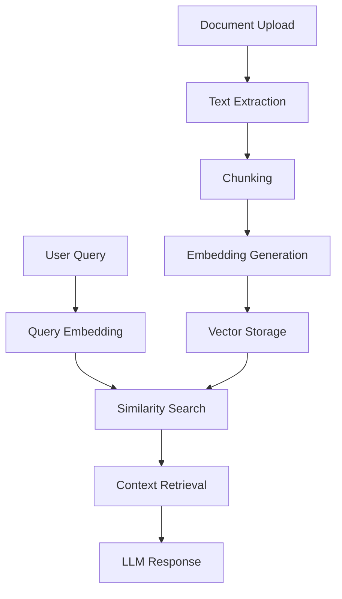

# AI & ML Services Documentation

## 🤖 AI/ML Architecture Overview

The Material Kai Vision Platform integrates multiple AI/ML services for comprehensive material analysis:

1. **OpenAI Services** - Text embeddings, chat completions, vision analysis
2. **HuggingFace Models** - Alternative ML models, CLIP embeddings
3. **Replicate API** - 3D generation, advanced AI models
4. **Custom ML Services** - Material-specific analysis
5. **RAG System** - Retrieval-Augmented Generation for documents

## 🔧 AI Service Configuration

### OpenAI Integration

**Configuration** (`src/config/apis/openaiConfig.ts`):
```typescript
export const openaiConfig = {
  name: 'openai',
  type: 'openai',
  baseUrl: 'https://api.openai.com/v1',
  models: {
    embedding: 'text-embedding-ada-002',
    chat: 'gpt-4',
    vision: 'gpt-4-vision-preview'
  },
  timeout: 30000,
  retryAttempts: 3
};
```

**Environment Variables**:
```bash
OPENAI_API_KEY=your_openai_api_key
OPENAI_ORG_ID=your_org_id  # Optional
```

### HuggingFace Integration

**Configuration** (`src/config/apis/huggingfaceConfig.ts`):
```typescript
export const huggingfaceConfig = {
  name: 'huggingface',
  type: 'huggingface',
  baseUrl: 'https://api-inference.huggingface.co',
  models: {
    clip: 'openai/clip-vit-base-patch32',
    embedding: 'sentence-transformers/all-MiniLM-L6-v2',
    classification: 'microsoft/DialoGPT-medium'
  }
};
```

### Replicate Integration

**Configuration** (`src/config/apis/replicateConfig.ts`):
```typescript
export const replicateConfig = {
  name: 'replicate',
  type: 'replicate',
  baseUrl: 'https://api.replicate.com/v1',
  models: {
    '3d-generation': 'stability-ai/stable-diffusion-3d',
    'image-analysis': 'yorickvp/llava-13b'
  }
};
```

## 🧠 Core AI Services

### 1. Embedding Generation Service

**Location**: `src/services/embeddingGenerationService.ts`

**Purpose**: Generate vector embeddings for text and images

**Models Used**:
- **OpenAI**: `text-embedding-ada-002` (1536 dimensions)
- **HuggingFace**: `sentence-transformers/all-MiniLM-L6-v2` (384 dimensions)

**Usage**:
```typescript
import { EmbeddingGenerationService } from '@/services/embeddingGenerationService';

const embedding = await EmbeddingGenerationService.generateTextEmbedding({
  text: "Steel with high tensile strength",
  model: "text-embedding-ada-002"
});
```

**⚠️ Issue**: Inconsistent embedding dimensions across services

### 2. Material Recognition API

**Location**: `src/services/materialRecognitionAPI.ts`

**Purpose**: Analyze images to identify material properties

**Workflow**:
1. Image preprocessing
2. Feature extraction using CLIP
3. Material classification
4. Property prediction

**Example**:
```typescript
const analysis = await MaterialRecognitionAPI.analyzeImage({
  imageUrl: "https://example.com/material.jpg",
  analysisType: "material_properties"
});
```

### 3. Enhanced RAG Service

**Location**: `src/services/enhancedRAGService.ts`

**Purpose**: Retrieval-Augmented Generation for document queries

**Components**:
- Document chunking
- Vector storage
- Similarity search
- Context-aware response generation

**Architecture**:


### 4. Hybrid AI Service

**Location**: `src/services/hybridAIService.ts`

**Purpose**: Intelligent routing between AI providers

**Features**:
- Provider fallback mechanism
- Cost optimization
- Performance monitoring
- Load balancing

**Provider Priority**:
1. MIVAA (Primary)
2. OpenAI (Secondary)
3. HuggingFace (Fallback)

## 🔬 Specialized ML Services

### 1. Material Analyzer

**Location**: `src/services/ml/materialAnalyzer.ts`

**Capabilities**:
- Chemical composition analysis
- Physical property prediction
- Safety classification
- Standards compliance checking

### 2. 3D Processing Services

#### NeRF Processing
**Location**: `src/services/nerfProcessingAPI.ts`

**Purpose**: Neural Radiance Fields for 3D reconstruction

**Input**: Multiple images of material samples
**Output**: 3D model with material properties

#### SVBRDF Extraction
**Location**: `src/services/svbrdfExtractionAPI.ts`

**Purpose**: Spatially-Varying Bidirectional Reflectance Distribution Function

**Input**: Single material image
**Output**: Material appearance parameters

### 3. Image Analysis Services

**Location**: `src/services/imageAnalysis/`

**Components**:
- Color analysis engine
- Texture classification
- Surface roughness estimation
- Defect detection

## 🔄 AI Workflow Orchestration

### Integrated AI Service

**Location**: `src/services/integratedAIService.ts`

**Purpose**: End-to-end AI workflow coordination

**Complete Design Process**:
```typescript
const results = await IntegratedAIService.generateCompleteDesign(
  images,
  roomType,
  userPreferences
);
```

**Workflow Steps**:
1. NeRF reconstruction (if multiple images)
2. SVBRDF extraction for each material
3. Spatial analysis
4. CrewAI coordination for design generation

### Agent Coordination

**Location**: `src/services/agentMLCoordinator.ts`

**Purpose**: Multi-agent ML task coordination

**Features**:
- Task distribution
- Result aggregation
- Performance monitoring
- Error handling

## 📊 Model Configurations

### OpenAI Models

| Model | Purpose | Context Length | Cost |
|-------|---------|----------------|------|
| `text-embedding-ada-002` | Text embeddings | 8,191 tokens | $0.0001/1K tokens |
| `gpt-4` | Chat completions | 8,192 tokens | $0.03/1K tokens |
| `gpt-4-vision-preview` | Image analysis | 128,000 tokens | $0.01/1K tokens |

### HuggingFace Models

| Model | Purpose | Dimensions | Performance |
|-------|---------|------------|-------------|
| `openai/clip-vit-base-patch32` | Image-text embeddings | 512 | Fast |
| `sentence-transformers/all-MiniLM-L6-v2` | Text embeddings | 384 | Fast |
| `microsoft/DialoGPT-medium` | Conversational AI | - | Medium |

### Replicate Models

| Model | Purpose | Input | Output |
|-------|---------|-------|--------|
| `stability-ai/stable-diffusion-3d` | 3D generation | Text prompt | 3D model |
| `yorickvp/llava-13b` | Vision-language | Image + text | Description |

## 🎯 Performance Optimization

### Caching Strategy

**Implementation**: `src/services/cache/cacheService.ts`

**Cache Layers**:
1. **Memory Cache**: Frequently used embeddings
2. **Redis Cache**: API responses
3. **Database Cache**: Processed results

**TTL Settings**:
- Embeddings: 24 hours
- API responses: 1 hour
- ML results: 7 days

### Cost Optimization

**Location**: `src/services/ml/costOptimizer.ts`

**Strategies**:
- Model selection based on requirements
- Batch processing for embeddings
- Result caching and reuse
- Provider cost comparison

### Performance Monitoring

**Metrics Tracked**:
- Response times per model
- Success/failure rates
- Cost per request
- Cache hit rates

## 🚨 Current Issues & Limitations

### 1. Embedding Dimension Inconsistency

**Problem**: Different services use different embedding models
- OpenAI: 1536 dimensions
- HuggingFace: 384 dimensions
- Custom models: Various dimensions

**Impact**: Vector search incompatibility

**Solution**: Standardize on single embedding model

### 2. Missing Error Handling

**Problem**: Inconsistent error handling across AI services

**Examples**:
- API rate limit handling
- Model unavailability
- Network timeouts

### 3. No Model Versioning

**Problem**: No tracking of model versions used

**Impact**: Reproducibility issues

### 4. Incomplete Fallback Logic

**Problem**: Limited fallback between providers

**Impact**: Service failures when primary provider is down

## 🔧 Configuration Management

### Model Selection Strategy

```typescript
// src/services/ml/modelSelector.ts
export class ModelSelector {
  static selectEmbeddingModel(requirements: {
    speed: 'fast' | 'medium' | 'slow';
    accuracy: 'high' | 'medium' | 'low';
    cost: 'low' | 'medium' | 'high';
  }) {
    // Selection logic based on requirements
  }
}
```

### Environment-Specific Configurations

**Development**:
```typescript
{
  primaryProvider: 'openai',
  fallbackProviders: ['huggingface'],
  cacheEnabled: true,
  debugMode: true
}
```

**Production**:
```typescript
{
  primaryProvider: 'mivaa',
  fallbackProviders: ['openai', 'huggingface'],
  cacheEnabled: true,
  debugMode: false,
  rateLimiting: true
}
```

## 📈 Scaling Considerations

### Horizontal Scaling

**Strategies**:
- Load balancing across AI providers
- Distributed caching with Redis
- Microservice architecture

### Vertical Scaling

**Optimizations**:
- GPU acceleration for local models
- Memory optimization for embeddings
- Batch processing for efficiency

## 🔗 Integration Points

### Frontend Integration

**React Hooks**:
```typescript
// src/hooks/useImageAnalysis.ts
export const useImageAnalysis = () => {
  // Hook for image analysis functionality
};
```

### Backend Integration

**API Gateway**:
```typescript
// src/services/apiGateway/apiIntegrationService.ts
export class ApiIntegrationService {
  // Unified interface for all AI services
}
```

### Database Integration

**Vector Storage**:
- PostgreSQL with pgvector extension
- Supabase vector operations
- Similarity search optimization

## 🔗 Related Documentation

- [API Documentation](./api-documentation.md) - AI API endpoints
- [Database & Schema](./database-schema.md) - Vector storage
- [Architecture & Services](./architecture-services.md) - Service architecture
