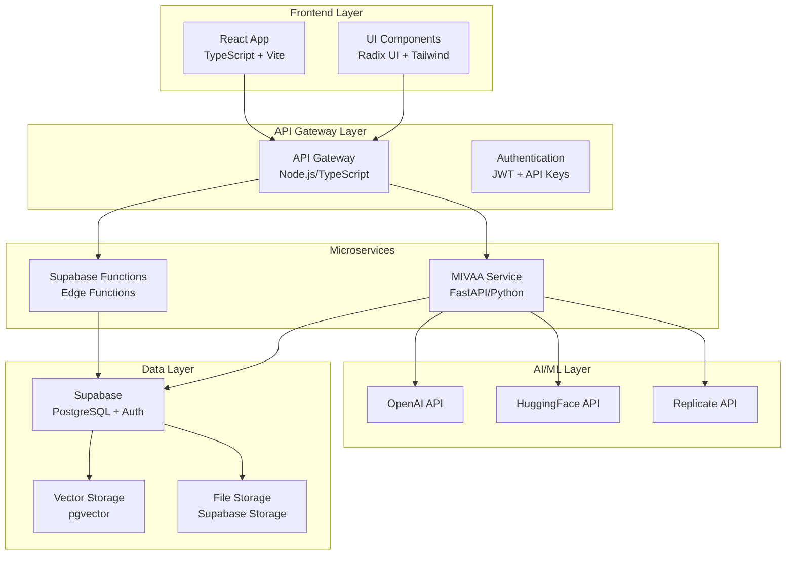
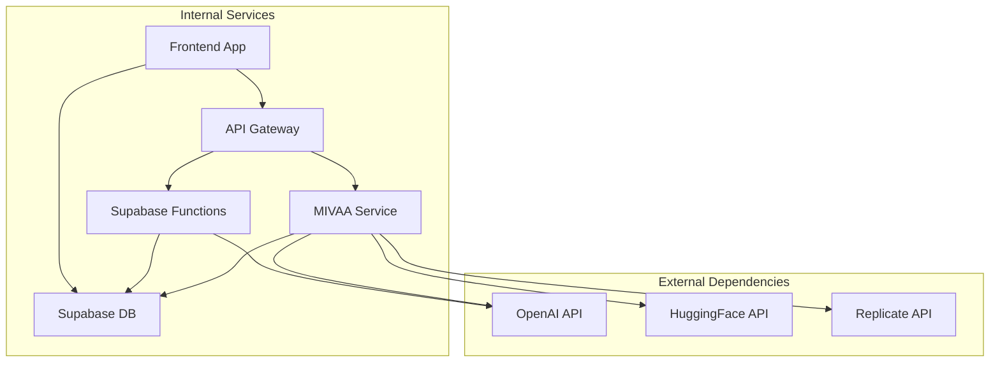
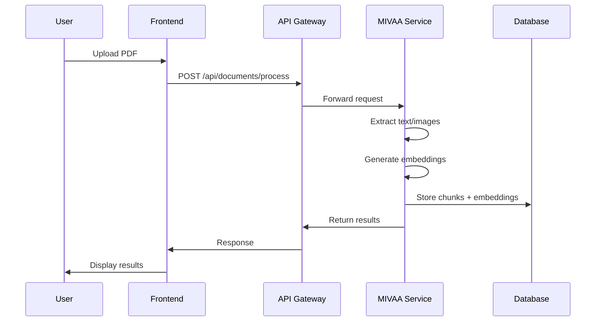
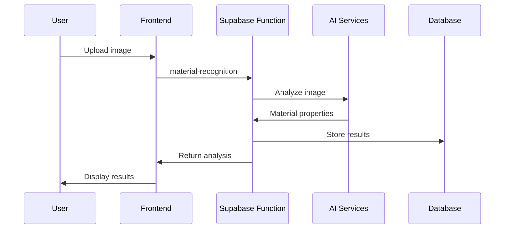
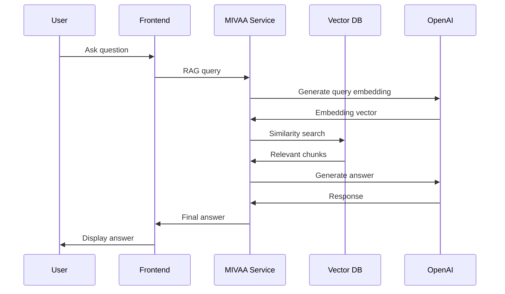
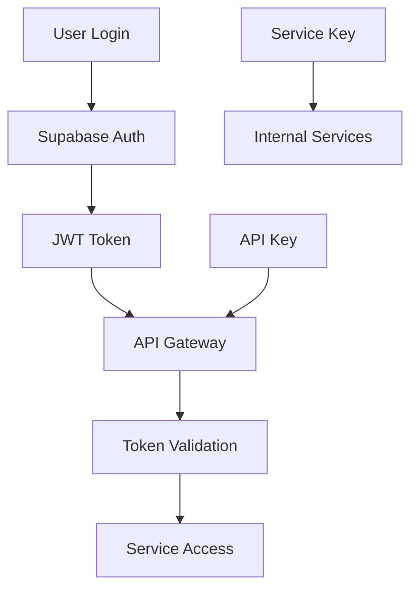

# Architecture & Services Documentation

## 🏗️ System Architecture Overview

The Material Kai Vision Platform follows a modern microservices architecture with clear separation of concerns:



## 📦 Service Inventory

### Frontend Services (React/TypeScript)

#### Core Application
- **Location**: `src/App.tsx`
- **Framework**: React 18 + TypeScript + Vite
- **Routing**: React Router DOM v7
- **State Management**: React Query + Context API

#### UI Components
- **Location**: `src/components/`
- **Library**: Radix UI primitives
- **Styling**: Tailwind CSS + CSS Variables
- **Icons**: Lucide React

#### Key Components:
- `Dashboard/` - Main application dashboard
- `Admin/` - Administrative interfaces
- `Recognition/` - Material recognition UI
- `3D/` - 3D visualization components
- `PDF/` - Document processing UI
- `AI/` - AI interaction interfaces

### Backend Services (Node.js/TypeScript)

#### API Gateway
- **Location**: `src/api/`
- **Purpose**: Request routing and authentication
- **Key Files**:
  - `routes.ts` - Route definitions
  - `mivaa-gateway.ts` - MIVAA service integration
  - `health.ts` - Health check endpoints

#### Service Layer
- **Location**: `src/services/`
- **Architecture**: Service-oriented with dependency injection
- **Key Services**:
  - `apiGateway/` - External API integrations
  - `ml/` - Machine learning services
  - `pdf/` - Document processing
  - `monitoring/` - System monitoring

### MIVAA Microservice (Python/FastAPI)

#### Core Application
- **Location**: `mivaa-pdf-extractor/app/`
- **Framework**: FastAPI + Pydantic
- **ASGI Server**: Uvicorn
- **Database**: Supabase (PostgreSQL)

#### Service Structure:
```
mivaa-pdf-extractor/
├── app/
│   ├── api/          # API routes
│   ├── core/         # Core functionality
│   ├── middleware/   # Request middleware
│   ├── models/       # Data models
│   ├── services/     # Business logic
│   └── utils/        # Utilities
├── tests/            # Test suite
└── deploy/           # Deployment configs
```

#### Key Features:
- PDF to Markdown conversion
- RAG (Retrieval-Augmented Generation)
- Vector embeddings
- Document search
- Image analysis

### Supabase Edge Functions

#### Available Functions:
- `crewai-3d-generation` - 3D model generation
- `enhanced-rag-search` - Advanced document search
- `material-recognition` - Material identification
- `material-scraper` - Web scraping for materials
- `nerf-processor` - NeRF 3D reconstruction
- `svbrdf-extractor` - Material property extraction

## 🔧 Service Dependencies

### Dependency Graph



### Service Communication

#### 1. Frontend ↔ Backend
- **Protocol**: HTTP/HTTPS
- **Format**: JSON REST API
- **Authentication**: JWT tokens + API keys

#### 2. Backend ↔ MIVAA
- **Protocol**: HTTP/HTTPS
- **Format**: JSON REST API
- **Authentication**: JWT tokens
- **Gateway**: Unified MIVAA gateway endpoint

#### 3. Services ↔ Supabase
- **Protocol**: HTTP/HTTPS + WebSocket (Realtime)
- **Authentication**: JWT + Service Role Key
- **Features**: Database, Auth, Storage, Functions

#### 4. Services ↔ External APIs
- **OpenAI**: REST API with Bearer tokens
- **HuggingFace**: REST API with API keys
- **Replicate**: REST API with tokens

## 🏛️ Architectural Patterns

### 1. Dependency Injection

**Implementation**: `src/di/`

```typescript
// Container setup
export class DIContainer {
  private services = new Map<string, any>();
  
  register<T>(name: string, factory: () => T): void {
    this.services.set(name, factory);
  }
  
  resolve<T>(name: string): T {
    const factory = this.services.get(name);
    return factory ? factory() : null;
  }
}
```

### 2. Service Factory Pattern

**Implementation**: `src/services/base/ServiceFactory.ts`

```typescript
export class ServiceFactory {
  static createApiService(config: ApiConfig): ApiService {
    return new ApiService(config);
  }
}
```

### 3. Circuit Breaker Pattern

**Implementation**: `src/services/circuitBreaker.ts`

```typescript
export class CircuitBreaker {
  // Prevents cascading failures
  // Implements timeout and retry logic
  // Monitors service health
}
```

### 4. Repository Pattern

**Implementation**: Database access abstraction

```typescript
interface IRepository<T> {
  findById(id: string): Promise<T | null>;
  save(entity: T): Promise<T>;
  delete(id: string): Promise<void>;
}
```

## 🔄 Data Flow Architecture

### 1. Document Processing Flow



### 2. Material Recognition Flow



### 3. RAG Query Flow



## 🔧 Configuration Management

### Environment-Based Configuration

**Development**:
```typescript
{
  environment: 'development',
  debug: true,
  apiTimeout: 30000,
  retryAttempts: 3,
  cacheEnabled: true
}
```

**Production**:
```typescript
{
  environment: 'production',
  debug: false,
  apiTimeout: 60000,
  retryAttempts: 5,
  cacheEnabled: true,
  rateLimiting: true
}
```

### Service Configuration

**API Gateway**:
```typescript
// src/config/apiConfig.ts
export const apiRegistry = new ApiRegistry();
apiRegistry.registerApi(openaiConfig);
apiRegistry.registerApi(huggingfaceConfig);
apiRegistry.registerApi(replicateConfig);
```

**MIVAA Service**:
```python
# mivaa-pdf-extractor/app/config.py
class Settings(BaseSettings):
    app_name: str = "MIVAA PDF Extractor"
    version: str = "1.0.0"
    debug: bool = False
    # ... other settings
```

## 📊 Performance Architecture

### Caching Strategy

**Multi-Layer Caching**:
1. **Browser Cache**: Static assets (1 year)
2. **CDN Cache**: API responses (1 hour)
3. **Application Cache**: Computed results (24 hours)
4. **Database Cache**: Query results (1 hour)

**Implementation**:
```typescript
// src/services/cache/cacheManager.ts
export class CacheManager {
  private memoryCache = new Map();
  private redisCache: Redis;
  
  async get(key: string): Promise<any> {
    // Check memory first, then Redis
  }
}
```

### Load Balancing

**Strategy**: Round-robin with health checks
**Implementation**: API Gateway level
**Monitoring**: Response time and error rates

### Horizontal Scaling

**Stateless Services**: All services designed to be stateless
**Database Scaling**: Read replicas for query optimization
**File Storage**: Distributed storage with Supabase

## 🔐 Security Architecture

### Authentication Flow



### Authorization Layers

1. **User Level**: JWT-based user authentication
2. **API Level**: API key validation
3. **Service Level**: Internal service authentication
4. **Resource Level**: Workspace-based access control

## 🚨 Architectural Issues

### 1. Missing Database Migrations

**Problem**: No version control for database schema
**Impact**: Deployment inconsistencies
**Solution**: Implement Supabase migrations

### 2. Inconsistent Error Handling

**Problem**: Different error formats across services
**Impact**: Poor debugging experience
**Solution**: Standardize error response format

### 3. No Service Discovery

**Problem**: Hardcoded service URLs
**Impact**: Difficult to scale and manage
**Solution**: Implement service registry

### 4. Limited Monitoring

**Problem**: Basic health checks only
**Impact**: Poor observability
**Solution**: Comprehensive monitoring stack

## 🔄 Deployment Architecture

### Development Environment

```
Local Machine
├── Frontend (localhost:5173)
├── API Gateway (localhost:3000)
├── MIVAA Service (localhost:8000)
└── Supabase (cloud)
```

### Production Environment

```
Vercel (Frontend)
├── Static Assets
├── API Routes
└── Edge Functions

External Services
├── MIVAA Service (Docker)
├── Supabase (Cloud)
└── AI APIs (Cloud)
```

## 📈 Scalability Considerations

### Current Limitations

1. **Single MIVAA Instance**: No horizontal scaling
2. **Memory-Based Caching**: Limited to single instance
3. **File Processing**: No distributed processing
4. **Database Connections**: Limited connection pooling

### Scaling Strategies

1. **Microservice Decomposition**: Split MIVAA into smaller services
2. **Container Orchestration**: Kubernetes deployment
3. **Distributed Caching**: Redis cluster
4. **Queue-Based Processing**: Async job processing

## 🔗 Related Documentation

- [Setup & Configuration](./setup-configuration.md) - Service setup
- [API Documentation](./api-documentation.md) - Service APIs
- [Security & Authentication](./security-authentication.md) - Security architecture
- [Database & Schema](./database-schema.md) - Data architecture
