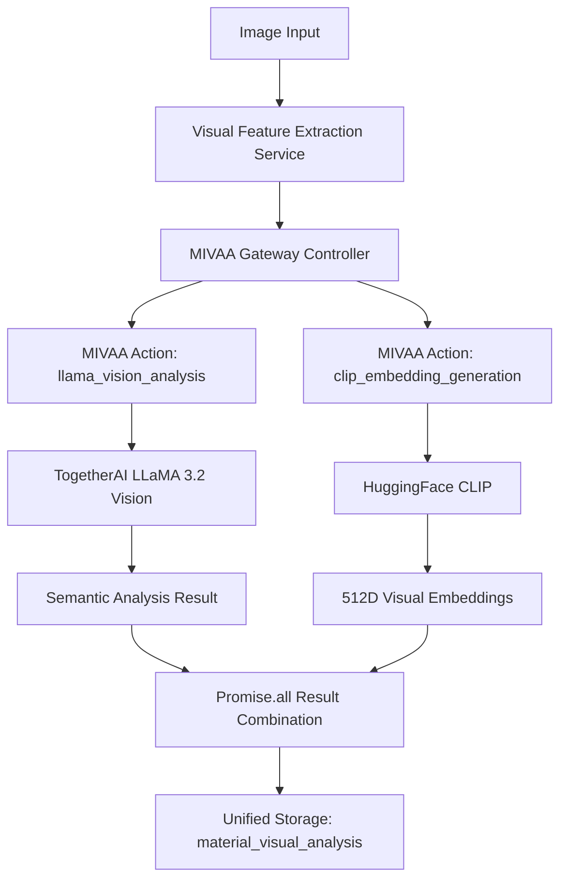

+++
# --- Basic Metadata ---
id = "MIVAA-UNIFIED-INTEGRATION-STRATEGY-V1"
title = "MIVAA Unified Integration Strategy: Modular LLaMA+CLIP Architecture"
context_type = "architecture"
scope = "Platform-wide MIVAA standardization with modular multimodal AI integration"
target_audience = ["architects", "backend-developers", "lead-backend", "lead-frontend"]
granularity = "comprehensive"
status = "active"
last_updated = "2025-09-09"
tags = ["mivaa", "llama", "clip", "multimodal", "architecture", "integration", "standardization"]
related_context = [
    "src/api/mivaa-gateway.ts",
    "src/services/visualFeatureExtractionService.ts", 
    "supabase/functions/hybrid-material-analysis/index.ts",
    "docs/architecture/MIVAA_Architecture_Assessment_20250830.md"
]
template_schema_doc = ".ruru/templates/toml-md/10_architecture.README.md"
relevance = "Critical: Defines unified multimodal AI architecture for platform"
+++

# MIVAA Unified Integration Strategy: Modular LLaMA+CLIP Architecture

## Executive Summary

This document outlines the comprehensive strategy for migrating the Material Kai Vision Platform from scattered OpenAI integrations to a unified, modular MIVAA-first architecture that preserves the sophisticated LLaMA 3.2 Vision + CLIP parallel processing capabilities while standardizing all multimodal AI operations through the MIVAA gateway.

## Current State Analysis

### Discovered Architecture Inconsistency
- **93 instances** of direct OpenAI API calls across **13 major functions**
- **Bypassing intended MIVAA gateway** architecture
- **LLaMA+CLIP integration** operates separately from MIVAA routing
- **Mixed integration patterns** creating maintenance and cost inefficiencies

### Current LLaMA+CLIP Integration Pattern
```typescript
// Current Pattern (visualFeatureExtractionService.ts)
✅ Parallel Processing: LLaMA semantic analysis + CLIP embeddings
✅ Complementary Outputs: Material classification + visual similarity
✅ Unified Storage: Both results in material_visual_analysis table
❌ Bypasses MIVAA Gateway: Direct TogetherAI/HuggingFace calls
```

## Target Architecture: Modular MIVAA Integration

### Core Principle: **Separate Parallel Actions**
Based on architectural review, the platform will implement separate MIVAA actions that can be called in parallel for maximum flexibility:

1. **`llama_vision_analysis`** - LLaMA 3.2 Vision semantic analysis
2. **`clip_embedding_generation`** - CLIP visual embeddings

### Modular Architecture Flow



## Implementation Specification

### 1. MIVAA Gateway Enhancement

**File**: [`src/api/mivaa-gateway.ts`](src/api/mivaa-gateway.ts:150)

**New Actions to Add**:
```typescript
// Extended endpoint mapping in MivaaGatewayController
'llama_vision_analysis': { 
  path: '/api/vision/llama-analysis', 
  method: 'POST' 
},
'clip_embedding_generation': { 
  path: '/api/vision/clip-embeddings', 
  method: 'POST' 
},
```

### 2. Client-Side Parallel Execution

**Primary Implementation**: [`src/services/visualFeatureExtractionService.ts`](src/services/visualFeatureExtractionService.ts:16)

**Current Foundation**:
- ✅ Already imports [`MivaaGatewayController`](src/services/visualFeatureExtractionService.ts:16)
- ✅ Has [`MaterialVisionAnalysisResult`](src/services/visualFeatureExtractionService.ts:31) interface
- ✅ Has [`MaterialVisionAnalysisRequest`](src/services/visualFeatureExtractionService.ts:60) interface
- ✅ Includes [`include_clip_analysis`](src/services/visualFeatureExtractionService.ts:77) option

**New Parallel Execution Pattern**:
```typescript
public static async extractVisualFeatures(request: VisualFeatureExtractionRequest) {
  
  // Parallel MIVAA Action Calls
  const [llamaAnalysis, clipEmbeddings] = await Promise.all([
    
    // LLaMA Vision Analysis
    this.mivaaGateway.makeRequest({
      action: 'llama_vision_analysis',
      payload: {
        image_data: request.image_data,
        image_url: request.image_url,
        analysis_type: request.analysis_options?.analysis_type || 'comprehensive',
        context: request.context
      }
    }),
    
    // CLIP Embedding Generation  
    this.mivaaGateway.makeRequest({
      action: 'clip_embedding_generation',
      payload: {
        image_data: request.image_data,
        image_url: request.image_url,
        embedding_type: 'visual_similarity'
      }
    })
  ]);

  // Preserve current result combination logic
  return this.combineResults(llamaAnalysis, clipEmbeddings, request);
}
```

### 3. Implementation Areas Across Platform

**Primary Migration Points**:

1. **Visual Feature Extraction**: [`src/services/visualFeatureExtractionService.ts`](src/services/visualFeatureExtractionService.ts:1)
   - **Current**: Direct LLaMA/CLIP calls
   - **Target**: Parallel MIVAA actions

2. **Hybrid Material Analysis**: [`supabase/functions/hybrid-material-analysis/index.ts`](supabase/functions/hybrid-material-analysis/index.ts)
   - **Current**: [`performVisualAnalysis()`](supabase/functions/hybrid-material-analysis/index.ts) with OpenAI calls
   - **Target**: MIVAA-routed multimodal analysis

3. **Visual Search Functions**: 
   - [`supabase/functions/visual-search-analyze/index.ts`](supabase/functions/visual-search-analyze/index.ts)
   - [`supabase/functions/material-recognition/index.ts`](supabase/functions/material-recognition/index.ts)

4. **AI Material Analysis**: [`supabase/functions/ai-material-analysis/index.ts`](supabase/functions/ai-material-analysis/index.ts)

### 4. Database Schema Preservation

**No Changes Required**: The existing [`material_visual_analysis`](src/services/visualFeatureExtractionService.ts:657) table schema supports MIVAA-routed results:

```sql
-- Current schema supports both LLaMA and CLIP results
llama_model_version TEXT,
llama_confidence_score FLOAT,
llama_processing_time_ms INTEGER,
clip_embedding JSONB,  -- 512D vector from CLIP
description_embedding JSONB,  -- Text embeddings
material_type_embedding JSONB
```

## Migration Strategy

### Phase 1: MIVAA Gateway Enhancement
- Add new `llama_vision_analysis` and `clip_embedding_generation` actions
- Implement MIVAA service endpoint routing
- Preserve existing gateway architecture

### Phase 2: Core Service Migration  
- Migrate [`visualFeatureExtractionService.ts`](src/services/visualFeatureExtractionService.ts:1) to parallel MIVAA calls
- Update result combination logic to handle MIVAA responses
- Maintain current performance characteristics

### Phase 3: Supabase Function Migration
- Migrate [`performVisualAnalysis()`](supabase/functions/hybrid-material-analysis/index.ts) function 
- Update all visual search and recognition functions
- Replace direct OpenAI calls with MIVAA routing

### Phase 4: Platform-Wide Standardization
- Migrate remaining 13 functions with OpenAI integrations
- Establish monitoring and fallback strategies
- Document cost and performance improvements

## Key Benefits

### Architectural Benefits
- **Centralized AI Management**: All multimodal AI through MIVAA gateway
- **Preserved Performance**: Parallel processing maintained
- **Enhanced Flexibility**: Modular actions for different use cases
- **Consistent Interface**: Unified [`GatewayRequest/GatewayResponse`](src/services/visualFeatureExtractionService.ts:17) pattern

### Operational Benefits  
- **Cost Optimization**: Centralized rate limiting and caching
- **Improved Monitoring**: Unified metrics and logging
- **Better Fallback**: Centralized error handling and recovery
- **Maintenance Efficiency**: Single integration point for AI services

## Implementation Priority

**High Priority** (Visual Analysis Functions):
1. [`visualFeatureExtractionService.ts`](src/services/visualFeatureExtractionService.ts:1) - Core visual pipeline
2. [`hybrid-material-analysis/index.ts`](supabase/functions/hybrid-material-analysis/index.ts) - Material analysis function
3. [`material-recognition/index.ts`](supabase/functions/material-recognition/index.ts) - Recognition workflows

**Medium Priority** (Search & Embedding Functions):
4. [`unified-material-search/index.ts`](supabase/functions/unified-material-search/index.ts)
5. [`enhanced-rag-search/index_optimized.ts`](supabase/functions/enhanced-rag-search/index_optimized.ts)
6. [`document-vector-search/index.ts`](supabase/functions/document-vector-search/index.ts)

**Lower Priority** (Specialized Functions):
7. [`voice-to-material/index.ts`](supabase/functions/voice-to-material/index.ts)
8. [`pdf-extract/index.ts`](supabase/functions/pdf-extract/index.ts)
9. Remaining OpenAI integration points

This modular approach ensures your sophisticated LLaMA+CLIP synergy is preserved while achieving complete MIVAA standardization across the platform.