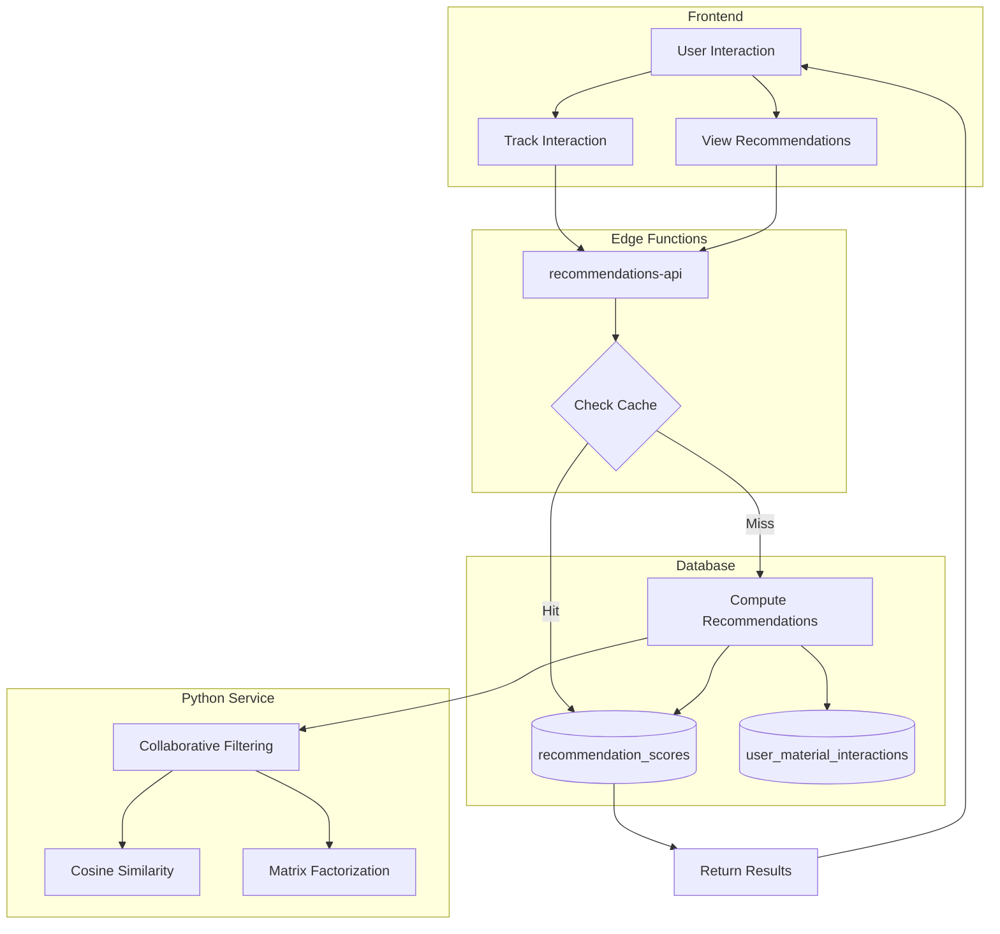

# Collaborative Filtering Recommendations System

Complete documentation for the collaborative filtering recommendation system that provides personalized material recommendations.

> **📚 Related Documentation:**
> - [System Architecture](./system-architecture.md) - Overall platform architecture
> - [API Endpoints](./api-endpoints.md) - Complete API reference

---

## 📋 Table of Contents

1. [Overview](#overview)
2. [Architecture](#architecture)
3. [Database Schema](#database-schema)
4. [Algorithms](#algorithms)
5. [API Endpoints](#api-endpoints)
6. [Frontend Integration](#frontend-integration)
7. [Performance & Caching](#performance--caching)
8. [Analytics](#analytics)

---

## Overview

The collaborative filtering system provides **personalized material recommendations** based on user behavior and interaction patterns.

### Key Features

✅ **User-User Collaborative Filtering** - "Users like you also liked..."  
✅ **Item-Item Collaborative Filtering** - "Materials similar to this..."  
✅ **Hybrid Recommendations** - Combining collaborative + content-based  
✅ **Interaction Tracking** - Track views, clicks, saves, purchases, ratings  
✅ **Smart Caching** - 7-day cache with automatic invalidation  
✅ **Real-time Analytics** - Track recommendation performance  

### Interaction Types

| Type | Weight | Description |
|------|--------|-------------|
| **view** | 1.0 | User viewed material page |
| **click** | 2.0 | User clicked on material |
| **save** | 3.0 | User saved material to favorites |
| **add_to_quote** | 4.0 | User added material to quote |
| **purchase** | 5.0 | User purchased material |
| **rate** | 1-5 | User rated material (uses actual rating value) |
| **share** | 3.0 | User shared material |

---

## Architecture



---

## Database Schema

### 1. user_material_interactions

Tracks all user interactions with materials for collaborative filtering.

```sql
CREATE TABLE user_material_interactions (
    id UUID PRIMARY KEY DEFAULT gen_random_uuid(),
    user_id UUID NOT NULL REFERENCES auth.users(id) ON DELETE CASCADE,
    workspace_id UUID NOT NULL REFERENCES workspaces(id) ON DELETE CASCADE,
    material_id UUID NOT NULL REFERENCES products(id) ON DELETE CASCADE,
    interaction_type TEXT NOT NULL CHECK (interaction_type IN ('view', 'click', 'save', 'purchase', 'rate', 'add_to_quote', 'share')),
    interaction_value FLOAT DEFAULT 1.0, -- Rating value (1-5), time spent (seconds), or weight
    session_id TEXT, -- Session identifier for grouping interactions
    metadata JSONB DEFAULT '{}'::jsonb, -- Additional context (source page, search query, etc.)
    created_at TIMESTAMPTZ DEFAULT NOW(),
    updated_at TIMESTAMPTZ DEFAULT NOW()
);
```

**Indexes:**
- `idx_user_interactions_user_id` - Fast user lookups
- `idx_user_interactions_material_id` - Fast material lookups
- `idx_user_interactions_workspace_id` - Workspace filtering
- `idx_user_interactions_user_material` - User-material composite
- `idx_user_interactions_workspace_material` - Workspace-material composite

---

### 2. recommendation_scores

Cached recommendation scores for fast retrieval.

```sql
CREATE TABLE recommendation_scores (
    id UUID PRIMARY KEY DEFAULT gen_random_uuid(),
    user_id UUID NOT NULL REFERENCES auth.users(id) ON DELETE CASCADE,
    workspace_id UUID NOT NULL REFERENCES workspaces(id) ON DELETE CASCADE,
    material_id UUID NOT NULL REFERENCES products(id) ON DELETE CASCADE,
    score FLOAT NOT NULL CHECK (score >= 0 AND score <= 1), -- Normalized score 0-1
    algorithm TEXT NOT NULL CHECK (algorithm IN ('collaborative', 'content', 'hybrid', 'user_user', 'item_item')),
    confidence FLOAT DEFAULT 0.5 CHECK (confidence >= 0 AND confidence <= 1), -- Confidence in recommendation
    metadata JSONB DEFAULT '{}'::jsonb, -- Algorithm-specific metadata (similar users, similar items, etc.)
    computed_at TIMESTAMPTZ DEFAULT NOW(),
    expires_at TIMESTAMPTZ DEFAULT (NOW() + INTERVAL '7 days'), -- Cache expiration
    created_at TIMESTAMPTZ DEFAULT NOW(),
    updated_at TIMESTAMPTZ DEFAULT NOW(),
    
    UNIQUE(user_id, material_id, algorithm)
);
```

**Indexes:**
- `idx_recommendation_scores_user_score` - Fast user recommendations
- `idx_recommendation_scores_workspace_score` - Workspace recommendations
- `idx_recommendation_scores_expires_at` - Cache cleanup

---

## Algorithms

### 1. User-User Collaborative Filtering

**"Users like you also liked..."**

**How it works:**
1. Build interaction vector for target user
2. Find users with similar interaction patterns (cosine similarity)
3. Recommend materials liked by similar users
4. Weight by similarity score and interaction value

**Example:**
```python
# User A: {material_1: 5.0, material_2: 3.0, material_3: 4.0}
# User B: {material_1: 4.0, material_2: 3.0, material_4: 5.0}
# Similarity: 0.85

# Recommend material_4 to User A with score: 0.85 * 5.0 = 4.25
```

**Minimum Requirements:**
- Target user: 3+ interactions
- Similar users: 3+ interactions
- Similarity threshold: 0.3

---

### 2. Item-Item Collaborative Filtering

**"Materials similar to this..."**

**How it works:**
1. Find users who interacted with target material
2. Find other materials these users interacted with
3. Calculate similarity based on common users
4. Rank by weighted overlap

**Example:**
```python
# Material A: Liked by [User1, User2, User3, User4]
# Material B: Liked by [User2, User3, User4, User5]
# Common users: 3
# Similarity: 3 / (4 + 4 - 3) = 0.6
```

**Minimum Requirements:**
- Target material: 3+ interactions
- Similar materials: 3+ interactions
- Similarity threshold: 0.3

---

### 3. Cosine Similarity

Used to calculate similarity between interaction vectors.

**Formula:**
```
similarity = (A · B) / (||A|| * ||B||)
```

**Where:**
- A · B = dot product of vectors
- ||A|| = magnitude of vector A
- ||B|| = magnitude of vector B

**Range:** 0.0 (no similarity) to 1.0 (identical)

---

## API Endpoints

### POST /functions/recommendations-api/track-interaction

Track user interaction with a material.

**Request:**
```typescript
{
  workspace_id: string;
  material_id: string;
  interaction_type: 'view' | 'click' | 'save' | 'purchase' | 'rate' | 'add_to_quote' | 'share';
  interaction_value?: number; // Default: 1.0
  session_id?: string;
  metadata?: Record<string, any>;
}
```

**Response:**
```typescript
{
  data: {
    id: string;
    user_id: string;
    workspace_id: string;
    material_id: string;
    interaction_type: string;
    interaction_value: number;
    created_at: string;
  };
  message: 'Interaction tracked successfully';
}
```

**Example:**
```typescript
const response = await fetch('/functions/recommendations-api/track-interaction', {
  method: 'POST',
  headers: {
    'Authorization': `Bearer ${token}`,
    'Content-Type': 'application/json',
  },
  body: JSON.stringify({
    workspace_id: 'workspace-123',
    material_id: 'material-456',
    interaction_type: 'view',
    interaction_value: 1.0,
    session_id: 'session-789',
    metadata: {
      source: 'search_results',
      query: 'blue ceramic tiles',
    },
  }),
});
```

---

### GET /functions/recommendations-api/for-user

Get personalized recommendations for the current user.

**Query Parameters:**
- `workspace_id` (required) - Workspace ID
- `limit` (optional) - Maximum number of recommendations (default: 20)
- `algorithm` (optional) - Algorithm to use: `user_user`, `item_item`, `hybrid` (default: `user_user`)

**Response:**
```typescript
{
  data: Array<{
    material_id: string;
    score: number; // 0-1
    confidence: number; // 0-1
    algorithm: string;
    metadata: {
      similar_users_count?: number;
      recommending_users?: number;
    };
  }>;
  cached: boolean;
}
```

**Example:**
```typescript
const response = await fetch(
  '/functions/recommendations-api/for-user?workspace_id=workspace-123&limit=20&algorithm=user_user',
  {
    headers: {
      'Authorization': `Bearer ${token}`,
    },
  }
);
```

---

### GET /functions/recommendations-api/similar-materials/{material_id}

Get materials similar to a specific material.

**Path Parameters:**
- `material_id` (required) - Material ID

**Query Parameters:**
- `workspace_id` (required) - Workspace ID
- `limit` (optional) - Maximum number of recommendations (default: 10)

**Response:**
```typescript
{
  data: Array<{
    material_id: string;
    score: number; // 0-1
    confidence: number; // 0-1
    algorithm: 'item_item';
    metadata: {
      source_material_id: string;
      common_users: number;
    };
  }>;
}
```

**Example:**
```typescript
const response = await fetch(
  '/functions/recommendations-api/similar-materials/material-456?workspace_id=workspace-123&limit=10',
  {
    headers: {
      'Authorization': `Bearer ${token}`,
    },
  }
);
```

---

### GET /functions/recommendations-api/analytics/{workspace_id}

Get recommendation analytics for a workspace.

**Path Parameters:**
- `workspace_id` (required) - Workspace ID

**Query Parameters:**
- `days` (optional) - Number of days to analyze (default: 30)

**Response:**
```typescript
{
  data: {
    workspace_id: string;
    period_days: number;
    total_interactions: number;
    interactions_by_type: Record<string, number>;
    cached_recommendations: number;
    recommendations_by_algorithm: Record<string, number>;
  };
}
```

**Example:**
```typescript
const response = await fetch(
  '/functions/recommendations-api/analytics/workspace-123?days=30',
  {
    headers: {
      'Authorization': `Bearer ${token}`,
    },
  }
);
```

---

### DELETE /functions/recommendations-api/cache

Invalidate recommendation cache.

**Query Parameters:**
- `workspace_id` (optional) - Filter by workspace
- `material_id` (optional) - Filter by material

**Response:**
```typescript
{
  message: 'Cache invalidated successfully';
}
```

**Example:**
```typescript
const response = await fetch(
  '/functions/recommendations-api/cache?workspace_id=workspace-123',
  {
    method: 'DELETE',
    headers: {
      'Authorization': `Bearer ${token}`,
    },
  }
);
```

---

## Frontend Integration

### 1. Track Interactions

Track user interactions automatically across the platform.

**Create Service:**
```typescript
// src/services/recommendationsService.ts
import { supabase } from '@/integrations/supabase/client';

export class RecommendationsService {
  private static async trackInteraction(
    materialId: string,
    interactionType: string,
    interactionValue: number = 1.0,
    metadata?: Record<string, any>
  ) {
    const { data: { session } } = await supabase.auth.getSession();
    if (!session) return;

    const workspaceId = localStorage.getItem('current_workspace_id');
    if (!workspaceId) return;

    await fetch('/functions/recommendations-api/track-interaction', {
      method: 'POST',
      headers: {
        'Authorization': `Bearer ${session.access_token}`,
        'Content-Type': 'application/json',
      },
      body: JSON.stringify({
        workspace_id: workspaceId,
        material_id: materialId,
        interaction_type: interactionType,
        interaction_value: interactionValue,
        session_id: session.user.id,
        metadata,
      }),
    });
  }

  static async trackView(materialId: string, metadata?: Record<string, any>) {
    await this.trackInteraction(materialId, 'view', 1.0, metadata);
  }

  static async trackClick(materialId: string, metadata?: Record<string, any>) {
    await this.trackInteraction(materialId, 'click', 2.0, metadata);
  }

  static async trackSave(materialId: string, metadata?: Record<string, any>) {
    await this.trackInteraction(materialId, 'save', 3.0, metadata);
  }

  static async trackRating(materialId: string, rating: number, metadata?: Record<string, any>) {
    await this.trackInteraction(materialId, 'rate', rating, metadata);
  }

  static async trackAddToQuote(materialId: string, metadata?: Record<string, any>) {
    await this.trackInteraction(materialId, 'add_to_quote', 4.0, metadata);
  }
}
```

**Usage in Components:**
```typescript
// In MaterialCard.tsx
import { RecommendationsService } from '@/services/recommendationsService';

const MaterialCard = ({ material }) => {
  const handleClick = () => {
    // Track click
    RecommendationsService.trackClick(material.id, {
      source: 'search_results',
      position: index,
    });

    // Navigate to material page
    navigate(`/materials/${material.id}`);
  };

  useEffect(() => {
    // Track view when card is visible
    const observer = new IntersectionObserver((entries) => {
      if (entries[0].isIntersecting) {
        RecommendationsService.trackView(material.id, {
          source: 'search_results',
        });
      }
    });

    observer.observe(cardRef.current);
    return () => observer.disconnect();
  }, [material.id]);

  return (
    <div ref={cardRef} onClick={handleClick}>
      {/* Material card content */}
    </div>
  );
};
```

---

### 2. Display Recommendations

**Create Recommendation Components:**

```typescript
// src/components/recommendations/RecommendedForYou.tsx
import { useEffect, useState } from 'react';
import { supabase } from '@/integrations/supabase/client';

export const RecommendedForYou = () => {
  const [recommendations, setRecommendations] = useState([]);
  const [loading, setLoading] = useState(true);

  useEffect(() => {
    const fetchRecommendations = async () => {
      const { data: { session } } = await supabase.auth.getSession();
      if (!session) return;

      const workspaceId = localStorage.getItem('current_workspace_id');
      if (!workspaceId) return;

      const response = await fetch(
        `/functions/recommendations-api/for-user?workspace_id=${workspaceId}&limit=20`,
        {
          headers: {
            'Authorization': `Bearer ${session.access_token}`,
          },
        }
      );

      const { data } = await response.json();
      setRecommendations(data);
      setLoading(false);
    };

    fetchRecommendations();
  }, []);

  if (loading) return <div>Loading recommendations...</div>;
  if (recommendations.length === 0) return null;

  return (
    <div className="recommended-for-you">
      <h2>Recommended for You</h2>
      <div className="recommendations-grid">
        {recommendations.map((rec) => (
          <MaterialCard key={rec.material_id} materialId={rec.material_id} />
        ))}
      </div>
    </div>
  );
};
```

```typescript
// src/components/recommendations/SimilarMaterials.tsx
export const SimilarMaterials = ({ materialId }: { materialId: string }) => {
  const [similar, setSimilar] = useState([]);

  useEffect(() => {
    const fetchSimilar = async () => {
      const { data: { session } } = await supabase.auth.getSession();
      if (!session) return;

      const workspaceId = localStorage.getItem('current_workspace_id');
      if (!workspaceId) return;

      const response = await fetch(
        `/functions/recommendations-api/similar-materials/${materialId}?workspace_id=${workspaceId}&limit=10`,
        {
          headers: {
            'Authorization': `Bearer ${session.access_token}`,
          },
        }
      );

      const { data } = await response.json();
      setSimilar(data);
    };

    fetchSimilar();
  }, [materialId]);

  if (similar.length === 0) return null;

  return (
    <div className="similar-materials">
      <h3>Similar Materials</h3>
      <div className="materials-carousel">
        {similar.map((rec) => (
          <MaterialCard key={rec.material_id} materialId={rec.material_id} />
        ))}
      </div>
    </div>
  );
};
```

---

## Performance & Caching

### Cache Strategy

**Cache TTL:** 7 days
**Cache Invalidation:** Automatic on new interactions
**Cache Key:** `(user_id, workspace_id, algorithm)`

### Performance Optimizations

1. **Indexed Lookups** - All queries use indexed columns
2. **Batch Processing** - Process multiple recommendations at once
3. **Lazy Loading** - Load recommendations only when needed
4. **Debouncing** - Debounce interaction tracking (1 second)
5. **Background Computation** - Compute recommendations asynchronously

### Scalability

- **User-User:** O(U * I) where U = users, I = interactions per user
- **Item-Item:** O(M * U) where M = materials, U = users per material
- **Cache Lookup:** O(1) with indexes

---

## Analytics

### Track Recommendation Performance

```typescript
const analytics = await fetch(
  '/functions/recommendations-api/analytics/workspace-123?days=30',
  {
    headers: {
      'Authorization': `Bearer ${token}`,
    },
  }
);

const { data } = await analytics.json();

console.log('Total Interactions:', data.total_interactions);
console.log('Interactions by Type:', data.interactions_by_type);
console.log('Cached Recommendations:', data.cached_recommendations);
console.log('Recommendations by Algorithm:', data.recommendations_by_algorithm);
```

### Metrics to Monitor

1. **Interaction Rate** - Interactions per user per day
2. **Click-Through Rate** - Clicks on recommendations / impressions
3. **Conversion Rate** - Purchases from recommendations / clicks
4. **Cache Hit Rate** - Cached responses / total requests
5. **Recommendation Coverage** - Users with recommendations / total users

---

## Summary

✅ **Database Schema Created** - 2 tables with proper indexes and RLS
✅ **Backend Service Built** - Python service with collaborative filtering
✅ **API Endpoints Created** - 5 endpoints for tracking and recommendations
✅ **Frontend Integration Ready** - Service and components documented
✅ **Caching Implemented** - 7-day cache with automatic invalidation
✅ **Analytics Available** - Track recommendation performance

**Next Steps:**
1. Build frontend components (RecommendedForYou, SimilarMaterials)
2. Integrate interaction tracking across platform
3. Test recommendation quality
4. Optimize algorithms based on analytics

**The collaborative filtering system is ready for integration!** 🚀

