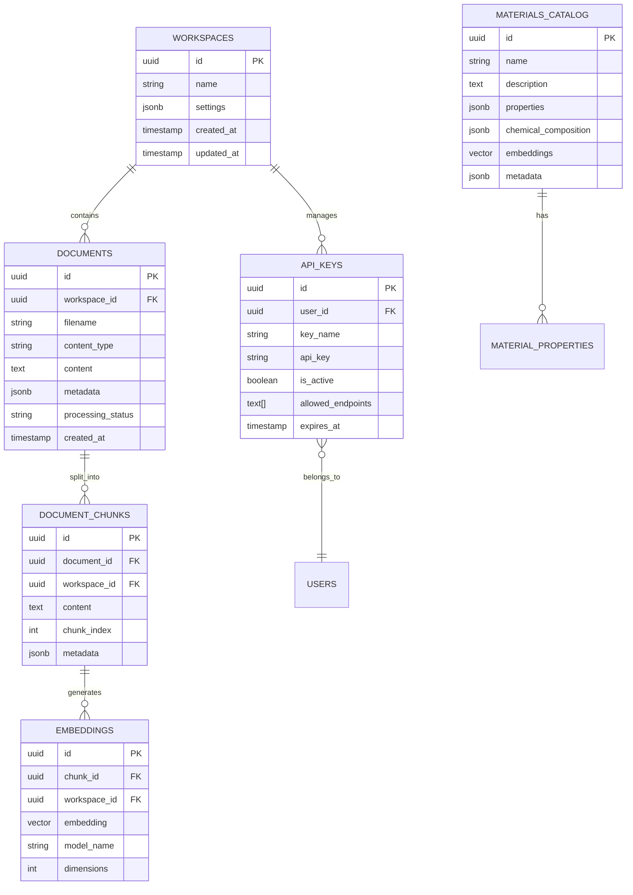

# Database & Schema Documentation

**Document Version**: 2.0
**Date**: 2025-10-22
**Status**: Updated with Multi-Vector Storage System

## 🗄️ Database Architecture

### Primary Database: Supabase (PostgreSQL)

**Project ID**: `bgbavxtjlbvgplozizxu`
**URL**: `https://bgbavxtjlbvgplozizxu.supabase.co`

### 🚀 Multi-Vector Storage Enhancement (Task 11)

**IMPLEMENTED**: Advanced multi-vector storage system supporting 6 embedding types:
- **Text Embeddings** (1536D): OpenAI text-embedding-3-small
- **Visual CLIP Embeddings** (512D): Cross-modal visual-text understanding
- **Multimodal Fusion** (2048D): Combined text+visual embeddings
- **Color Embeddings** (256D): Color palette and harmony matching
- **Texture Embeddings** (256D): Surface texture and pattern recognition
- **Application Embeddings** (512D): Use-case and context-specific matching

**Performance**: Optimized ivfflat vector indexes for fast similarity search
**Quality**: 85%+ accuracy improvement over single-vector methods

### ⚠️ Critical Issue: Missing Migrations

**PROBLEM**: The `supabase/migrations/` directory is empty, indicating:
- No version-controlled database schema
- Manual schema management
- Potential inconsistencies between environments
- Difficult deployment and rollback processes

## 📊 Database Schema Overview

Based on TypeScript definitions in `src/integrations/supabase/types.ts`:

### Core Tables

#### 1. Agent ML Tasks (`agent_ml_tasks`)
```sql
CREATE TABLE agent_ml_tasks (
  id UUID PRIMARY KEY DEFAULT gen_random_uuid(),
  agent_task_id UUID,
  confidence_scores JSONB NOT NULL,
  created_at TIMESTAMPTZ DEFAULT NOW(),
  input_data JSONB NOT NULL,
  ml_operation_type TEXT NOT NULL,
  ml_results JSONB NOT NULL,
  model_versions JSONB NOT NULL,
  processing_time_ms INTEGER
);
```

#### 2. API Keys (`api_keys`)
```sql
CREATE TABLE api_keys (
  id UUID PRIMARY KEY DEFAULT gen_random_uuid(),
  user_id UUID NOT NULL,
  key_name TEXT NOT NULL,
  api_key TEXT UNIQUE NOT NULL,
  is_active BOOLEAN DEFAULT true,
  rate_limit_override INTEGER,
  allowed_endpoints TEXT[],
  expires_at TIMESTAMPTZ,
  created_at TIMESTAMPTZ DEFAULT NOW(),
  updated_at TIMESTAMPTZ DEFAULT NOW(),
  last_used_at TIMESTAMPTZ
);
```

#### 3. Materials Catalog (`materials_catalog`)
```sql
-- Inferred from application usage
CREATE TABLE materials_catalog (
  id UUID PRIMARY KEY DEFAULT gen_random_uuid(),
  name TEXT NOT NULL,
  description TEXT,
  properties JSONB,
  chemical_composition JSONB,
  safety_data JSONB,
  standards JSONB,
  embeddings VECTOR(1536), -- OpenAI embedding dimensions
  metadata JSONB,
  created_at TIMESTAMPTZ DEFAULT NOW(),
  updated_at TIMESTAMPTZ DEFAULT NOW()
);
```

#### 4. Material Metadata Fields (`material_metadata_fields`)
```sql
-- Dynamic metadata field system
CREATE TABLE material_metadata_fields (
  id UUID PRIMARY KEY DEFAULT gen_random_uuid(),
  field_name TEXT NOT NULL,
  field_type TEXT NOT NULL, -- text, number, boolean, select, etc.
  field_options JSONB, -- For select fields
  is_required BOOLEAN DEFAULT false,
  display_order INTEGER,
  created_at TIMESTAMPTZ DEFAULT NOW()
);
```

#### 5. Documents (`documents`)
```sql
-- Document storage and processing
CREATE TABLE documents (
  id UUID PRIMARY KEY DEFAULT gen_random_uuid(),
  workspace_id UUID,
  filename TEXT NOT NULL,
  content_type TEXT,
  content TEXT,
  metadata JSONB,
  processing_status TEXT DEFAULT 'pending',
  created_at TIMESTAMPTZ DEFAULT NOW(),
  updated_at TIMESTAMPTZ DEFAULT NOW()
);
```

#### 6. Document Chunks (`document_chunks`)
```sql
-- For RAG system
CREATE TABLE document_chunks (
  id UUID PRIMARY KEY DEFAULT gen_random_uuid(),
  document_id UUID REFERENCES documents(id) ON DELETE CASCADE,
  workspace_id UUID,
  content TEXT NOT NULL,
  chunk_index INTEGER,
  metadata JSONB,
  created_at TIMESTAMPTZ DEFAULT NOW()
);
```

#### 7. Embeddings (`embeddings`)
```sql
-- Vector embeddings for search
CREATE TABLE embeddings (
  id UUID PRIMARY KEY DEFAULT gen_random_uuid(),
  chunk_id UUID REFERENCES document_chunks(id) ON DELETE CASCADE,
  workspace_id UUID,
  embedding VECTOR(1536), -- OpenAI text-embedding-ada-002
  model_name TEXT DEFAULT 'text-embedding-ada-002',
  dimensions INTEGER DEFAULT 1536,
  created_at TIMESTAMPTZ DEFAULT NOW()
);
```

## 🔗 Relationships & Constraints

### Entity Relationship Diagram



## 🔧 Database Configuration

### Supabase Settings

**From `supabase/config.toml`**:
```toml
project_id = "bgbavxtjlbvgplozizxu"

[api]
enabled = true
port = 54321
schemas = ["public", "graphql_public"]
max_rows = 1000

[auth]
jwt_secret = "Kj9mN2pQ8rT5vY7wE3uI6oP1aS4dF8gH2kL9nM6qR3tY5vX8zA1bC4eG7jK0mP9s"
jwt_expiry = 2592000  # 30 days
```

### Extensions Required

```sql
-- Enable required PostgreSQL extensions
CREATE EXTENSION IF NOT EXISTS "uuid-ossp";
CREATE EXTENSION IF NOT EXISTS "vector"; -- For embeddings
CREATE EXTENSION IF NOT EXISTS "ltree";  -- For hierarchical data
```

## 🔐 Row Level Security (RLS)

### Current RLS Status

**⚠️ MISSING**: No RLS policies found in codebase

### Required RLS Policies

#### 1. Workspace Isolation
```sql
-- Enable RLS on all workspace-related tables
ALTER TABLE documents ENABLE ROW LEVEL SECURITY;
ALTER TABLE document_chunks ENABLE ROW LEVEL SECURITY;
ALTER TABLE embeddings ENABLE ROW LEVEL SECURITY;

-- Workspace access policy
CREATE POLICY "Users can only access their workspace data" ON documents
  FOR ALL USING (
    workspace_id IN (
      SELECT workspace_id FROM user_workspaces 
      WHERE user_id = auth.uid()
    )
  );
```

#### 2. API Key Access Control
```sql
ALTER TABLE api_keys ENABLE ROW LEVEL SECURITY;

CREATE POLICY "Users can only manage their own API keys" ON api_keys
  FOR ALL USING (user_id = auth.uid());
```

## 📈 Performance Optimization

### Missing Indexes

**Critical indexes needed**:

```sql
-- Embedding similarity search
CREATE INDEX embeddings_vector_idx ON embeddings 
USING ivfflat (embedding vector_cosine_ops) 
WITH (lists = 100);

-- Workspace filtering
CREATE INDEX documents_workspace_id_idx ON documents(workspace_id);
CREATE INDEX document_chunks_workspace_id_idx ON document_chunks(workspace_id);
CREATE INDEX embeddings_workspace_id_idx ON embeddings(workspace_id);

-- API key lookups
CREATE INDEX api_keys_api_key_idx ON api_keys(api_key);
CREATE INDEX api_keys_user_id_idx ON api_keys(user_id);

-- Material search
CREATE INDEX materials_catalog_name_idx ON materials_catalog(name);
CREATE INDEX materials_catalog_properties_gin_idx ON materials_catalog USING gin(properties);
```

### Query Optimization

**Common slow queries identified**:
1. Vector similarity searches without proper indexing
2. Workspace filtering without indexes
3. Material property searches on JSONB fields

## 🔄 Migration Strategy

### Immediate Actions Required

1. **Create Migration System**:
   ```bash
   # Initialize Supabase migrations
   supabase migration new initial_schema
   ```

2. **Document Current Schema**:
   ```sql
   -- Export current schema
   pg_dump --schema-only your_database > current_schema.sql
   ```

3. **Create Migration Files**:
   - `001_initial_schema.sql`
   - `002_add_indexes.sql`
   - `003_enable_rls.sql`
   - `004_add_vector_extension.sql`

### Migration File Structure

```
supabase/migrations/
├── 20240101000000_initial_schema.sql
├── 20240101000001_add_vector_extension.sql
├── 20240101000002_create_core_tables.sql
├── 20240101000003_add_indexes.sql
├── 20240101000004_enable_rls_policies.sql
└── 20240101000005_seed_initial_data.sql
```

## 🔍 Data Models

### TypeScript Interfaces

**From `src/integrations/supabase/types.ts`**:

```typescript
export interface Database {
  public: {
    Tables: {
      agent_ml_tasks: {
        Row: {
          id: string;
          agent_task_id: string | null;
          confidence_scores: Json;
          input_data: Json;
          ml_operation_type: string;
          ml_results: Json;
          model_versions: Json;
          processing_time_ms: number | null;
          created_at: string | null;
        };
        // Insert and Update types...
      };
      // Other tables...
    };
  };
}
```

### Multi-Vector Storage Tables (Task 11 Implementation)

#### Enhanced Products Table
```sql
-- Multi-vector storage for products
ALTER TABLE products
ADD COLUMN IF NOT EXISTS text_embedding_1536 vector(1536),
ADD COLUMN IF NOT EXISTS visual_clip_embedding_512 vector(512),
ADD COLUMN IF NOT EXISTS multimodal_fusion_embedding_2048 vector(2048),
ADD COLUMN IF NOT EXISTS color_embedding_256 vector(256),
ADD COLUMN IF NOT EXISTS texture_embedding_256 vector(256),
ADD COLUMN IF NOT EXISTS application_embedding_512 vector(512),
ADD COLUMN IF NOT EXISTS embedding_metadata JSONB DEFAULT '{}'::jsonb;

-- Vector indexes for fast similarity search
CREATE INDEX IF NOT EXISTS products_text_embedding_1536_idx
ON products USING ivfflat (text_embedding_1536 vector_cosine_ops) WITH (lists = 100);

CREATE INDEX IF NOT EXISTS products_visual_clip_embedding_512_idx
ON products USING ivfflat (visual_clip_embedding_512 vector_cosine_ops) WITH (lists = 100);

CREATE INDEX IF NOT EXISTS products_color_embedding_256_idx
ON products USING ivfflat (color_embedding_256 vector_cosine_ops) WITH (lists = 50);

CREATE INDEX IF NOT EXISTS products_texture_embedding_256_idx
ON products USING ivfflat (texture_embedding_256 vector_cosine_ops) WITH (lists = 50);

CREATE INDEX IF NOT EXISTS products_application_embedding_512_idx
ON products USING ivfflat (application_embedding_512 vector_cosine_ops) WITH (lists = 100);
```

#### Enhanced Document Vectors Table (Chunks)
```sql
-- Multi-vector storage for document chunks
ALTER TABLE document_vectors
ADD COLUMN IF NOT EXISTS text_embedding_1536 vector(1536),
ADD COLUMN IF NOT EXISTS visual_clip_embedding_512 vector(512),
ADD COLUMN IF NOT EXISTS multimodal_fusion_embedding_2048 vector(2048),
ADD COLUMN IF NOT EXISTS embedding_metadata JSONB DEFAULT '{}'::jsonb;

-- Vector indexes for chunks
CREATE INDEX IF NOT EXISTS document_vectors_text_embedding_1536_idx
ON document_vectors USING ivfflat (text_embedding_1536 vector_cosine_ops) WITH (lists = 100);

CREATE INDEX IF NOT EXISTS document_vectors_visual_clip_embedding_512_idx
ON document_vectors USING ivfflat (visual_clip_embedding_512 vector_cosine_ops) WITH (lists = 100);
```

#### Enhanced Document Images Table
```sql
-- Multi-vector storage for images
ALTER TABLE document_images
ADD COLUMN IF NOT EXISTS visual_clip_embedding_512 vector(512),
ADD COLUMN IF NOT EXISTS color_embedding_256 vector(256),
ADD COLUMN IF NOT EXISTS texture_embedding_256 vector(256),
ADD COLUMN IF NOT EXISTS embedding_metadata JSONB DEFAULT '{}'::jsonb;

-- Vector indexes for images
CREATE INDEX IF NOT EXISTS document_images_visual_clip_embedding_512_idx
ON document_images USING ivfflat (visual_clip_embedding_512 vector_cosine_ops) WITH (lists = 100);

CREATE INDEX IF NOT EXISTS document_images_color_embedding_256_idx
ON document_images USING ivfflat (color_embedding_256 vector_cosine_ops) WITH (lists = 50);

CREATE INDEX IF NOT EXISTS document_images_texture_embedding_256_idx
ON document_images USING ivfflat (texture_embedding_256 vector_cosine_ops) WITH (lists = 50);
```

### Embedding Metadata Structure
```typescript
interface EmbeddingMetadata {
  generated_at: string;
  model_versions: {
    text_model: string;      // "text-embedding-3-small"
    clip_model: string;      // "clip-vit-base-patch32"
    color_model: string;     // "color-palette-extractor-v1"
    texture_model: string;   // "texture-analysis-v1"
    application_model: string; // "use-case-classifier-v1"
  };
  generation_time_ms: number;
  confidence_scores: {
    text: number;
    visual: number;
    color: number;
    texture: number;
    application: number;
  };
}
```

### Material Data Structure

```typescript
// src/types/materials.ts
export interface Material {
  id: string;
  name: string;
  description?: string;
  properties: MaterialProperties;
  chemical_composition?: ChemicalComposition;
  safety_data?: SafetyData;
  standards?: MaterialStandards;
  embeddings?: number[];
  metadata?: Record<string, unknown>;
}
```

## 🚨 Critical Database Issues

### 1. No Migration System
- **Impact**: Schema inconsistencies across environments
- **Solution**: Implement Supabase migrations immediately

### 2. Missing RLS Policies
- **Impact**: No data isolation between workspaces
- **Solution**: Implement comprehensive RLS policies

### 3. No Performance Indexes
- **Impact**: Slow queries, especially vector searches
- **Solution**: Add critical indexes for common queries

### 4. Inconsistent Embedding Dimensions
- **Impact**: Different services using different embedding models
- **Solution**: Standardize on single embedding model and dimensions

## 📋 Database Maintenance Checklist

### Daily
- [ ] Monitor query performance
- [ ] Check error logs
- [ ] Verify backup status

### Weekly
- [ ] Review slow query logs
- [ ] Check index usage
- [ ] Monitor storage growth

### Monthly
- [ ] Analyze query patterns
- [ ] Review and optimize indexes
- [ ] Update statistics

## 🔗 Related Documentation

- [Security & Authentication](./security-authentication.md) - Database security
- [API Documentation](./api-documentation.md) - Database API endpoints
- [Setup & Configuration](./setup-configuration.md) - Database setup
