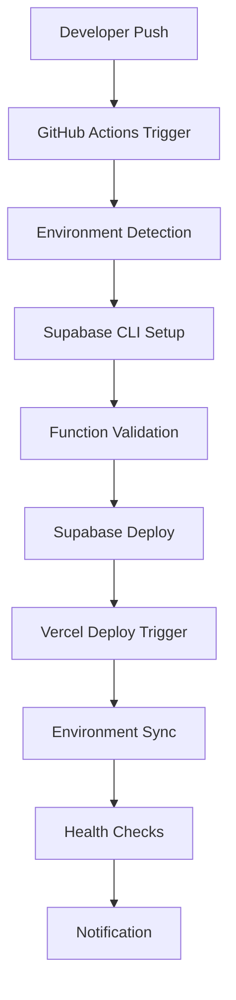

# Supabase Deployment Service Architecture

## Overview

This document outlines the architecture for a comprehensive deployment service that automates the deployment of Supabase Edge Functions and integrates with the Vercel deployment process for the Material Kai Vision Platform.

## Current Project Analysis

### Existing Infrastructure
- **Frontend**: React/TypeScript with Vite build system
- **Backend**: 21 Supabase Edge Functions (Deno-based)
- **Database**: Supabase PostgreSQL with migrations
- **Hosting**: Vercel (inferred from project structure)
- **CI/CD**: None currently implemented

### Supabase Functions Inventory
1. **AI/ML Functions**: material-recognition, ai-material-analysis, crewai-3d-generation, enhanced-crewai, huggingface-model-trainer, nerf-processor, spaceformer-analysis, svbrdf-extractor
2. **Search & RAG**: vector-similarity-search, enhanced-rag-search, rag-knowledge-search
3. **Processing**: ocr-processing, convertapi-pdf-processor, material-scraper, parse-sitemap, scrape-single-page, scrape-session-manager
4. **Core Services**: api-gateway, voice-to-material, style-analysis, material-properties-analysis

## Architecture Design

### 1. Deployment Pipeline Overview



### 2. Core Components

#### 2.1 GitHub Actions Workflows
- **Main Deployment**: `.github/workflows/deploy.yml`
- **Function Testing**: `.github/workflows/test-functions.yml`
- **Environment Sync**: `.github/workflows/sync-env.yml`

#### 2.2 Deployment Scripts
- **Supabase Deployer**: `scripts/deploy-supabase.js`
- **Environment Manager**: `scripts/manage-env.js`
- **Health Checker**: `scripts/health-check.js`

#### 2.3 Configuration Management
- **Environment Templates**: `config/env.template`
- **Deployment Config**: `config/deployment.json`
- **Function Mapping**: `config/function-mapping.json`

### 3. Environment Strategy

#### 3.1 Environment Tiers
1. **Development**: Feature branches, personal Supabase projects
2. **Staging**: `develop` branch, shared staging environment
3. **Production**: `main` branch, production Supabase project

#### 3.2 Environment Variables
```bash
# Supabase Configuration
SUPABASE_PROJECT_ID=bgbavxtjlbvgplozizxu
SUPABASE_ACCESS_TOKEN=<secret>
SUPABASE_DB_PASSWORD=<secret>

# Vercel Integration
VERCEL_TOKEN=<secret>
VERCEL_PROJECT_ID=<project-id>

# External Services
CONVERTAPI_SECRET=<secret>
HUGGINGFACE_API_KEY=<secret>
```

### 4. Deployment Workflow

#### 4.1 Trigger Conditions
- **Automatic**: Push to `main` or `develop` branches
- **Manual**: Workflow dispatch with environment selection
- **Scheduled**: Daily health checks and dependency updates

#### 4.2 Deployment Steps
1. **Pre-deployment**
   - Validate function syntax
   - Check environment variables
   - Run function tests
   - Backup current deployment

2. **Supabase Deployment**
   - Deploy database migrations
   - Deploy edge functions
   - Update function configurations
   - Verify function health

3. **Vercel Integration**
   - Trigger Vercel deployment
   - Update environment variables
   - Sync deployment status

4. **Post-deployment**
   - Run integration tests
   - Update monitoring dashboards
   - Send notifications

### 5. Security & Secrets Management

#### 5.1 GitHub Secrets
```yaml
secrets:
  SUPABASE_ACCESS_TOKEN: ${{ secrets.SUPABASE_ACCESS_TOKEN }}
  SUPABASE_DB_PASSWORD: ${{ secrets.SUPABASE_DB_PASSWORD }}
  VERCEL_TOKEN: ${{ secrets.VERCEL_TOKEN }}
  CONVERTAPI_SECRET: ${{ secrets.CONVERTAPI_SECRET }}
  HUGGINGFACE_API_KEY: ${{ secrets.HUGGINGFACE_API_KEY }}
```

#### 5.2 Environment Isolation
- Separate Supabase projects per environment
- Environment-specific secret management
- Network access controls

### 6. Monitoring & Observability

#### 6.1 Health Checks
- Function availability monitoring
- Response time tracking
- Error rate monitoring
- Database connection health

#### 6.2 Logging Strategy
- Centralized logging via Supabase Edge Functions logs
- GitHub Actions workflow logs
- Custom deployment metrics

#### 6.3 Alerting
- Deployment failure notifications
- Function health alerts
- Performance degradation warnings

### 7. Rollback Strategy

#### 7.1 Automated Rollback Triggers
- Function deployment failures
- Health check failures
- Critical error rate thresholds

#### 7.2 Rollback Process
1. Identify last known good deployment
2. Restore function code and configuration
3. Verify system health
4. Update monitoring dashboards

### 8. Integration Points

#### 8.1 Vercel Integration
- Automatic deployment triggers
- Environment variable synchronization
- Build status reporting

#### 8.2 External Services
- ConvertAPI configuration management
- Hugging Face model deployment
- Third-party API key rotation

### 9. Performance Considerations

#### 9.1 Deployment Optimization
- Parallel function deployment
- Incremental deployments (changed functions only)
- Caching strategies for dependencies

#### 9.2 Function Performance
- Cold start optimization
- Memory allocation tuning
- Connection pooling for database access

### 10. Disaster Recovery

#### 10.1 Backup Strategy
- Automated database backups
- Function code versioning
- Configuration snapshots

#### 10.2 Recovery Procedures
- Point-in-time recovery
- Cross-region failover
- Data integrity verification

## Implementation Phases

### Phase 1: Core Infrastructure (Week 1)
- [ ] GitHub Actions workflow setup
- [ ] Basic Supabase deployment script
- [ ] Environment configuration management
- [ ] Secret management implementation

### Phase 2: Integration & Testing (Week 2)
- [ ] Vercel integration hooks
- [ ] Automated testing pipeline
- [ ] Health check implementation
- [ ] Basic monitoring setup

### Phase 3: Advanced Features (Week 3)
- [ ] Rollback mechanisms
- [ ] Performance optimization
- [ ] Advanced monitoring
- [ ] Documentation and training

### Phase 4: Production Hardening (Week 4)
- [ ] Security audit
- [ ] Load testing
- [ ] Disaster recovery testing
- [ ] Production deployment

## Success Metrics

### Deployment Metrics
- Deployment success rate: >99%
- Deployment time: <5 minutes
- Rollback time: <2 minutes
- Zero-downtime deployments: 100%

### Operational Metrics
- Function availability: >99.9%
- Mean time to recovery: <10 minutes
- Alert response time: <5 minutes
- Documentation coverage: 100%

## Risk Assessment

### High Risk
- **Database migration failures**: Mitigated by backup/restore procedures
- **Function deployment conflicts**: Mitigated by staging environment testing
- **Secret exposure**: Mitigated by proper secret management

### Medium Risk
- **Third-party service outages**: Mitigated by retry mechanisms
- **Performance degradation**: Mitigated by monitoring and alerting
- **Configuration drift**: Mitigated by Infrastructure as Code

### Low Risk
- **Documentation gaps**: Mitigated by automated documentation generation
- **Team knowledge gaps**: Mitigated by training and runbooks

## Conclusion

This architecture provides a robust, scalable, and secure deployment pipeline for the Material Kai Vision Platform's Supabase infrastructure. The phased implementation approach ensures minimal disruption while building comprehensive deployment capabilities.

The design emphasizes automation, observability, and reliability while maintaining flexibility for future enhancements and scaling requirements.