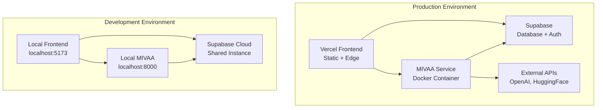

# Deployment Guide

## 🚀 Deployment Architecture

The Material Kai Vision Platform uses a multi-service deployment strategy:

1. **Frontend**: Vercel (Static hosting + Edge functions)
2. **MIVAA Service**: Docker containers (Self-hosted or cloud)
3. **Database**: Supabase (Managed PostgreSQL)
4. **External APIs**: Third-party services (OpenAI, HuggingFace, Replicate)

## 🏗️ Infrastructure Overview



## 🔧 Environment Configuration

### Production Environment Variables

#### Frontend (Set in Vercel Production Environment)
```bash
# Application
NODE_ENV=production
VITE_DEBUG=false

# Supabase
SUPABASE_URL=https://bgbavxtjlbvgplozizxu.supabase.co
SUPABASE_ANON_KEY=your_production_anon_key

# Services
VITE_MIVAA_SERVICE_URL=https://your-mivaa-service.com
VITE_MATERIAL_KAI_API_KEY=your_production_api_key

# External APIs
VITE_OPENAI_API_KEY=your_production_openai_key
VITE_HUGGINGFACE_API_KEY=your_production_hf_key
VITE_REPLICATE_API_TOKEN=your_production_replicate_token

# Security
VITE_ALLOWED_ORIGINS=https://your-domain.com
```

#### MIVAA Service (Set in Deployment Platform)
```bash
# Application
ENVIRONMENT=production
DEBUG=false
LOG_LEVEL=ERROR
HOST=0.0.0.0
PORT=8000

# Database
SUPABASE_URL=https://bgbavxtjlbvgplozizxu.supabase.co
SUPABASE_ANON_KEY=your_production_anon_key
SUPABASE_SERVICE_ROLE_KEY=your_production_service_key

# Security
JWT_SECRET_KEY=your_secure_production_jwt_secret
CORS_ORIGINS=https://your-domain.com
RATE_LIMIT_REQUESTS=50
RATE_LIMIT_WINDOW=60

# Performance
MAX_WORKERS=4
CACHE_TTL=3600
DATABASE_POOL_SIZE=20

# Monitoring
SENTRY_DSN=your_sentry_dsn
LOG_FILE=/var/log/mivaa/app.log
```

## 📦 Frontend Deployment (Vercel)

### Vercel Configuration

**File**: `vercel.json`
```json
{
  "buildCommand": "npm run build",
  "outputDirectory": "dist",
  "framework": "vite",
  "headers": [
    {
      "source": "/assets/(.*)",
      "headers": [
        {
          "key": "Cache-Control",
          "value": "public, max-age=31536000, immutable"
        }
      ]
    },
    {
      "source": "/(.*)",
      "headers": [
        {
          "key": "X-Content-Type-Options",
          "value": "nosniff"
        },
        {
          "key": "X-Frame-Options",
          "value": "DENY"
        },
        {
          "key": "X-XSS-Protection",
          "value": "1; mode=block"
        }
      ]
    }
  ]
}
```

### Deployment Steps

1. **Connect Repository**:
   ```bash
   # Install Vercel CLI
   npm install -g vercel
   
   # Login and link project
   vercel login
   vercel link
   ```

2. **Configure Environment Variables**:
   ```bash
   # Set production environment variables
   vercel env add SUPABASE_URL production
   vercel env add SUPABASE_ANON_KEY production
   vercel env add VITE_MIVAA_SERVICE_URL production
   # ... add all required variables
   ```

3. **Deploy**:
   ```bash
   # Deploy to production
   vercel --prod
   
   # Or use automatic deployment via Git
   git push origin main  # Triggers automatic deployment
   ```

### Build Optimization

**Vite Configuration** (`vite.config.ts`):
```typescript
export default defineConfig({
  build: {
    rollupOptions: {
      output: {
        manualChunks: {
          vendor: ['react', 'react-dom'],
          ui: ['@radix-ui/react-dialog', '@radix-ui/react-dropdown-menu'],
          supabase: ['@supabase/supabase-js'],
          utils: ['clsx', 'tailwind-merge', 'lucide-react'],
        },
      },
    },
    sourcemap: true,
    chunkSizeWarningLimit: 1000,
  },
});
```

## 🐳 MIVAA Service Deployment (Docker)

### 🚀 Deployment Options

#### 🔄 Default Deployment (Recommended)
- **Automatic**: Triggers on push to `main` or `production` branches
- **Fast & Reliable**: Optimized for regular deployments (2-3 minutes)
- **Manual Option**: Available via GitHub Actions workflow_dispatch
- **Health Monitoring**: Real-time endpoint testing with auto-recovery

#### 🚀 Orchestrated Deployment (Advanced)
- **On-Demand Only**: Manual trigger via GitHub Actions
- **Multi-Phase Pipeline**: Intelligence, validation, and comprehensive reporting
- **Configurable**: Multiple deployment modes (fast-track, intelligent, comprehensive)
- **Advanced Diagnostics**: Comprehensive system analysis and auto-recovery

### 🏥 Health Check & Monitoring Features

#### **Real-Time Health Monitoring**
- **HTTP Status Code Verification**: Tests actual endpoint responses (200, 502, 404, etc.)
- **Multiple Endpoint Testing**: Health, docs, redoc, and OpenAPI schema endpoints
- **Response Time Monitoring**: Tracks endpoint response times and availability
- **Retry Logic**: Multiple attempts with intelligent backoff

#### **Automatic Diagnostics**
When health checks fail, the system automatically:
- **System Resource Analysis**: CPU, memory, disk usage, and load averages
- **Service Status Investigation**: systemd service status and configuration
- **Network Diagnostics**: Port availability, process binding, and network interfaces
- **Application Log Analysis**: Recent logs, error logs, and service history
- **Environment Verification**: Python environment, dependencies, and application structure

#### **Auto-Recovery Features**
- **Automatic Service Restart**: Attempts to restart failed services
- **Post-Restart Verification**: Re-tests endpoints after recovery attempts
- **Recovery Status Reporting**: Clear indication of recovery success or failure
- **Escalation Path**: Provides manual intervention steps when auto-recovery fails

### 🌐 Service Endpoints

All MIVAA service endpoints are available at:
- **Base URL**: `https://v1api.materialshub.gr`
- **Health Check**: `https://v1api.materialshub.gr/health`
- **API Documentation**: `https://v1api.materialshub.gr/docs`
- **ReDoc**: `https://v1api.materialshub.gr/redoc`
- **OpenAPI Schema**: `https://v1api.materialshub.gr/openapi.json`
- **PDF Processing**: `https://v1api.materialshub.gr/api/v1/pdf/*`
- **AI Analysis**: `https://v1api.materialshub.gr/api/v1/ai/*`
- **Vector Search**: `https://v1api.materialshub.gr/api/v1/search/*`

### Docker Configuration

**Dockerfile**:
```dockerfile
FROM python:3.9-slim

WORKDIR /app

# Install system dependencies
RUN apt-get update && apt-get install -y \
    gcc \
    g++ \
    && rm -rf /var/lib/apt/lists/*

# Copy requirements and install Python dependencies
COPY requirements.txt .
RUN pip install --no-cache-dir -r requirements.txt

# Copy application code
COPY . .

# Create non-root user
RUN useradd -m -u 1000 appuser && chown -R appuser:appuser /app
USER appuser

# Expose port
EXPOSE 8000

# Health check
HEALTHCHECK --interval=30s --timeout=30s --start-period=5s --retries=3 \
  CMD curl -f http://localhost:8000/health || exit 1

# Start application
CMD ["uvicorn", "app.main:app", "--host", "0.0.0.0", "--port", "8000"]
```

**Docker Compose** (`docker-compose.yml`):
```yaml
version: '3.8'

services:
  mivaa-service:
    build: .
    ports:
      - "8000:8000"
    environment:
      - ENVIRONMENT=production
      - DEBUG=false
      - SUPABASE_URL=${SUPABASE_URL}
      - SUPABASE_ANON_KEY=${SUPABASE_ANON_KEY}
      - JWT_SECRET_KEY=${JWT_SECRET_KEY}
    volumes:
      - ./logs:/var/log/mivaa
    restart: unless-stopped
    healthcheck:
      test: ["CMD", "curl", "-f", "http://localhost:8000/health"]
      interval: 30s
      timeout: 10s
      retries: 3

  nginx:
    image: nginx:alpine
    ports:
      - "80:80"
      - "443:443"
    volumes:
      - ./nginx.conf:/etc/nginx/nginx.conf
      - ./ssl:/etc/nginx/ssl
    depends_on:
      - mivaa-service
    restart: unless-stopped
```

### Deployment Options

#### Option 1: Cloud Provider (AWS/GCP/Azure)

**AWS ECS Deployment**:
```bash
# Build and push to ECR
aws ecr get-login-password --region us-east-1 | docker login --username AWS --password-stdin your-account.dkr.ecr.us-east-1.amazonaws.com

docker build -t mivaa-service .
docker tag mivaa-service:latest your-account.dkr.ecr.us-east-1.amazonaws.com/mivaa-service:latest
docker push your-account.dkr.ecr.us-east-1.amazonaws.com/mivaa-service:latest

# Deploy to ECS
aws ecs update-service --cluster mivaa-cluster --service mivaa-service --force-new-deployment
```

#### Option 2: VPS/Dedicated Server

**Setup Script** (`deploy/setup-server.sh`):
```bash
#!/bin/bash

# Update system
sudo apt update && sudo apt upgrade -y

# Install Docker
curl -fsSL https://get.docker.com -o get-docker.sh
sh get-docker.sh
sudo usermod -aG docker $USER

# Install Docker Compose
sudo curl -L "https://github.com/docker/compose/releases/download/v2.20.0/docker-compose-$(uname -s)-$(uname -m)" -o /usr/local/bin/docker-compose
sudo chmod +x /usr/local/bin/docker-compose

# Clone repository
git clone https://github.com/your-org/material-kai-vision-platform.git
cd material-kai-vision-platform/mivaa-pdf-extractor

# Set up environment variables for Docker deployment
# These MUST be available in the shell environment where docker-compose runs
export SUPABASE_URL="https://your-project.supabase.co"
export SUPABASE_ANON_KEY="your-anon-key"
export OPENAI_API_KEY="your-openai-key"
export MATERIAL_KAI_API_URL="https://your-platform-url.com"
export MATERIAL_KAI_API_KEY="your-api-key"
export SENTRY_DSN="your-sentry-dsn"

# Deploy
docker-compose -f docker-compose.prod.yml up -d

# Set up SSL with Let's Encrypt
sudo apt install certbot python3-certbot-nginx
sudo certbot --nginx -d your-domain.com
```

## 🤖 GitHub Actions Deployment Workflows

### 🚀 Default Deployment Workflow

**File**: `.github/workflows/deploy.yml`

**Features**:
- **Automatic Triggers**: Push to `main` or `production` branches
- **Manual Triggers**: workflow_dispatch with optional deployment reason
- **Comprehensive Overview**: Pre-deployment system architecture and process breakdown
- **Real-Time Health Checks**: Tests actual service endpoints with HTTP status verification
- **Automatic Diagnostics**: System analysis when health checks fail
- **Auto-Recovery**: Service restart attempts with verification
- **GitHub Summary**: Detailed deployment results on action summary page

**Usage**:
```bash
# Automatic deployment
git push origin main

# Manual deployment
# Go to GitHub Actions → "MIVAA Deployment (Default)" → Run workflow
```

### 🚀 Orchestrated Deployment Workflow

**File**: `.github/workflows/orchestrated-deployment.yml`

**Features**:
- **On-Demand Only**: Manual trigger via workflow_dispatch
- **Multi-Phase Pipeline**: 5-phase deployment with validation gates
- **Configurable Options**:
  - **Deployment Mode**: fast-track, intelligent, comprehensive
  - **Skip Diagnostics**: For faster deployments
  - **Target Branch**: main, production
  - **Deployment Reason**: Custom description for audit trail
- **Advanced Verification**: Comprehensive endpoint testing and system validation
- **Enhanced Diagnostics**: Detailed system analysis and recovery attempts
- **Complete Audit Trail**: Full deployment journey with metrics and status

**Usage**:
```bash
# Manual orchestrated deployment
# Go to GitHub Actions → "Orchestrated MIVAA Deployment Pipeline (On-Demand)"
# Configure options:
# - Deployment Mode: intelligent
# - Target Branch: main
# - Deployment Reason: "Feature release with enhanced monitoring"
# Run workflow
```

### 🏥 Health Check Features

Both workflows include comprehensive health monitoring:

#### **Endpoint Testing**
```bash
# Tested endpoints:
curl https://v1api.materialshub.gr/health
curl https://v1api.materialshub.gr/docs
curl https://v1api.materialshub.gr/redoc
curl https://v1api.materialshub.gr/openapi.json
```

#### **Status Code Verification**
- **200**: ✅ Service healthy and responding correctly
- **502**: ❌ Bad Gateway - Service not responding
- **404**: ❌ Not Found - Endpoint not available
- **500**: ❌ Internal Server Error - Application error
- **000**: ❌ Connection failed - Service not reachable

#### **Automatic Diagnostics on Failure**
```bash
# System diagnostics collected:
- Server uptime and load averages
- Memory and disk usage
- Service status (systemctl status mivaa-pdf-extractor)
- Recent service logs (last 50 lines)
- Network status (port 8000 availability)
- Process binding verification
- Service restart attempt
- Post-restart verification
```

#### **GitHub Action Summary**
All deployment results are displayed on the main GitHub Action page with:
- **Deployment Overview**: Architecture, components, and process steps
- **Health Check Results**: Real-time endpoint status with HTTP codes
- **Service Endpoints**: Clickable links to all available endpoints
- **Troubleshooting**: Commands and steps for manual intervention
- **Quick Actions**: Direct links to health check, docs, and service endpoints

### 📋 Deployment Overview Features

#### **Pre-Deployment Information**
- **Deployment Configuration**: Environment, target server, branch, commit details
- **Application Architecture**: Runtime (Python 3.9, pyenv, uv), dependencies, process management
- **Key Components**: PDF processing, AI/ML models, database, authentication
- **Environment Variables**: Verification of all required secrets and configurations (15+ variables)
- **Deployment Process**: 8-step breakdown of the deployment pipeline
- **Expected Outcomes**: Clear expectations for deployment results
- **Summary Table**: All key information displayed on the main action page

#### **Post-Deployment Summary**
- **Deployment Status**: Success/failure with timestamps and duration
- **Service Information**: Server details, service status, process management
- **Health Check Results**: Real-time endpoint testing with HTTP status codes
- **API Endpoints**: Complete list of available endpoints with clickable URLs
- **Verification Checklist**: Confirmation of all deployment steps
- **Automatic Diagnostics**: Comprehensive system analysis when health checks fail
- **Auto-Recovery**: Automatic service restart and re-testing on failures
- **Troubleshooting Guide**: Quick access to logs, status commands, and common fixes
- **Next Steps**: Recommended actions after deployment
- **Results Table**: Deployment results and service status on the main action page

#### **Deployment Process Steps**
1. **🔄 Code Checkout**: Latest code from target branch
2. **🐍 Environment Setup**: Python 3.9, pyenv, uv package manager
3. **📦 Dependency Installation**: Requirements and system packages
4. **🔧 Service Configuration**: systemd service setup and configuration
5. **🚀 Service Deployment**: Service restart and process management
6. **🏥 Health Verification**: Real-time endpoint testing with diagnostics
7. **📊 Summary Generation**: Comprehensive results on GitHub Action page
8. **✅ Completion**: Final status and next steps

#### **System Architecture Overview**
- **Runtime**: Python 3.9+ with pyenv version management
- **Package Manager**: uv (ultrafast Python package installer)
- **Process Management**: systemd service (mivaa-pdf-extractor.service)
- **Web Framework**: FastAPI with Uvicorn ASGI server
- **Database**: Supabase PostgreSQL with vector extensions
- **AI Integration**: OpenAI, HuggingFace, TogetherAI APIs
- **Monitoring**: Sentry error tracking and structured logging
- **Security**: JWT authentication and environment-based secrets

### 🔧 Workflow Configuration

#### **Required Secrets**
Set these in GitHub repository secrets:
```bash
# Server Access
SSH_PRIVATE_KEY=your_ssh_private_key
DEPLOY_HOST=104.248.68.3

# Application Environment
SUPABASE_URL=https://bgbavxtjlbvgplozizxu.supabase.co
SUPABASE_ANON_KEY=your_supabase_anon_key
SUPABASE_SERVICE_ROLE_KEY=your_service_role_key
JWT_SECRET_KEY=your_jwt_secret
OPENAI_API_KEY=your_openai_key
HUGGINGFACE_API_KEY=your_huggingface_key
MATERIAL_KAI_API_URL=https://v1api.materialshub.gr
MATERIAL_KAI_API_KEY=your_api_key
SENTRY_DSN=your_sentry_dsn
```

#### **Deployment Process**
1. **Code Checkout**: Latest code from target branch
2. **Environment Setup**: Python 3.9, pyenv, uv package manager
3. **Dependency Installation**: Requirements and system packages
4. **Service Deployment**: systemd service configuration and restart
5. **Health Verification**: Real-time endpoint testing with diagnostics
6. **Summary Generation**: Comprehensive results on GitHub Action page

## 🗄️ Database Deployment (Supabase)

### Supabase Setup

1. **Create Project**:
   - Go to [supabase.com](https://supabase.com)
   - Create new project
   - Note project URL and keys

2. **Configure Database**:
   ```sql
   -- Enable required extensions
   CREATE EXTENSION IF NOT EXISTS "uuid-ossp";
   CREATE EXTENSION IF NOT EXISTS "vector";
   CREATE EXTENSION IF NOT EXISTS "ltree";
   ```

3. **Set Up Authentication**:
   ```bash
   # Configure JWT settings in Supabase dashboard
   # Set up email templates
   # Configure OAuth providers (if needed)
   ```

4. **Deploy Schema**:
   ```bash
   # Initialize migrations (when available)
   supabase migration new initial_schema
   supabase db push
   ```

### Database Security

**Row Level Security (RLS)**:
```sql
-- Enable RLS on all tables
ALTER TABLE documents ENABLE ROW LEVEL SECURITY;
ALTER TABLE api_keys ENABLE ROW LEVEL SECURITY;

-- Create policies
CREATE POLICY "Users can only access their workspace data" ON documents
  FOR ALL USING (workspace_id IN (
    SELECT workspace_id FROM user_workspaces 
    WHERE user_id = auth.uid()
  ));
```

## 🔐 Security Configuration

### SSL/TLS Setup

**Nginx Configuration** (`nginx.conf`):
```nginx
server {
    listen 80;
    server_name your-domain.com;
    return 301 https://$server_name$request_uri;
}

server {
    listen 443 ssl http2;
    server_name your-domain.com;

    ssl_certificate /etc/nginx/ssl/cert.pem;
    ssl_certificate_key /etc/nginx/ssl/key.pem;
    ssl_protocols TLSv1.2 TLSv1.3;
    ssl_ciphers ECDHE-RSA-AES256-GCM-SHA512:DHE-RSA-AES256-GCM-SHA512;

    location / {
        proxy_pass http://mivaa-service:8000;
        proxy_set_header Host $host;
        proxy_set_header X-Real-IP $remote_addr;
        proxy_set_header X-Forwarded-For $proxy_add_x_forwarded_for;
        proxy_set_header X-Forwarded-Proto $scheme;
    }
}
```

### Firewall Configuration

```bash
# UFW firewall setup
sudo ufw default deny incoming
sudo ufw default allow outgoing
sudo ufw allow ssh
sudo ufw allow 80/tcp
sudo ufw allow 443/tcp
sudo ufw enable
```

## 📊 Monitoring & Logging

### Application Monitoring

**Health Check Endpoints**:
```bash
# Frontend health
curl https://your-domain.com/api/health

# MIVAA service health
curl https://your-mivaa-service.com/health

# Database health
curl https://your-mivaa-service.com/api/v1/health
```

### Logging Configuration

**Structured Logging**:
```python
# mivaa-pdf-extractor/app/utils/logging.py
import structlog

logger = structlog.get_logger()

# Log with context
logger.info("Document processed", 
           document_id=doc_id, 
           processing_time=time_taken,
           user_id=user_id)
```

### Error Tracking

**Sentry Integration**:
```typescript
// Frontend error tracking
import * as Sentry from "@sentry/react";

Sentry.init({
  dsn: process.env.VITE_SENTRY_DSN,
  environment: process.env.NODE_ENV,
});
```

## 🔄 CI/CD Pipeline

### GitHub Actions Workflow

```yaml
# .github/workflows/deploy.yml
name: Deploy to Production

on:
  push:
    branches: [main]

jobs:
  test:
    runs-on: ubuntu-latest
    steps:
      - uses: actions/checkout@v3
      - uses: actions/setup-node@v3
      - run: npm ci
      - run: npm test
      - run: npm run build

  deploy-frontend:
    needs: test
    runs-on: ubuntu-latest
    steps:
      - uses: actions/checkout@v3
      - uses: amondnet/vercel-action@v20
        with:
          vercel-token: ${{ secrets.VERCEL_TOKEN }}
          vercel-org-id: ${{ secrets.ORG_ID }}
          vercel-project-id: ${{ secrets.PROJECT_ID }}
          vercel-args: '--prod'

  deploy-backend:
    needs: test
    runs-on: ubuntu-latest
    steps:
      - uses: actions/checkout@v3
      - name: Deploy to server
        env:
          # ⚠️ IMPORTANT: Use GH_TOKEN, not GITHUB_TOKEN as env var name
          GH_TOKEN: ${{ secrets.GITHUB_TOKEN }}
        uses: appleboy/ssh-action@v0.1.5
        with:
          host: ${{ secrets.HOST }}
          username: ${{ secrets.USERNAME }}
          key: ${{ secrets.KEY }}
          script: |
            cd /app/material-kai-vision-platform
            git pull origin main
            # Authenticate with GitHub Container Registry
            echo "$GH_TOKEN" | docker login ghcr.io -u ${{ github.actor }} --password-stdin
            docker-compose -f docker-compose.prod.yml up -d --build
```

### ⚠️ GitHub Actions Security Notes

1. **Token Naming**: GitHub doesn't allow environment variables starting with `GITHUB_` prefix
   - ✅ **Correct**: `GH_TOKEN: ${{ secrets.GITHUB_TOKEN }}`
   - ❌ **Wrong**: `GITHUB_TOKEN: ${{ secrets.GITHUB_TOKEN }}`

2. **Container Registry Authentication**: Always authenticate before pulling private images
   ```bash
   echo "$GH_TOKEN" | docker login ghcr.io -u ${{ github.actor }} --password-stdin
   ```

## 🚨 Deployment Issues & Solutions

### Common Issues

1. **Missing Docker Environment Variables**:
   - **Problem**: Docker shows warnings like "variable is not set. Defaulting to a blank string"
   - **Solution**: Ensure all required environment variables are exported on the deployment server:
     ```bash
     export SUPABASE_URL="https://your-project.supabase.co"
     export SUPABASE_ANON_KEY="your-anon-key"
     export OPENAI_API_KEY="your-openai-key"
     export MATERIAL_KAI_API_URL="https://your-platform-url.com"
     export MATERIAL_KAI_API_KEY="your-api-key"
     export SENTRY_DSN="your-sentry-dsn"
     ```

2. **Environment Variable Mismatch**:
   - **Problem**: Different env vars between environments
   - **Solution**: Configure environment-specific variables in Vercel (Production/Preview/Development)

2. **CORS Errors**:
   - **Problem**: Frontend can't connect to backend
   - **Solution**: Configure CORS_ORIGINS properly

3. **Database Connection Issues**:
   - **Problem**: Can't connect to Supabase
   - **Solution**: Verify connection strings and firewall rules

4. **SSL Certificate Issues**:
   - **Problem**: HTTPS not working
   - **Solution**: Use Let's Encrypt or proper SSL certificates

### Rollback Strategy

```bash
# Quick rollback for MIVAA service
docker-compose -f docker-compose.prod.yml down
docker-compose -f docker-compose.prod.yml up -d --scale mivaa-service=0
docker tag mivaa-service:previous mivaa-service:latest
docker-compose -f docker-compose.prod.yml up -d
```

## 📋 Deployment Checklist

### Pre-Deployment
- [ ] All tests passing
- [ ] Environment variables configured in GitHub Secrets
- [ ] **Docker environment variables exported on server** (SUPABASE_URL, SUPABASE_ANON_KEY, OPENAI_API_KEY, MATERIAL_KAI_API_URL, MATERIAL_KAI_API_KEY, SENTRY_DSN)
- [ ] SSL certificates ready
- [ ] Database migrations prepared
- [ ] Backup strategy in place

### Deployment
- [ ] Frontend deployed to Vercel
- [ ] Backend deployed to production server
- [ ] Database schema updated
- [ ] Health checks passing
- [ ] SSL/HTTPS working

### Post-Deployment
- [ ] Monitor application logs
- [ ] Verify all endpoints working
- [ ] Check performance metrics
- [ ] Validate security headers
- [ ] Test critical workflows

## 🔗 Related Documentation

- [Setup & Configuration](./setup-configuration.md) - Environment setup
- [Security & Authentication](./security-authentication.md) - Security configuration
- [Testing Strategy](./testing-strategy.md) - Pre-deployment testing
- [Troubleshooting](./troubleshooting.md) - Issue resolution
