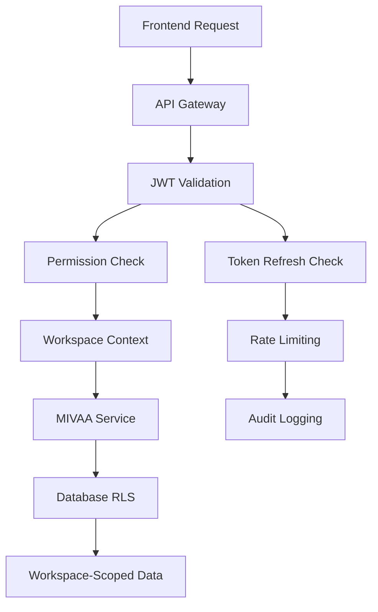

+++
id = "ARCH-JWT-MIVAA-INTEGRATION-2025"
title = "JWT Authentication + MIVAA PDF Extractor Integration Architecture"
context_type = "architecture"
scope = "Comprehensive integration strategy combining JWT authentication with MIVAA PDF extractor for Material Kai Vision Platform"
target_audience = ["core-architect", "lead-backend", "lead-security", "data-specialist", "roo-commander"]
granularity = "detailed"
status = "active"
last_updated = "2025-07-26"
tags = ["jwt", "authentication", "mivaa", "pdf-extractor", "integration", "security", "multi-tenant", "architecture"]
related_context = [
    ".ruru/tasks/SECURITY_JWT_Auth/TASK-ARCH-20250725-160726.md",
    "docs/mivaa_pdf_extractor_integration_analysis.md",
    "mivaa-pdf-extractor/app/services/material_kai_service.py"
]
template_schema_doc = ".ruru/templates/toml-md/16_ai_rule.README.md"
relevance = "Critical: Defines secure integration strategy for next phase implementation"
+++

# JWT Authentication + MIVAA PDF Extractor Integration Architecture

## Executive Summary

This document defines the comprehensive integration architecture that combines the newly designed JWT authentication system with the MIVAA PDF extractor service for the Material Kai Vision Platform. The integration addresses critical security vulnerabilities while leveraging MIVAA's advanced PDF processing capabilities, ensuring secure multi-tenant operation and seamless data flow.

## Integration Overview

### Current State Analysis

**JWT Authentication System (Phase 1 - Completed)**:
- ✅ Comprehensive JWT token structure with workspace isolation
- ✅ FastAPI authentication middleware design
- ✅ Multi-tenant data isolation architecture
- ✅ Token refresh and security protocols
- ✅ Supabase Auth integration patterns
- ✅ Scalability considerations with performance targets

**MIVAA PDF Extractor (Existing)**:
- ✅ Production-ready FastAPI service with PyMuPDF4LLM
- ✅ Advanced PDF processing capabilities
- ❌ **Critical Security Gap**: No JWT authentication validation
- ❌ **Integration Gap**: Database schema conflicts with existing system
- ❌ **Data Flow Gap**: No bridge to existing RAG functions

### Integration Challenges

1. **Security Integration**: MIVAA service lacks JWT authentication
2. **Database Schema Alignment**: Conflicting table structures
3. **Embedding Model Consistency**: Different embedding dimensions
4. **Multi-tenant Isolation**: MIVAA not workspace-aware
5. **Data Flow Integration**: No unified processing pipeline

## Integrated Architecture Design

### 1. Secure MIVAA Service Architecture

#### 1.1 JWT Authentication Integration

**Enhanced MIVAA Service with JWT Middleware**:

```python
# mivaa-pdf-extractor/app/middleware/jwt_auth.py
from fastapi import HTTPException, Depends, Request
from fastapi.security import HTTPBearer, HTTPAuthorizationCredentials
import jwt
from typing import Optional, Dict, Any
import redis
from datetime import datetime, timezone

class JWTAuthMiddleware:
    def __init__(self, 
                 secret_key: str,
                 algorithm: str = "HS256",
                 redis_client: Optional[redis.Redis] = None):
        self.secret_key = secret_key
        self.algorithm = algorithm
        self.redis_client = redis_client
        self.security = HTTPBearer()
    
    async def verify_token(self, 
                          credentials: HTTPAuthorizationCredentials = Depends(HTTPBearer())) -> Dict[str, Any]:
        """Verify JWT token and extract claims"""
        try:
            token = credentials.credentials
            
            # Check token blacklist (if Redis available)
            if self.redis_client and await self.redis_client.get(f"blacklist:{token}"):
                raise HTTPException(status_code=401, detail="Token has been revoked")
            
            # Decode and validate token
            payload = jwt.decode(token, self.secret_key, algorithms=[self.algorithm])
            
            # Validate required claims
            required_claims = ['sub', 'workspace_id', 'permissions', 'exp', 'iat']
            for claim in required_claims:
                if claim not in payload:
                    raise HTTPException(status_code=401, detail=f"Missing required claim: {claim}")
            
            # Check expiration
            if datetime.fromtimestamp(payload['exp'], tz=timezone.utc) < datetime.now(timezone.utc):
                raise HTTPException(status_code=401, detail="Token has expired")
            
            # Validate workspace access
            workspace_id = payload.get('workspace_id')
            if not workspace_id:
                raise HTTPException(status_code=401, detail="Invalid workspace context")
            
            return payload
            
        except jwt.ExpiredSignatureError:
            raise HTTPException(status_code=401, detail="Token has expired")
        except jwt.InvalidTokenError:
            raise HTTPException(status_code=401, detail="Invalid token")
        except Exception as e:
            raise HTTPException(status_code=401, detail=f"Authentication failed: {str(e)}")

# Enhanced permission decorators for MIVAA endpoints
def require_permissions(*required_permissions: str):
    def decorator(func):
        async def wrapper(*args, **kwargs):
            # Extract JWT payload from request context
            request = kwargs.get('request') or args[0] if args else None
            if not hasattr(request.state, 'jwt_payload'):
                raise HTTPException(status_code=401, detail="Authentication required")
            
            user_permissions = request.state.jwt_payload.get('permissions', [])
            
            # Check if user has required permissions
            if not any(perm in user_permissions for perm in required_permissions):
                raise HTTPException(
                    status_code=403, 
                    detail=f"Insufficient permissions. Required: {required_permissions}"
                )
            
            return await func(*args, **kwargs)
        return wrapper
    return decorator
```

#### 1.2 Workspace-Aware MIVAA Endpoints

**Updated MIVAA API with JWT Integration**:

```python
# mivaa-pdf-extractor/app/api/v1/pdf_processing.py
from fastapi import APIRouter, Depends, Request, UploadFile, File
from app.middleware.jwt_auth import JWTAuthMiddleware, require_permissions
from app.services.workspace_pdf_processor import WorkspacePDFProcessor
from app.models.workspace_models import WorkspaceDocument

router = APIRouter(prefix="/api/v1/pdf", tags=["PDF Processing"])
jwt_auth = JWTAuthMiddleware(secret_key=settings.JWT_SECRET_KEY)

@router.post("/process")
@require_permissions("pdf:process", "workspace:write")
async def process_pdf_with_workspace(
    request: Request,
    file: UploadFile = File(...),
    jwt_payload: dict = Depends(jwt_auth.verify_token)
):
    """Process PDF with workspace isolation and JWT authentication"""
    
    workspace_id = jwt_payload['workspace_id']
    user_id = jwt_payload['sub']
    
    # Initialize workspace-aware processor
    processor = WorkspacePDFProcessor(
        workspace_id=workspace_id,
        user_id=user_id,
        embedding_model="text-embedding-3-small",  # Aligned with existing system
        embedding_dimensions=512
    )
    
    try:
        # Process PDF with workspace context
        result = await processor.process_pdf(
            file=file,
            processing_options={
                "extract_images": True,
                "extract_tables": True,
                "generate_embeddings": True,
                "store_in_existing_schema": True  # Bridge to existing system
            }
        )
        
        return {
            "status": "success",
            "document_id": result.document_id,
            "workspace_id": workspace_id,
            "processing_summary": result.summary,
            "integration_status": result.integration_status
        }
        
    except Exception as e:
        logger.error(f"PDF processing failed for workspace {workspace_id}: {str(e)}")
        raise HTTPException(status_code=500, detail=f"Processing failed: {str(e)}")

@router.get("/documents")
@require_permissions("pdf:read", "workspace:read")
async def list_workspace_documents(
    request: Request,
    jwt_payload: dict = Depends(jwt_auth.verify_token),
    limit: int = 50,
    offset: int = 0
):
    """List documents for the authenticated workspace"""
    
    workspace_id = jwt_payload['workspace_id']
    
    # Query workspace-scoped documents
    documents = await WorkspaceDocument.get_by_workspace(
        workspace_id=workspace_id,
        limit=limit,
        offset=offset
    )
    
    return {
        "documents": documents,
        "workspace_id": workspace_id,
        "total_count": len(documents)
    }
```

### 2. Database Schema Integration

#### 2.1 Unified Schema Design

**Extended Schema with Workspace Isolation**:

```sql
-- Enhanced schema bridging MIVAA and existing system
-- File: migrations/001_jwt_mivaa_integration.sql

-- Extend existing enhanced_knowledge_base for MIVAA compatibility
ALTER TABLE enhanced_knowledge_base 
ADD COLUMN IF NOT EXISTS workspace_id UUID NOT NULL DEFAULT '00000000-0000-0000-0000-000000000000',
ADD COLUMN IF NOT EXISTS source_document_id UUID,
ADD COLUMN IF NOT EXISTS processing_method TEXT DEFAULT 'convertapi',
ADD COLUMN IF NOT EXISTS mivaa_metadata JSONB,
ADD COLUMN IF NOT EXISTS created_by UUID;

-- Create workspace-scoped index
CREATE INDEX IF NOT EXISTS idx_enhanced_knowledge_base_workspace 
ON enhanced_knowledge_base(workspace_id, created_at DESC);

-- MIVAA-specific tables with workspace isolation
CREATE TABLE IF NOT EXISTS mivaa_processed_documents (
    id UUID PRIMARY KEY DEFAULT gen_random_uuid(),
    workspace_id UUID NOT NULL,
    filename TEXT NOT NULL,
    original_file_path TEXT,
    file_size_bytes BIGINT,
    mime_type TEXT,
    status TEXT NOT NULL DEFAULT 'pending' CHECK (status IN ('pending', 'processing', 'completed', 'failed')),
    processing_method TEXT DEFAULT 'pymupdf4llm',
    extracted_content JSONB,
    processing_metadata JSONB,
    error_details JSONB,
    created_by UUID NOT NULL,
    created_at TIMESTAMP WITH TIME ZONE DEFAULT NOW(),
    updated_at TIMESTAMP WITH TIME ZONE DEFAULT NOW(),
    completed_at TIMESTAMP WITH TIME ZONE
);

-- Workspace isolation indexes
CREATE INDEX idx_mivaa_documents_workspace ON mivaa_processed_documents(workspace_id, created_at DESC);
CREATE INDEX idx_mivaa_documents_status ON mivaa_processed_documents(workspace_id, status);
CREATE INDEX idx_mivaa_documents_user ON mivaa_processed_documents(created_by, created_at DESC);

-- Bridge table linking MIVAA docs with existing embeddings
CREATE TABLE IF NOT EXISTS mivaa_document_embeddings (
    id UUID PRIMARY KEY DEFAULT gen_random_uuid(),
    workspace_id UUID NOT NULL,
    mivaa_document_id UUID NOT NULL REFERENCES mivaa_processed_documents(id) ON DELETE CASCADE,
    enhanced_knowledge_base_id UUID NOT NULL REFERENCES enhanced_knowledge_base(id) ON DELETE CASCADE,
    chunk_index INTEGER NOT NULL,
    chunk_text TEXT,
    chunk_metadata JSONB,
    created_at TIMESTAMP WITH TIME ZONE DEFAULT NOW(),
    UNIQUE(mivaa_document_id, chunk_index)
);

CREATE INDEX idx_mivaa_embeddings_workspace ON mivaa_document_embeddings(workspace_id);
CREATE INDEX idx_mivaa_embeddings_document ON mivaa_document_embeddings(mivaa_document_id);

-- Workspace-scoped extracted images table
CREATE TABLE IF NOT EXISTS mivaa_extracted_images (
    id UUID PRIMARY KEY DEFAULT gen_random_uuid(),
    workspace_id UUID NOT NULL,
    mivaa_document_id UUID NOT NULL REFERENCES mivaa_processed_documents(id) ON DELETE CASCADE,
    image_path TEXT NOT NULL,
    page_number INTEGER,
    image_metadata JSONB,
    storage_url TEXT,
    created_at TIMESTAMP WITH TIME ZONE DEFAULT NOW()
);

CREATE INDEX idx_mivaa_images_workspace ON mivaa_extracted_images(workspace_id);
CREATE INDEX idx_mivaa_images_document ON mivaa_extracted_images(mivaa_document_id);

-- Row Level Security (RLS) for workspace isolation
ALTER TABLE mivaa_processed_documents ENABLE ROW LEVEL SECURITY;
ALTER TABLE mivaa_document_embeddings ENABLE ROW LEVEL SECURITY;
ALTER TABLE mivaa_extracted_images ENABLE ROW LEVEL SECURITY;

-- RLS Policies for workspace isolation
CREATE POLICY mivaa_documents_workspace_isolation ON mivaa_processed_documents
    FOR ALL USING (workspace_id = current_setting('app.current_workspace_id')::UUID);

CREATE POLICY mivaa_embeddings_workspace_isolation ON mivaa_document_embeddings
    FOR ALL USING (workspace_id = current_setting('app.current_workspace_id')::UUID);

CREATE POLICY mivaa_images_workspace_isolation ON mivaa_extracted_images
    FOR ALL USING (workspace_id = current_setting('app.current_workspace_id')::UUID);
```

#### 2.2 Data Migration Strategy

**Migration Service for Existing Data**:

```python
# app/services/migration_service.py
class MivaaIntegrationMigrationService:
    def __init__(self, db_connection):
        self.db = db_connection
    
    async def migrate_existing_data(self, default_workspace_id: str):
        """Migrate existing data to workspace-aware schema"""
        
        # Update existing enhanced_knowledge_base records
        await self.db.execute("""
            UPDATE enhanced_knowledge_base 
            SET workspace_id = $1, processing_method = 'convertapi'
            WHERE workspace_id = '00000000-0000-0000-0000-000000000000'
        """, default_workspace_id)
        
        # Create workspace isolation function
        await self.db.execute("""
            CREATE OR REPLACE FUNCTION set_workspace_context(workspace_uuid UUID)
            RETURNS void AS $$
            BEGIN
                PERFORM set_config('app.current_workspace_id', workspace_uuid::text, true);
            END;
            $$ LANGUAGE plpgsql;
        """)
        
        logger.info(f"Migration completed for workspace: {default_workspace_id}")
```

### 3. Workspace-Aware PDF Processing Service

#### 3.1 Enhanced Processing Pipeline

**Integrated Workspace PDF Processor**:

```python
# app/services/workspace_pdf_processor.py
from typing import Dict, Any, List, Optional
import asyncio
from app.services.pdf_processor import PDFProcessor
from app.services.embedding_service import EmbeddingService
from app.models.workspace_models import WorkspaceDocument, DocumentChunk
from app.integrations.supabase_bridge import SupabaseBridge

class WorkspacePDFProcessor:
    def __init__(self, workspace_id: str, user_id: str, 
                 embedding_model: str = "text-embedding-3-small",
                 embedding_dimensions: int = 512):
        self.workspace_id = workspace_id
        self.user_id = user_id
        self.pdf_processor = PDFProcessor()
        self.embedding_service = EmbeddingService(
            model=embedding_model,
            dimensions=embedding_dimensions
        )
        self.supabase_bridge = SupabaseBridge()
    
    async def process_pdf(self, file, processing_options: Dict[str, Any]) -> ProcessingResult:
        """Process PDF with workspace context and integration"""
        
        # Set workspace context for database operations
        await self.set_workspace_context()
        
        try:
            # 1. Create document record
            document = await self.create_document_record(file)
            
            # 2. Process PDF with MIVAA
            mivaa_result = await self.pdf_processor.process_pdf(
                file=file,
                extract_images=processing_options.get("extract_images", True),
                extract_tables=processing_options.get("extract_tables", True)
            )
            
            # 3. Generate workspace-scoped embeddings
            if processing_options.get("generate_embeddings", True):
                embeddings_result = await self.generate_embeddings(
                    document.id, mivaa_result.content
                )
            
            # 4. Bridge to existing system
            if processing_options.get("store_in_existing_schema", True):
                integration_result = await self.bridge_to_existing_system(
                    document, mivaa_result, embeddings_result
                )
            
            # 5. Update document status
            await document.update_status("completed", {
                "processing_summary": mivaa_result.summary,
                "integration_status": integration_result.status,
                "chunks_created": len(embeddings_result.chunks)
            })
            
            return ProcessingResult(
                document_id=document.id,
                summary=mivaa_result.summary,
                integration_status=integration_result.status
            )
            
        except Exception as e:
            await document.update_status("failed", {"error": str(e)})
            raise
    
    async def set_workspace_context(self):
        """Set workspace context for RLS policies"""
        await self.db.execute(
            "SELECT set_workspace_context($1)", 
            self.workspace_id
        )
    
    async def create_document_record(self, file) -> WorkspaceDocument:
        """Create workspace-scoped document record"""
        return await WorkspaceDocument.create({
            "workspace_id": self.workspace_id,
            "filename": file.filename,
            "file_size_bytes": len(await file.read()),
            "mime_type": file.content_type,
            "created_by": self.user_id,
            "status": "processing"
        })
    
    async def generate_embeddings(self, document_id: str, content: Dict) -> EmbeddingResult:
        """Generate embeddings with workspace context"""
        
        chunks = self.chunk_content(content)
        embedding_tasks = []
        
        for i, chunk in enumerate(chunks):
            # Generate embedding
            embedding = await self.embedding_service.generate_embedding(chunk.text)
            
            # Store in both MIVAA and existing schema
            embedding_tasks.append(
                self.store_chunk_embedding(document_id, i, chunk, embedding)
            )
        
        await asyncio.gather(*embedding_tasks)
        
        return EmbeddingResult(chunks=chunks, embeddings_count=len(chunks))
    
    async def bridge_to_existing_system(self, document, mivaa_result, embeddings_result):
        """Bridge MIVAA data to existing enhanced_knowledge_base"""
        
        bridge_tasks = []
        
        for chunk_data in embeddings_result.chunks:
            # Create entry in enhanced_knowledge_base
            bridge_tasks.append(
                self.supabase_bridge.create_enhanced_knowledge_entry({
                    "workspace_id": self.workspace_id,
                    "content": chunk_data.text,
                    "embedding": chunk_data.embedding,
                    "metadata": {
                        "source_document_id": document.id,
                        "processing_method": "pymupdf4llm",
                        "mivaa_metadata": chunk_data.metadata,
                        "chunk_index": chunk_data.index
                    },
                    "source_document_id": document.id,
                    "processing_method": "pymupdf4llm"
                })
            )
        
        results = await asyncio.gather(*bridge_tasks)
        
        return IntegrationResult(
            status="success",
            enhanced_kb_entries=len(results),
            bridge_mappings=results
        )
```

### 4. Security Integration Patterns

#### 4.1 Multi-Layer Security Architecture

**Security Integration Flow**:



#### 4.2 Workspace Isolation Enforcement

**Workspace Security Service**:

```python
# app/services/workspace_security.py
class WorkspaceSecurityService:
    def __init__(self, redis_client, audit_logger):
        self.redis = redis_client
        self.audit_logger = audit_logger
    
    async def enforce_workspace_isolation(self, jwt_payload: Dict, resource_id: str):
        """Enforce workspace-level access control"""
        
        workspace_id = jwt_payload['workspace_id']
        user_id = jwt_payload['sub']
        
        # Verify resource belongs to workspace
        resource_workspace = await self.get_resource_workspace(resource_id)
        
        if resource_workspace != workspace_id:
            await self.audit_logger.log_security_violation({
                "event": "workspace_isolation_violation",
                "user_id": user_id,
                "requested_workspace": workspace_id,
                "resource_workspace": resource_workspace,
                "resource_id": resource_id,
                "timestamp": datetime.utcnow()
            })
            raise HTTPException(
                status_code=403, 
                detail="Access denied: Resource not in user workspace"
            )
        
        return True
    
    async def validate_workspace_permissions(self, jwt_payload: Dict, action: str):
        """Validate workspace-specific permissions"""
        
        workspace_permissions = jwt_payload.get('workspace_permissions', {})
        workspace_id = jwt_payload['workspace_id']
        
        if not workspace_permissions.get(workspace_id, {}).get(action, False):
            raise HTTPException(
                status_code=403,
                detail=f"Insufficient workspace permissions for action: {action}"
            )
        
        return True
```

### 5. Performance Optimization

#### 5.1 Caching Strategy

**Multi-Layer Caching with Workspace Awareness**:

```python
# app/services/workspace_cache.py
class WorkspaceCacheService:
    def __init__(self, redis_client):
        self.redis = redis_client
        self.cache_ttl = {
            "jwt_validation": 300,  # 5 minutes
            "workspace_permissions": 600,  # 10 minutes
            "document_metadata": 1800,  # 30 minutes
            "embeddings": 3600  # 1 hour
        }
    
    async def cache_jwt_validation(self, token_hash: str, payload: Dict):
        """Cache JWT validation results"""
        cache_key = f"jwt:validation:{token_hash}"
        await self.redis.setex(
            cache_key, 
            self.cache_ttl["jwt_validation"],
            json.dumps(payload)
        )
    
    async def cache_workspace_embeddings(self, workspace_id: str, document_id: str, embeddings: List):
        """Cache workspace-scoped embeddings"""
        cache_key = f"embeddings:{workspace_id}:{document_id}"
        await self.redis.setex(
            cache_key,
            self.cache_ttl["embeddings"],
            json.dumps(embeddings)
        )
    
    async def get_cached_embeddings(self, workspace_id: str, document_id: str):
        """Retrieve cached embeddings with workspace isolation"""
        cache_key = f"embeddings:{workspace_id}:{document_id}"
        cached_data = await self.redis.get(cache_key)
        return json.loads(cached_data) if cached_data else None
```

#### 5.2 Performance Monitoring

**Integrated Performance Metrics**:

```python
# app/monitoring/performance_monitor.py
class IntegratedPerformanceMonitor:
    def __init__(self):
        self.metrics = {
            "jwt_validation_time": [],
            "pdf_processing_time": [],
            "embedding_generation_time": [],
            "database_query_time": [],
            "workspace_isolation_overhead": []
        }
    
    async def track_processing_pipeline(self, workspace_id: str, document_id: str):
        """Track end-to-end processing performance"""
        
        start_time = time.time()
        
        # Track individual components
        jwt_time = await self.measure_jwt_validation()
        processing_time = await self.measure_pdf_processing()
        embedding_time = await self.measure_embedding_generation()
        storage_time = await self.measure_database_operations()
        
        total_time = time.time() - start_time
        
        # Log performance metrics
        await self.log_performance_metrics({
            "workspace_id": workspace_id,
            "document_id": document_id,
            "total_processing_time": total_time,
            "jwt_validation_time": jwt_time,
            "pdf_processing_time": processing_time,
            "embedding_generation_time": embedding_time,
            "database_storage_time": storage_time,
            "timestamp": datetime.utcnow()
        })
        
        # Alert if performance degrades
        if total_time > 30:  # 30 second threshold
            await self.send_performance_alert(workspace_id, total_time)
```

### 6. Implementation Roadmap

#### Phase 1: Security Foundation (Week 1-2)
- [ ] Implement JWT middleware for MIVAA service
- [ ] Create workspace-aware authentication decorators
- [ ] Implement database schema extensions
- [ ] Set up Row Level Security policies
- [ ] Create workspace context management

#### Phase 2: Service Integration (Week 3-4)
- [ ] Develop WorkspacePDFProcessor service
- [ ] Implement bridge to existing enhanced_knowledge_base
- [ ] Create workspace-scoped API endpoints
- [ ] Implement embedding model alignment
- [ ] Set up data migration utilities

#### Phase 3: Performance & Monitoring (Week 5-6)
- [ ] Implement multi-layer caching strategy
- [ ] Set up performance monitoring
- [ ] Create audit logging system
- [ ] Implement rate limiting
- [ ] Performance optimization and tuning

#### Phase 4: Testing & Deployment (Week 7-8)
- [ ] Comprehensive integration testing
- [ ] Security penetration testing
- [ ] Performance benchmarking
- [ ] Gradual production rollout
- [ ] Documentation and training

### 7. Security Considerations

#### 7.1 Threat Model

**Identified Threats**:
1. **JWT Token Compromise**: Mitigated by token rotation and blacklisting
2. **Workspace Isolation Bypass**: Prevented by RLS and application-level checks
3. **Privilege Escalation**: Controlled by granular permission system
4. **Data Leakage**: Prevented by workspace-scoped queries and audit logging

#### 7.2 Security Controls

**Multi-Layer Security Controls**:
- JWT signature validation with HS256
- Workspace-based Row Level Security
- Permission-based access control
- Rate limiting and DDoS protection
- Comprehensive audit logging
- Token blacklisting and rotation
- Input validation and sanitization

### 8. Monitoring & Observability

#### 8.1 Key Metrics

**Performance Metrics**:
- JWT validation time: < 10ms (target)
- PDF processing time: < 30s for 10MB files
- Embedding generation time: < 5s per chunk
- Database query time: < 100ms
- End-to-end processing: < 60s

**Security Metrics**:
- Failed authentication attempts
- Workspace isolation violations
- Permission denied events
- Token refresh frequency
- Suspicious activity patterns

#### 8.2 Alerting Strategy

**Critical Alerts**:
- Authentication failures > 10/minute
- Workspace isolation violations
- Processing time > 60 seconds
- Database connection failures
- Token validation errors

### 9. Conclusion

This integrated architecture successfully combines JWT authentication with MIVAA PDF processing while maintaining:

- **Security**: Multi-layer authentication and workspace isolation
- **Performance**: Optimized caching and processing pipeline
- **Scalability**: Horizontal scaling with workspace partitioning
- **Maintainability**: Clean separation of concerns and modular design
- **Compatibility**: Seamless integration with existing Material Kai platform

The architecture provides a secure, scalable foundation for the next phase of implementation, ensuring that the Material Kai Vision Platform can leverage MIVAA's advanced PDF processing capabilities while maintaining enterprise-grade security and multi-tenant isolation.

**Next Steps**: Proceed with Phase 1 implementation focusing on security foundation and JWT integration with MIVAA service.