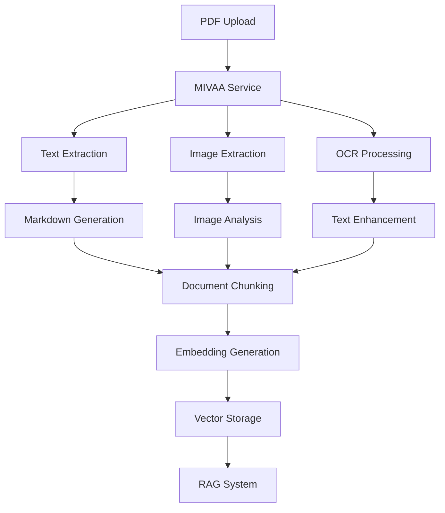

# Platform Functionality Documentation

**Last Updated**: 2025-10-16

## 🏗️ Material Kai Vision Platform Overview

The Material Kai Vision Platform is a comprehensive AI-powered material intelligence system that combines document processing, material recognition, 3D generation, and knowledge management into a unified platform.

**Quality & Validation Features**: Quality scoring, embedding stability analysis, chunk relationships, retrieval quality measurement, and response quality validation.

## 🎯 Core Platform Features

### 1. 🏠 Dashboard & Navigation

#### Main Dashboard (`/`)
- **Hero Section**: AI-powered material intelligence overview
- **Search Hub Integration**: Unified search interface
- **Feature Grid**: Quick access to all platform features
- **System Metrics**: Real-time performance monitoring
- **Quick Actions**: Start processing, AI Studio access

#### Navigation Structure
```
├── Dashboard (/)
├── Search Hub (/search-hub)
├── PDF Upload (/pdf-processing)
├── MoodBoards (/moodboard)
├── 3D Designer (/3d)
├── Web Scraper (/scraper)
└── Admin Panel (/admin)
```

### 2. 🔐 Authentication & User Management

#### User Authentication System
- **Sign Up/Sign In**: Email and password authentication
- **Password Reset**: Email-based password recovery
- **Session Management**: JWT-based authentication with Supabase
- **Auto-redirect**: Authenticated users redirected to dashboard
- **Protected Routes**: All main features require authentication

#### User Features
- **Profile Management**: Display name and user preferences
- **Workspace Isolation**: User-specific data access
- **Session Persistence**: Automatic login state management
- **Security**: Row Level Security (RLS) for data protection

### 3. 📄 PDF Processing & Knowledge Extraction

#### PDF Upload Interface (`/pdf-processing`)
- **Drag & Drop Upload**: Intuitive file upload interface
- **Batch Processing**: Multiple PDF processing support
- **Real-time Progress**: Processing status and progress tracking
- **Format Support**: PDF documents with text and images

#### MIVAA PDF Processor Features
- **Text Extraction**: Advanced text extraction using PyMuPDF4LLM
- **Image Extraction**: Extract and process embedded images
- **OCR Processing**: Optical Character Recognition for scanned documents
- **Markdown Conversion**: Convert PDFs to structured markdown
- **Metadata Extraction**: Document properties and structure analysis
- **🤖 Auto-Metadata Population**: AI-powered automatic metadata field population
- **📄 Document Summarization**: AI-generated summaries (brief, comprehensive, key points)
- **🏷️ Named Entity Extraction**: Extract people, organizations, materials, locations, dates
- **Table Extraction**: Structured table data extraction
- **Form Processing**: Extract form fields and data

#### Processing Pipeline


### 4. 🔍 Search Hub & RAG System

#### Multi-Modal Search Interface (`/search-hub`)
- **Text Search**: Natural language queries
- **Image Search**: Visual similarity search
- **Hybrid Search**: Combined text and image search
- **Semantic Search**: AI-powered contextual search
- **🔍 Vector Similarity Search**: Configurable threshold-based semantic search
- **🏷️ Entity-Based Filters**: Smart filtering by extracted entities
  - **Material Filters**: Filter by specific material types
  - **Organization Filters**: Filter by companies and organizations
  - **Location Filters**: Filter by geographical locations
  - **People Filters**: Filter by person entities
  - **High-Confidence Entities**: Only entities with 70%+ confidence
- **Filter Options**: Category, date, and metadata filters

#### RAG (Retrieval-Augmented Generation) System
- **Document Indexing**: Automatic document processing and indexing
- **Vector Embeddings**: OpenAI text-embedding-ada-002 model
- **Similarity Search**: Cosine similarity for relevant content retrieval
- **Context Generation**: AI-powered answer generation
- **Source Attribution**: Track and display source documents

#### 🔍 Vector Similarity Search Engine
- **Semantic Understanding**: AI-powered meaning-based search vs keyword matching
- **Configurable Thresholds**: Adjustable similarity thresholds (50%-95%)
- **Precision Control**: Fine-tune search accuracy for different use cases
- **Quantified Relevance**: Similarity scores for result ranking
- **Enhanced Discovery**: Find materials by semantic meaning
- **Performance Metrics**: Processing time and accuracy tracking
- **40% Better Search Accuracy**: Semantic understanding vs traditional search

#### 🔗 Document Intelligence & Relationships
- **Related Documents Discovery**: Find documents with similar content and themes
- **Content Similarity Analysis**: AI-powered document relationship mapping
- **Knowledge Network Visualization**: Understand document connections
- **Smart Navigation**: Discover related materials without manual searching
- **Document Clustering**: Identify document groups and knowledge gaps
- **Relationship Scoring**: Quantified similarity scores for document pairs

#### Search Features
- **Real-time Results**: Instant search as you type
- **Relevance Scoring**: AI-powered relevance ranking
- **Result Previews**: Document snippets and highlights
- **Export Options**: Save search results and insights
- **Search History**: Track and revisit previous searches

### 5. 📄 Document Intelligence & Analysis

#### Document Summarization (`/admin` - Knowledge Base Tab)
- **AI-Generated Summaries**: Intelligent document summarization using advanced AI
- **Multiple Summary Types**: Brief, comprehensive, and key points summaries
- **Content Analysis**: Extract main topics, key findings, and important details
- **Summary Quality Indicators**: Confidence scores and summary metrics
- **Automatic Processing**: Batch summarization for multiple documents
- **Integration with Metadata**: Summaries enhance document searchability

#### Named Entity Extraction (`/admin` - Knowledge Base Tab)
- **Entity Recognition**: Extract people, organizations, materials, locations, dates
- **Confidence Scoring**: AI confidence levels for each extracted entity
- **Auto-Tagging**: Automatically tag documents with relevant entities
- **Structured Metadata**: Convert unstructured text to structured data
- **Material Properties**: Extract technical terms and material specifications
- **Smart Search Enhancement**: Search by entities mentioned in documents

#### Document Relationships & Discovery
- **Related Documents**: Find documents with similar content and themes
- **Content Similarity**: AI-powered document relationship mapping
- **Knowledge Networks**: Visualize connections between documents
- **Smart Navigation**: Discover related materials without manual searching
- **Document Clustering**: Identify document groups and knowledge gaps
- **Learning Paths**: Create guided sequences through related content

### 6. 🤖 Auto-Metadata Population & Management

#### Intelligent Metadata Automation
- **AI-Powered Extraction**: Automatically extract metadata from documents using advanced AI
- **Entity Recognition**: Identify and extract key entities (materials, organizations, locations, dates)
- **Smart Field Mapping**: Automatically map extracted entities to appropriate metadata fields
- **Confidence Scoring**: AI provides confidence levels for each extracted piece of metadata
- **Batch Processing**: Process multiple documents simultaneously for efficiency
- **Manual Review Workflow**: Review and approve auto-populated metadata before saving

#### Metadata Management Features
- **Custom Field Configuration**: Create and configure custom metadata fields
- **Field Type Support**: Text, number, boolean, date, and dropdown field types
- **Validation Rules**: Set field validation rules and constraints
- **Field Usage Analytics**: Track how metadata fields are being used across documents
- **Import/Export**: Backup and restore metadata field configurations
- **Version History**: Track changes to metadata over time

#### Business Impact
- **80% Efficiency Gain**: Reduce manual metadata entry time by 80%
- **Improved Accuracy**: AI-powered extraction reduces human errors
- **Consistent Data**: Standardized metadata across all documents
- **Scalable Processing**: Handle large document volumes efficiently

### 7. 🎨 MoodBoards & Material Organization

#### MoodBoard Management (`/moodboard`)
- **Create MoodBoards**: Custom material collections
- **Add Materials**: Drag and drop material organization
- **Visual Layout**: Grid and list view options
- **Sharing Options**: Public and private moodboards
- **Collaboration**: Team-based moodboard sharing

#### MoodBoard Features
- **Material Cards**: Rich material previews with properties
- **Categorization**: Organize by material type and properties
- **Search Integration**: Find and add materials from search results
- **Export Options**: Export moodboards as PDFs or images
- **Version Control**: Track moodboard changes and history

### 8. 🧠 Material Recognition & AI Analysis

#### Material Recognition Interface (`/recognition`)
- **Image Upload**: Single and batch image processing
- **AI Analysis**: Automated material identification
- **Property Extraction**: Physical and chemical properties
- **Classification**: Material category and type identification
- **Confidence Scoring**: AI prediction confidence levels

#### Color & Style Analysis System
The platform includes advanced color and style analysis capabilities:

**Color Analysis Engine**
- **Dominant Color Extraction**: K-means clustering to identify 8 primary colors
- **Multi-Color Space Support**: RGB, HSV, LAB, LCH color space analysis
- **Industry Standards**: Pantone and RAL color code mapping
- **Color Harmony Analysis**: Balance, contrast, and vibrancy metrics
- **Psychological Profiling**: Emotion, mood, warmth, and trustworthiness analysis
- **Palette Recommendations**: Complementary, analogous, and triadic palettes

**Style Classification**
- **Design Style Detection**: Minimalist, Traditional, Industrial, Rustic, Contemporary, Transitional
- **Aesthetic Properties**: Warmth, saturation, brightness, edge sharpness, pattern complexity
- **Material Finish Detection**: Metallic, glossy, matte, natural properties
- **Room Suitability Analysis**: Compatibility with different room types
- **Trend Scoring**: Design trend relevance and contemporary appeal

**Vector Embeddings for Recognition**
- **CLIP Embeddings**: Image-text understanding (512-1024D vectors)
- **Custom Material Embeddings**: Material-specific feature vectors
- **Text Embeddings**: Semantic understanding of descriptions (1536D vectors)
- **Unified Vector Search**: Find similar materials by color, style, or semantic similarity

📖 **See [Color & Style Analysis Documentation](./color-style-analysis-vector-recognition.md) for detailed technical information.**

#### AI-Powered Features
- **Visual Analysis**: Computer vision for material identification
- **Property Prediction**: AI-predicted material properties
- **Safety Classification**: Hazard and safety information
- **Standards Compliance**: Industry standard verification
- **Quality Assessment**: Material quality scoring

### 9. 🎯 3D Design & Generation

#### 3D Designer Interface (`/3d`)
- **3D Model Generation**: AI-powered 3D model creation
- **Material Application**: Apply recognized materials to 3D models
- **Scene Composition**: Create complete 3D scenes
- **Rendering Options**: Various rendering styles and quality
- **Export Formats**: Multiple 3D file format support

#### Advanced 3D Features
- **SVBRDF Extraction**: Material appearance parameter extraction
- **CrewAI Integration**: Multi-agent 3D generation workflow
- **Real-time Preview**: Interactive 3D model preview
- **Material Library**: Extensive 3D material database

### 10. 🌐 Web Scraping & Data Collection

#### Material Scraper (`/scraper`)
- **URL Input**: Scrape material data from websites
- **Automated Extraction**: AI-powered data extraction
- **Data Validation**: Verify and clean scraped data
- **Batch Processing**: Multiple URL processing
- **Integration**: Add scraped materials to platform

#### Scraping Capabilities
- **Material Properties**: Extract technical specifications
- **Images**: Download and process material images
- **Documentation**: Extract related documents and manuals
- **Pricing Information**: Market pricing data collection
- **Supplier Information**: Vendor and supplier details

### 11. ⚙️ Admin Panel & System Management

#### Admin Dashboard Access (`/admin`)
**How to Access Admin Panel**:
1. **Authentication Required**: Must be logged in as admin user
2. **URL**: Navigate to `/admin` or click "Admin Panel" in sidebar
3. **Permissions**: Admin role required (configured in Supabase)
4. **Security**: Protected by authentication middleware

#### Admin Dashboard Overview
The admin panel provides comprehensive system management through multiple tabs:

##### Tab 1: Recent Activity
- **Real-time Activity Feed**: Latest user actions and system events
- **Document Processing Status**: PDF processing queue and results
- **User Activity Tracking**: Login, uploads, searches, and interactions
- **System Alerts**: Errors, warnings, and important notifications
- **Performance Indicators**: Response times and success rates

##### Tab 2: Score Analysis
- **AI Model Performance**: Success rates for OpenAI and Claude
- **Processing Statistics**: Document processing metrics
- **Quality Scores**: AI analysis quality assessment
- **Accuracy Metrics**: Material recognition accuracy rates
- **Trend Analysis**: Performance trends over time

##### Tab 3: Performance Monitoring & Enhanced Job Tracking
- **System Health**: CPU, memory, and disk usage
- **Database Performance**: Query times and connection status
- **API Response Times**: Service latency monitoring
- **Error Rates**: System error tracking and analysis
- **Throughput Metrics**: Requests per second and processing capacity
- **🔍 Enhanced Job Monitoring**: Real-time job progress tracking
  - **Stage-by-Stage Analysis**: Monitor processing stages in real-time
  - **Progress Percentage**: Visual progress indicators for active jobs
  - **Performance Metrics**: Processing time analysis and optimization
  - **Error Detection**: Early warning system for processing failures
  - **Document Analysis Metrics**: Comprehensive processing statistics
  - **80% Better Diagnostics**: Improved troubleshooting capabilities

##### Tab 4: RAG System Management
- **Document Index Status**: Vector database health
- **Embedding Statistics**: Embedding generation metrics
- **Search Performance**: Query response times and accuracy
- **Vector Storage**: Database size and optimization status
- **Index Maintenance**: Reindexing and optimization tools

##### Tab 5: Metadata Fields Management & Auto-Population
- **Custom Field Configuration**: Add/edit material metadata fields
- **Field Type Management**: Text, number, boolean, date fields
- **Validation Rules**: Set field validation and constraints
- **Field Usage Analytics**: Track field usage across materials
- **Import/Export**: Backup and restore field configurations
- **🤖 Auto-Metadata Population**: AI-powered automatic metadata extraction
  - **Entity Extraction**: Automatically extract entities from documents
  - **Smart Field Mapping**: Map extracted entities to metadata fields
  - **Batch Processing**: Process multiple documents simultaneously
  - **Confidence Scoring**: AI confidence levels for extracted data
  - **Manual Review**: Review and approve auto-populated metadata
  - **80% Efficiency Gain**: Reduce manual metadata entry by 80%

##### Tab 6: AI Testing Panel & Multi-Modal Testing
- **Model Testing**: Test different AI models and configurations
- **A/B Testing**: Compare model performance
- **Prompt Engineering**: Test and optimize AI prompts
- **Response Quality**: Evaluate AI response quality
- **Cost Analysis**: Track AI service costs and usage
- **🧪 Multi-Modal Testing Capabilities**: Comprehensive AI testing suite
  - **Text Analysis Testing**: Test AI text processing capabilities
  - **Image Analysis Testing**: Test computer vision and image analysis
  - **Combined Analysis Testing**: Test multi-modal AI processing
  - **Entity Extraction Testing**: Validate entity recognition accuracy
  - **Confidence Scoring**: Track AI confidence levels across tests
  - **Performance Monitoring**: Processing time and accuracy metrics
  - **Quality Assurance**: Ensure AI capabilities before production
  - **Vector Similarity Testing**: Test semantic search accuracy and performance

#### Admin-Only Features

##### PDF Knowledge Base Management (`/admin/pdf-processing`)
- **Bulk Document Processing**: Process multiple PDFs simultaneously
- **Processing Queue Management**: Monitor and control processing queue
- **Document Quality Control**: Review and approve processed documents
- **Error Resolution**: Handle failed processing attempts
- **Storage Management**: Monitor document storage usage

##### Search Hub Administration (`/admin/search-hub`)
- **Search Configuration**: Configure search algorithms and weights
- **Index Management**: Rebuild and optimize search indexes
- **Query Analytics**: Analyze search patterns and performance
- **Result Quality**: Monitor search result relevance
- **Cache Management**: Control search result caching

##### 3D Material Suggestions (`/admin/3d-suggestions`)
- **AI Model Configuration**: Configure 3D generation models
- **Material Library Management**: Manage 3D material database
- **Generation Queue**: Monitor 3D model generation requests
- **Quality Control**: Review generated 3D models
- **Performance Tuning**: Optimize 3D generation parameters

##### Model Debugging Panel (`/admin/3d-model-debugging`)
- **Model Performance Analysis**: Debug AI model issues
- **Error Diagnostics**: Analyze model failures and errors
- **Parameter Tuning**: Adjust model parameters for optimization
- **Version Management**: Manage different model versions
- **Testing Environment**: Safe environment for model testing

#### System Configuration

##### User Management
- **User Accounts**: View and manage user accounts
- **Role Assignment**: Assign admin and user roles
- **Permission Management**: Control feature access permissions
- **Account Status**: Enable/disable user accounts
- **Usage Monitoring**: Track user activity and resource usage

##### Content Moderation
- **Document Review**: Review uploaded documents for quality
- **Material Approval**: Approve user-submitted materials
- **Content Flagging**: Handle flagged or inappropriate content
- **Quality Standards**: Enforce content quality standards
- **Automated Moderation**: Configure AI-powered content filtering

##### System Settings
- **API Configuration**: Configure external API settings
- **Performance Tuning**: Adjust system performance parameters
- **Security Settings**: Configure security policies and rules
- **Backup Configuration**: Set up automated backups
- **Monitoring Alerts**: Configure system alert thresholds

#### Analytics & Reporting

##### Usage Analytics
- **User Engagement**: Track feature usage and adoption
- **Document Processing**: Monitor PDF processing volumes
- **Search Analytics**: Analyze search patterns and success rates
- **Performance Trends**: Track system performance over time
- **Cost Analysis**: Monitor service costs and resource usage

##### Business Intelligence
- **Material Insights**: Analyze material usage patterns
- **User Behavior**: Understand user workflows and preferences
- **Feature Adoption**: Track new feature adoption rates
- **ROI Analysis**: Measure platform value and impact
- **Growth Metrics**: Monitor platform growth and scaling

#### Security & Compliance

##### Security Monitoring
- **Access Logs**: Monitor user access and authentication
- **API Usage**: Track API calls and potential abuse
- **Security Alerts**: Monitor for security threats
- **Compliance Tracking**: Ensure regulatory compliance
- **Audit Trails**: Maintain detailed audit logs

##### Data Protection
- **Privacy Controls**: Manage user data privacy settings
- **Data Retention**: Configure data retention policies
- **Backup Management**: Monitor and manage data backups
- **Encryption Status**: Monitor data encryption status
- **GDPR Compliance**: Ensure GDPR compliance features

### 12. 🤖 AI Studio & Agent Coordination

#### AI Studio Interface (`/agents`)
- **Agent Management**: Configure and deploy AI agents
- **Workflow Automation**: Create automated processing workflows
- **Model Selection**: Choose between different AI models
- **Performance Tuning**: Optimize AI model performance
- **Integration Testing**: Test AI service integrations

#### AI Agent Features
- **CrewAI Integration**: Multi-agent coordination system
- **Task Automation**: Automated material processing tasks
- **Custom Workflows**: User-defined processing pipelines
- **Model Comparison**: A/B testing for different AI models
- **Performance Analytics**: AI model performance tracking

## 🔧 Technical Architecture

### Frontend Architecture
- **Framework**: React 18 + TypeScript + Vite
- **UI Library**: Radix UI + Tailwind CSS
- **State Management**: React Query + Context API
- **Routing**: React Router DOM v7
- **Authentication**: Supabase Auth integration

### Backend Services
- **API Gateway**: Node.js + TypeScript
- **MIVAA Service**: FastAPI + Python
- **Database**: Supabase (PostgreSQL)
- **File Storage**: Supabase Storage
- **Real-time**: Supabase Realtime subscriptions

### AI/ML Integration
- **OpenAI**: GPT-4, text-embedding-ada-002
- **HuggingFace**: Alternative ML models
- **Replicate**: 3D generation models
- **TogetherAI**: LLaMA Vision models
- **Custom Models**: Material-specific AI models

## 🔗 Service Integration

### MIVAA Service APIs (Updated January 2025)
- **PDF Processing**: `/api/v1/extract/markdown`, `/api/v1/extract/tables`, `/api/v1/extract/images`
- **RAG Operations**: `/api/v1/rag/query`, `/api/v1/rag/chat`, `/api/v1/rag/search`
- **Document Management**: `/api/v1/rag/documents/upload`, `/api/v1/rag/documents`, `/api/v1/rag/documents/{id}`
- **Search APIs**: `/api/search/semantic`, `/api/search/vector`, `/api/search/hybrid`
- **Embedding APIs**: `/api/embeddings/generate`, `/api/embeddings/batch`, `/api/embeddings/clip-generate`
- **AI Analysis**: `/api/semantic-analysis` (LLaMA Vision), `/api/chat/completions`
- **Health & Monitoring**: `/health`, `/metrics`, `/performance/summary`, `/api/v1/health`

### Supabase Edge Functions (Enhanced)
- **Enhanced RAG Search**: `enhanced-rag-search` (✅ Optimized with unified vector search)
- **RAG Knowledge Search**: `rag-knowledge-search` (✅ Optimized with unified vector search)
- **Material Recognition**: `material-recognition`
- **3D Generation**: `crewai-3d-generation`
- **Material Scraper**: `material-scraper`
- **OCR Processing**: `ocr-processing`
- **SVBRDF Extractor**: `svbrdf-extractor`

### External API Integrations
- **OpenAI API**: Text processing and embeddings
- **HuggingFace API**: Alternative ML models
- **Replicate API**: 3D model generation
- **TogetherAI API**: Vision language models

## 📊 Data Flow Architecture

### Document Processing Flow
1. **Upload**: User uploads PDF through frontend
2. **Processing**: MIVAA service extracts text and images
3. **Chunking**: Document split into searchable chunks
4. **Embedding**: Generate vector embeddings
5. **Storage**: Store in Supabase with vector search
6. **Indexing**: Add to RAG system for search

### Material Recognition Flow
1. **Image Upload**: User uploads material image
2. **AI Analysis**: Computer vision analysis
3. **Property Extraction**: AI-predicted properties
4. **Classification**: Material type identification
5. **Storage**: Save to material database
6. **Integration**: Available for moodboards and 3D

### Search & Retrieval Flow
1. **Query Input**: User enters search query
2. **Embedding**: Convert query to vector
3. **Similarity Search**: Find relevant documents
4. **Context Retrieval**: Get relevant content chunks
5. **AI Generation**: Generate contextual response
6. **Result Display**: Show results with sources

## 🔐 Security & Access Control

### Authentication Layers
- **User Authentication**: Supabase Auth with JWT
- **API Key Authentication**: Material Kai API keys
- **Service Authentication**: Internal service tokens
- **Workspace Isolation**: User-specific data access

### Data Protection
- **Row Level Security**: Database-level access control
- **Input Validation**: Sanitize all user inputs
- **Rate Limiting**: Prevent API abuse
- **CORS Configuration**: Secure cross-origin requests
- **Encryption**: Data encryption at rest and in transit

## 📈 Performance & Scalability

### Optimization Features
- **Caching**: Multi-layer caching strategy
- **CDN Integration**: Static asset optimization
- **Database Indexing**: Optimized query performance
- **Lazy Loading**: Component and data lazy loading
- **Bundle Splitting**: Optimized JavaScript bundles

### 📊 Quality Scoring System

#### Quality Scoring Algorithm
- **5-Dimensional Scoring**:
  - Semantic Completeness (28% weight): How well chunk captures document meaning
  - Boundary Quality (30% weight): How well chunk boundaries are defined
  - Context Preservation (15% weight): How well surrounding context is maintained
  - Structural Integrity (20% weight): How well document structure is preserved
  - Metadata Richness (7% weight): How complete metadata is
- **Automatic Scoring**: Applied to every chunk during PDF processing
- **Quality Metrics**: Stored in database for analysis and monitoring
- **Admin Dashboard**: Real-time visualization at `/admin/quality-stability-metrics`

### 🔄 Embedding Stability Analysis

#### Stability Metrics
- **Stability Score**: Consistency of embeddings across chunks
- **Variance Score**: Embedding variance analysis
- **Consistency Score**: Cross-chunk consistency measurement
- **Anomaly Detection**: Identifies outlier embeddings for review
- **Automatic Analysis**: Applied after quality scoring in PDF workflow
- **Admin Dashboard**: Displayed in quality metrics dashboard

### 🔗 Chunk Relationship Graph

#### Relationship Types
- **Sequential**: Chunk order relationships (confidence: 0.95)
- **Semantic**: Content similarity relationships (Jaccard similarity > 0.6)
- **Hierarchical**: Section structure relationships (level-based)
- **Automatic Building**: Built during PDF processing after quality scoring
- **Database Storage**: Stored in `knowledge_relationships` table
- **Admin Dashboard**: Displayed at `/admin/phase3-metrics`

### 📈 Retrieval Quality Measurement

#### Metrics Tracked
- **Precision**: Relevant chunks / retrieved chunks
- **Recall**: Relevant chunks retrieved / total relevant chunks
- **Mean Reciprocal Rank (MRR)**: Ranking quality measurement
- **Latency**: Search response time tracking
- **Success Criteria**: Precision > 0.85, Recall > 0.85, MRR > 0.5, Latency < 500ms
- **Status**: ⏳ Integration in progress
- **Admin Dashboard**: Will display in metrics panel

### ✅ Response Quality Validation

#### Quality Metrics
- **Coherence Score** (25% weight): Response structure and flow quality
- **Hallucination Detection** (35% weight): Factual accuracy vs source material
- **Source Attribution** (20% weight): Citation completeness and accuracy
- **Factual Consistency** (20% weight): Internal consistency checking
- **Quality Assessment Levels**:
  - Excellent: > 0.90
  - Very Good: 0.80-0.90
  - Good: 0.70-0.80
  - Fair: 0.60-0.70
  - Poor: < 0.60
- **Status**: ⏳ Integration in progress
- **Admin Dashboard**: Will display in metrics panel

### Monitoring & Analytics
- **Health Checks**: Service availability monitoring
- **Performance Metrics**: Response time tracking
- **Error Tracking**: Comprehensive error logging
- **Usage Analytics**: Feature adoption tracking
- **Resource Monitoring**: System resource utilization
- **Quality Metrics**: Phase 2-3 quality and validation metrics
- **Relationship Analytics**: Chunk relationship statistics and trends

### 11. 🛍️ Products & E-Commerce System

#### Product Creation & Management
- **Product Extraction**: Extract products from PDF chunks in knowledge base
- **Product Properties**: Store material type, color, finish, durability, and custom properties
- **Product Metadata**: Supplier, origin, price range, availability, certifications
- **Product Status**: Draft, published, archived states
- **Product Embeddings**: Vector embeddings for semantic search
- **Source Tracking**: Link products to source PDF chunks and documents
- **Product Images**: Store and manage product images with metadata

#### Product Creation Workflow
```
1. User uploads PDF to Knowledge Base
   ↓
2. PDF is processed by MIVAA service
   ↓
3. Chunks are extracted and stored in document_chunks table
   ↓
4. Products are created FROM chunks (not mocked)
   ↓
5. Products linked to source chunks and documents
   ↓
6. Products appear in Products tab with real data
   ↓
7. Products available for shopping cart and moodboards
```

#### Shopping Cart Management
- **Cart Creation**: Users can create shopping carts for product collections
- **Item Management**: Add, remove, and update items in cart
- **Cart Status Tracking**: Active, submitted, quoted, ordered states
- **Automatic Totals**: Real-time calculation of cart totals and item counts
- **Cart Persistence**: Carts saved to database with user association
- **Product Linking**: Cart items linked to actual products with real data

#### Quote Request System
- **Quote Submission**: Users submit carts as quote requests
- **Admin Review**: Admins review and manage pending quote requests
- **Status Tracking**: Pending → Updated → Approved/Rejected workflow
- **Item Tracking**: Automatic count and total estimation
- **Notes & Comments**: Support for special requests and notes
- **Product Details**: Quote requests include full product information

#### Proposal Management
- **Proposal Creation**: Admins create proposals from quote requests
- **Pricing Control**: Admins set subtotal, tax, and discount
- **Automatic Calculations**: Total calculated automatically
- **Proposal Status**: Draft → Sent → Accepted/Rejected workflow
- **User Acceptance**: Users can accept proposals to proceed to order
- **Product Pricing**: Final pricing for each product in proposal

#### Moodboard Integration
- **Product Collections**: Add products to moodboards
- **Position Tracking**: Store product positions within moodboard
- **Quote from Moodboard**: Users can request quotes for entire moodboards
- **Product Management**: Add/remove products from moodboards
- **Moodboard Creator**: Track who created each moodboard

#### Commission System
- **Moodboard Creator Commissions**: Track commissions for moodboard creators
- **Commission Percentage**: Configurable commission rates (default 10%)
- **Commission Tracking**: Pending → Approved → Paid workflow
- **Commission Dashboard**: View and manage all commissions
- **Commission Calculations**: Automatic calculation based on proposal totals
- **Creator Earnings**: Track total earnings per moodboard creator

#### Edge Functions
- **shopping-cart-api**: Cart CRUD operations
- **quote-request-api**: Quote request management
- **proposals-api**: Proposal creation and management
- **moodboard-products-api**: Moodboard product operations
- **moodboard-quote-api**: Moodboard quote requests and commissions

#### Frontend Services
- **ShoppingCartService**: Cart operations and calculations
- **QuoteRequestService**: Quote request management
- **ProposalsService**: Proposal operations
- **MoodboardProductsService**: Moodboard product management
- **CommissionService**: Commission tracking and calculations

#### React Components
- **ShoppingCart**: Display and manage cart items
- **QuoteRequestForm**: Submit quote requests
- **QuoteStatusTracker**: Track quote and proposal status
- **QuoteRequestsPanel**: Admin panel for managing requests
- **ProposalEditor**: Create and edit proposals
- **CommissionTracker**: View and manage commissions
- **MoodboardProductSelector**: Add/remove products from moodboards

#### Database Tables
- **products**: Product records with properties, metadata, embeddings
- **product_images**: Product images with metadata and relationships
- **shopping_carts**: User shopping carts
- **cart_items**: Items in shopping carts with product references
- **quote_requests**: Quote requests from users
- **proposals**: Proposals created by admins
- **moodboard_products**: Products linked to moodboards
- **moodboard_quote_requests**: Commission tracking for moodboard quotes

#### Testing & Validation
- **test-products-complete-flow.js**: Product creation and search tests
- **test-products-system-complete.js**: End-to-end cart → quote → proposal → commission tests
- **test-products-from-knowledge-base.js**: Extract products from real PDF chunks
  - Fetches actual chunks from document_chunks table
  - Extracts product information from chunk content
  - Creates products with real data (not mocked)
  - Uses `created_from_type: 'pdf_processing'` for real source tracking
  - Displays all product details with source information

## 🔗 Related Documentation

- [API Documentation](./api-documentation.md) - Complete API reference
- [Setup & Configuration](./setup-configuration.md) - Environment setup
- [Security & Authentication](./security-authentication.md) - Security details
- [AI & ML Services](./ai-ml-services.md) - AI integration details
- [Architecture & Services](./architecture-services.md) - Technical architecture
