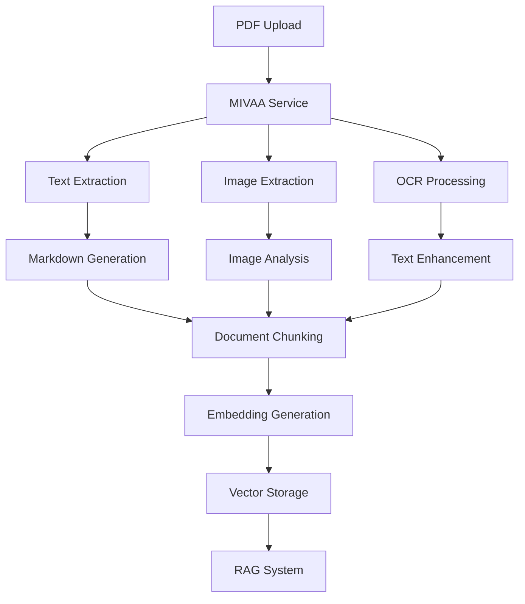

# Platform Functionality Documentation

## 🏗️ Material Kai Vision Platform Overview

The Material Kai Vision Platform is a comprehensive AI-powered material intelligence system that combines document processing, material recognition, 3D generation, and knowledge management into a unified platform.

## 🎯 Core Platform Features

### 1. 🏠 Dashboard & Navigation

#### Main Dashboard (`/`)
- **Hero Section**: AI-powered material intelligence overview
- **Search Hub Integration**: Unified search interface
- **Feature Grid**: Quick access to all platform features
- **System Metrics**: Real-time performance monitoring
- **Quick Actions**: Start processing, AI Studio access

#### Navigation Structure
```
├── Dashboard (/)
├── Search Hub (/search-hub)
├── PDF Upload (/pdf-processing)
├── MoodBoards (/moodboard)
├── 3D Designer (/3d)
├── Web Scraper (/scraper)
└── Admin Panel (/admin)
```

### 2. 🔐 Authentication & User Management

#### User Authentication System
- **Sign Up/Sign In**: Email and password authentication
- **Password Reset**: Email-based password recovery
- **Session Management**: JWT-based authentication with Supabase
- **Auto-redirect**: Authenticated users redirected to dashboard
- **Protected Routes**: All main features require authentication

#### User Features
- **Profile Management**: Display name and user preferences
- **Workspace Isolation**: User-specific data access
- **Session Persistence**: Automatic login state management
- **Security**: Row Level Security (RLS) for data protection

### 3. 📄 PDF Processing & Knowledge Extraction

#### PDF Upload Interface (`/pdf-processing`)
- **Drag & Drop Upload**: Intuitive file upload interface
- **Batch Processing**: Multiple PDF processing support
- **Real-time Progress**: Processing status and progress tracking
- **Format Support**: PDF documents with text and images

#### MIVAA PDF Processor Features
- **Text Extraction**: Advanced text extraction using PyMuPDF4LLM
- **Image Extraction**: Extract and process embedded images
- **OCR Processing**: Optical Character Recognition for scanned documents
- **Markdown Conversion**: Convert PDFs to structured markdown
- **Metadata Extraction**: Document properties and structure analysis
- **Table Extraction**: Structured table data extraction
- **Form Processing**: Extract form fields and data

#### Processing Pipeline


### 4. 🔍 Search Hub & RAG System

#### Multi-Modal Search Interface (`/search-hub`)
- **Text Search**: Natural language queries
- **Image Search**: Visual similarity search
- **Hybrid Search**: Combined text and image search
- **Semantic Search**: AI-powered contextual search
- **Filter Options**: Category, date, and metadata filters

#### RAG (Retrieval-Augmented Generation) System
- **Document Indexing**: Automatic document processing and indexing
- **Vector Embeddings**: OpenAI text-embedding-ada-002 model
- **Similarity Search**: Cosine similarity for relevant content retrieval
- **Context Generation**: AI-powered answer generation
- **Source Attribution**: Track and display source documents

#### Search Features
- **Real-time Results**: Instant search as you type
- **Relevance Scoring**: AI-powered relevance ranking
- **Result Previews**: Document snippets and highlights
- **Export Options**: Save search results and insights
- **Search History**: Track and revisit previous searches

### 5. 🎨 MoodBoards & Material Organization

#### MoodBoard Management (`/moodboard`)
- **Create MoodBoards**: Custom material collections
- **Add Materials**: Drag and drop material organization
- **Visual Layout**: Grid and list view options
- **Sharing Options**: Public and private moodboards
- **Collaboration**: Team-based moodboard sharing

#### MoodBoard Features
- **Material Cards**: Rich material previews with properties
- **Categorization**: Organize by material type and properties
- **Search Integration**: Find and add materials from search results
- **Export Options**: Export moodboards as PDFs or images
- **Version Control**: Track moodboard changes and history

### 6. 🧠 Material Recognition & AI Analysis

#### Material Recognition Interface (`/recognition`)
- **Image Upload**: Single and batch image processing
- **AI Analysis**: Automated material identification
- **Property Extraction**: Physical and chemical properties
- **Classification**: Material category and type identification
- **Confidence Scoring**: AI prediction confidence levels

#### AI-Powered Features
- **Visual Analysis**: Computer vision for material identification
- **Property Prediction**: AI-predicted material properties
- **Safety Classification**: Hazard and safety information
- **Standards Compliance**: Industry standard verification
- **Quality Assessment**: Material quality scoring

### 7. 🎯 3D Design & Generation

#### 3D Designer Interface (`/3d`)
- **3D Model Generation**: AI-powered 3D model creation
- **Material Application**: Apply recognized materials to 3D models
- **Scene Composition**: Create complete 3D scenes
- **Rendering Options**: Various rendering styles and quality
- **Export Formats**: Multiple 3D file format support

#### Advanced 3D Features
- **SVBRDF Extraction**: Material appearance parameter extraction
- **CrewAI Integration**: Multi-agent 3D generation workflow
- **Real-time Preview**: Interactive 3D model preview
- **Material Library**: Extensive 3D material database

### 8. 🌐 Web Scraping & Data Collection

#### Material Scraper (`/scraper`)
- **URL Input**: Scrape material data from websites
- **Automated Extraction**: AI-powered data extraction
- **Data Validation**: Verify and clean scraped data
- **Batch Processing**: Multiple URL processing
- **Integration**: Add scraped materials to platform

#### Scraping Capabilities
- **Material Properties**: Extract technical specifications
- **Images**: Download and process material images
- **Documentation**: Extract related documents and manuals
- **Pricing Information**: Market pricing data collection
- **Supplier Information**: Vendor and supplier details

### 9. ⚙️ Admin Panel & System Management

#### Admin Dashboard Access (`/admin`)
**How to Access Admin Panel**:
1. **Authentication Required**: Must be logged in as admin user
2. **URL**: Navigate to `/admin` or click "Admin Panel" in sidebar
3. **Permissions**: Admin role required (configured in Supabase)
4. **Security**: Protected by authentication middleware

#### Admin Dashboard Overview
The admin panel provides comprehensive system management through multiple tabs:

##### Tab 1: Recent Activity
- **Real-time Activity Feed**: Latest user actions and system events
- **Document Processing Status**: PDF processing queue and results
- **User Activity Tracking**: Login, uploads, searches, and interactions
- **System Alerts**: Errors, warnings, and important notifications
- **Performance Indicators**: Response times and success rates

##### Tab 2: Score Analysis
- **AI Model Performance**: Success rates for OpenAI and Claude
- **Processing Statistics**: Document processing metrics
- **Quality Scores**: AI analysis quality assessment
- **Accuracy Metrics**: Material recognition accuracy rates
- **Trend Analysis**: Performance trends over time

##### Tab 3: Performance Monitoring
- **System Health**: CPU, memory, and disk usage
- **Database Performance**: Query times and connection status
- **API Response Times**: Service latency monitoring
- **Error Rates**: System error tracking and analysis
- **Throughput Metrics**: Requests per second and processing capacity

##### Tab 4: RAG System Management
- **Document Index Status**: Vector database health
- **Embedding Statistics**: Embedding generation metrics
- **Search Performance**: Query response times and accuracy
- **Vector Storage**: Database size and optimization status
- **Index Maintenance**: Reindexing and optimization tools

##### Tab 5: Metadata Fields Management
- **Custom Field Configuration**: Add/edit material metadata fields
- **Field Type Management**: Text, number, boolean, date fields
- **Validation Rules**: Set field validation and constraints
- **Field Usage Analytics**: Track field usage across materials
- **Import/Export**: Backup and restore field configurations

##### Tab 6: AI Testing Panel
- **Model Testing**: Test different AI models and configurations
- **A/B Testing**: Compare model performance
- **Prompt Engineering**: Test and optimize AI prompts
- **Response Quality**: Evaluate AI response quality
- **Cost Analysis**: Track AI service costs and usage

#### Admin-Only Features

##### PDF Knowledge Base Management (`/admin/pdf-processing`)
- **Bulk Document Processing**: Process multiple PDFs simultaneously
- **Processing Queue Management**: Monitor and control processing queue
- **Document Quality Control**: Review and approve processed documents
- **Error Resolution**: Handle failed processing attempts
- **Storage Management**: Monitor document storage usage

##### Search Hub Administration (`/admin/search-hub`)
- **Search Configuration**: Configure search algorithms and weights
- **Index Management**: Rebuild and optimize search indexes
- **Query Analytics**: Analyze search patterns and performance
- **Result Quality**: Monitor search result relevance
- **Cache Management**: Control search result caching

##### 3D Material Suggestions (`/admin/3d-suggestions`)
- **AI Model Configuration**: Configure 3D generation models
- **Material Library Management**: Manage 3D material database
- **Generation Queue**: Monitor 3D model generation requests
- **Quality Control**: Review generated 3D models
- **Performance Tuning**: Optimize 3D generation parameters

##### Model Debugging Panel (`/admin/3d-model-debugging`)
- **Model Performance Analysis**: Debug AI model issues
- **Error Diagnostics**: Analyze model failures and errors
- **Parameter Tuning**: Adjust model parameters for optimization
- **Version Management**: Manage different model versions
- **Testing Environment**: Safe environment for model testing

#### System Configuration

##### User Management
- **User Accounts**: View and manage user accounts
- **Role Assignment**: Assign admin and user roles
- **Permission Management**: Control feature access permissions
- **Account Status**: Enable/disable user accounts
- **Usage Monitoring**: Track user activity and resource usage

##### Content Moderation
- **Document Review**: Review uploaded documents for quality
- **Material Approval**: Approve user-submitted materials
- **Content Flagging**: Handle flagged or inappropriate content
- **Quality Standards**: Enforce content quality standards
- **Automated Moderation**: Configure AI-powered content filtering

##### System Settings
- **API Configuration**: Configure external API settings
- **Performance Tuning**: Adjust system performance parameters
- **Security Settings**: Configure security policies and rules
- **Backup Configuration**: Set up automated backups
- **Monitoring Alerts**: Configure system alert thresholds

#### Analytics & Reporting

##### Usage Analytics
- **User Engagement**: Track feature usage and adoption
- **Document Processing**: Monitor PDF processing volumes
- **Search Analytics**: Analyze search patterns and success rates
- **Performance Trends**: Track system performance over time
- **Cost Analysis**: Monitor service costs and resource usage

##### Business Intelligence
- **Material Insights**: Analyze material usage patterns
- **User Behavior**: Understand user workflows and preferences
- **Feature Adoption**: Track new feature adoption rates
- **ROI Analysis**: Measure platform value and impact
- **Growth Metrics**: Monitor platform growth and scaling

#### Security & Compliance

##### Security Monitoring
- **Access Logs**: Monitor user access and authentication
- **API Usage**: Track API calls and potential abuse
- **Security Alerts**: Monitor for security threats
- **Compliance Tracking**: Ensure regulatory compliance
- **Audit Trails**: Maintain detailed audit logs

##### Data Protection
- **Privacy Controls**: Manage user data privacy settings
- **Data Retention**: Configure data retention policies
- **Backup Management**: Monitor and manage data backups
- **Encryption Status**: Monitor data encryption status
- **GDPR Compliance**: Ensure GDPR compliance features

### 10. 🤖 AI Studio & Agent Coordination

#### AI Studio Interface (`/agents`)
- **Agent Management**: Configure and deploy AI agents
- **Workflow Automation**: Create automated processing workflows
- **Model Selection**: Choose between different AI models
- **Performance Tuning**: Optimize AI model performance
- **Integration Testing**: Test AI service integrations

#### AI Agent Features
- **CrewAI Integration**: Multi-agent coordination system
- **Task Automation**: Automated material processing tasks
- **Custom Workflows**: User-defined processing pipelines
- **Model Comparison**: A/B testing for different AI models
- **Performance Analytics**: AI model performance tracking

## 🔧 Technical Architecture

### Frontend Architecture
- **Framework**: React 18 + TypeScript + Vite
- **UI Library**: Radix UI + Tailwind CSS
- **State Management**: React Query + Context API
- **Routing**: React Router DOM v7
- **Authentication**: Supabase Auth integration

### Backend Services
- **API Gateway**: Node.js + TypeScript
- **MIVAA Service**: FastAPI + Python
- **Database**: Supabase (PostgreSQL)
- **File Storage**: Supabase Storage
- **Real-time**: Supabase Realtime subscriptions

### AI/ML Integration
- **OpenAI**: GPT-4, text-embedding-ada-002
- **HuggingFace**: Alternative ML models
- **Replicate**: 3D generation models
- **TogetherAI**: LLaMA Vision models
- **Custom Models**: Material-specific AI models

## 🔗 Service Integration

### MIVAA Service APIs
- **PDF Processing**: `/api/v1/extract/markdown`
- **RAG Operations**: `/api/v1/rag/query`
- **Document Upload**: `/api/v1/rag/documents/upload`
- **Search**: `/api/v1/search/semantic`
- **Health Check**: `/health`

### Supabase Edge Functions
- **Material Recognition**: `material-recognition`
- **Enhanced RAG Search**: `enhanced-rag-search`
- **3D Generation**: `crewai-3d-generation`
- **Material Scraper**: `material-scraper`

- **SVBRDF Extractor**: `svbrdf-extractor`

### External API Integrations
- **OpenAI API**: Text processing and embeddings
- **HuggingFace API**: Alternative ML models
- **Replicate API**: 3D model generation
- **TogetherAI API**: Vision language models

## 📊 Data Flow Architecture

### Document Processing Flow
1. **Upload**: User uploads PDF through frontend
2. **Processing**: MIVAA service extracts text and images
3. **Chunking**: Document split into searchable chunks
4. **Embedding**: Generate vector embeddings
5. **Storage**: Store in Supabase with vector search
6. **Indexing**: Add to RAG system for search

### Material Recognition Flow
1. **Image Upload**: User uploads material image
2. **AI Analysis**: Computer vision analysis
3. **Property Extraction**: AI-predicted properties
4. **Classification**: Material type identification
5. **Storage**: Save to material database
6. **Integration**: Available for moodboards and 3D

### Search & Retrieval Flow
1. **Query Input**: User enters search query
2. **Embedding**: Convert query to vector
3. **Similarity Search**: Find relevant documents
4. **Context Retrieval**: Get relevant content chunks
5. **AI Generation**: Generate contextual response
6. **Result Display**: Show results with sources

## 🔐 Security & Access Control

### Authentication Layers
- **User Authentication**: Supabase Auth with JWT
- **API Key Authentication**: Material Kai API keys
- **Service Authentication**: Internal service tokens
- **Workspace Isolation**: User-specific data access

### Data Protection
- **Row Level Security**: Database-level access control
- **Input Validation**: Sanitize all user inputs
- **Rate Limiting**: Prevent API abuse
- **CORS Configuration**: Secure cross-origin requests
- **Encryption**: Data encryption at rest and in transit

## 📈 Performance & Scalability

### Optimization Features
- **Caching**: Multi-layer caching strategy
- **CDN Integration**: Static asset optimization
- **Database Indexing**: Optimized query performance
- **Lazy Loading**: Component and data lazy loading
- **Bundle Splitting**: Optimized JavaScript bundles

### Monitoring & Analytics
- **Health Checks**: Service availability monitoring
- **Performance Metrics**: Response time tracking
- **Error Tracking**: Comprehensive error logging
- **Usage Analytics**: Feature adoption tracking
- **Resource Monitoring**: System resource utilization

## 🔗 Related Documentation

- [API Documentation](./api-documentation.md) - Complete API reference
- [Setup & Configuration](./setup-configuration.md) - Environment setup
- [Security & Authentication](./security-authentication.md) - Security details
- [AI & ML Services](./ai-ml-services.md) - AI integration details
- [Architecture & Services](./architecture-services.md) - Technical architecture
