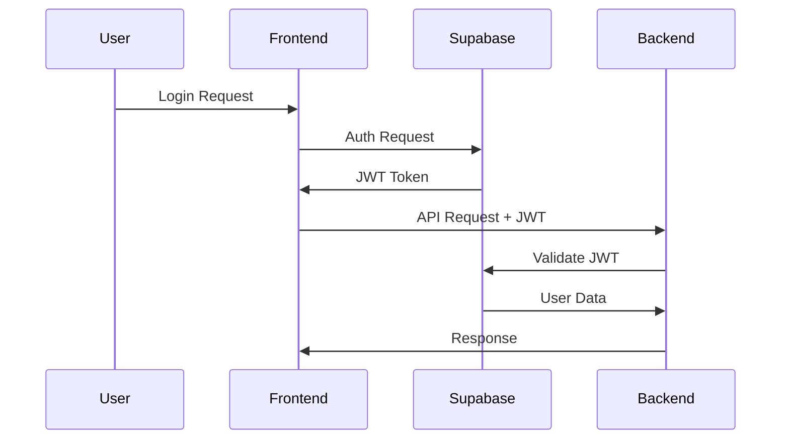
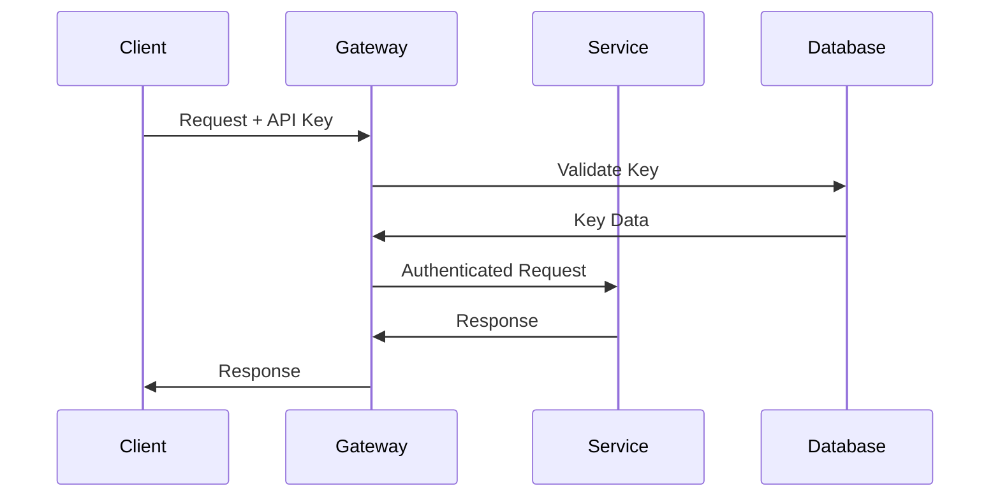

# Security & Authentication Guide

## 🚨 CRITICAL SECURITY ISSUES FOUND

### Immediate Action Required

1. **Hardcoded API Keys** (CRITICAL)
2. **Exposed JWT Secrets** (CRITICAL)
3. **Weak CORS Configuration** (HIGH)
4. **Missing Input Validation** (HIGH)

## 🔐 Authentication Systems

### 1. Supabase Authentication

**Primary authentication system for user management**

```typescript
// Frontend: src/contexts/AuthContext.tsx
export const AuthProvider: React.FC<{ children: React.ReactNode }> = ({ children }) => {
  // Handles user sign-up, sign-in, and session management
}
```

**Configuration**:
```typescript
// src/integrations/supabase/client.ts
export const supabase = createClient<Database>(url, key, {
  auth: {
    storage: localStorage,
    persistSession: true,
    autoRefreshToken: true,
    detectSessionInUrl: false,
    flowType: 'pkce', // PKCE flow for better security
  }
});
```

### 2. JWT Authentication Middleware

**Backend JWT validation for API endpoints**

```typescript
// src/middleware/jwtAuthMiddleware.ts
export class JWTAuthMiddleware {
  // Validates JWT tokens from Supabase
  // Supports API key authentication
  // Handles internal connection tokens
}
```

**SECURITY ISSUE**: Hardcoded internal token found:
```typescript
const INTERNAL_CONNECTION_TOKEN = 'Kj9mN2pQ8rT5vY7wE3uI6oP1aS4dF8gH2kL9nM6qR3tY5vX8zA1bC4eG7jK0mP9s';
```

### 3. Material Kai API Authentication

**Custom API key system for Material Kai services**

```typescript
// src/middleware/materialKaiAuthMiddleware.ts
// ⚠️ CRITICAL: Contains hardcoded API keys
private readonly HARDCODED_KEYS: Record<string, MaterialKaiKeyData> = {
  'mk_api_2024_Kj9mN2pQ8rT5vY7wE3uI6oP1aS4dF8gH2kL9nM6qR3tY5vX8zA1bC4eG7jK0mP9s': {
    // Hardcoded key data
  }
};
```

### 4. MIVAA Service Authentication

**JWT-based authentication for Python microservice**

```python
# mivaa-pdf-extractor/app/middleware/jwt_auth.py
class JWTAuthMiddleware(BaseHTTPMiddleware):
    # Validates JWT tokens
    # Extracts workspace context
    # Enforces permission-based access control
```

## 🔑 API Key Management

### Current API Key Systems

1. **Supabase API Keys**:
   - Anon Key: `eyJhbGciOiJIUzI1NiIsInR5cCI6IkpXVCJ9...` (EXPOSED)
   - Service Role Key: Required for admin operations

2. **Material Kai API Keys**:
   - Format: `mk_api_2024_[64-char-string]`
   - **CRITICAL**: Hardcoded in source code

3. **External Service Keys**:
   - OpenAI API Key
   - HuggingFace API Key
   - Replicate API Token

### API Key Storage Locations

#### ⚠️ SECURITY VIOLATIONS FOUND:

1. **Supabase Config** (`supabase/config.toml`):
   ```toml
   [auth]
   jwt_secret = "Kj9mN2pQ8rT5vY7wE3uI6oP1aS4dF8gH2kL9nM6qR3tY5vX8zA1bC4eG7jK0mP9s"
   ```

2. **Supabase Client Config** (`src/config/apis/supabaseConfig.ts`):
   ```typescript
   anonKey: 'eyJhbGciOiJIUzI1NiIsInR5cCI6IkpXVCJ9...'
   ```

3. **CORS Headers** (`supabase/functions/_shared/cors.ts`):
   ```typescript
   'Access-Control-Allow-Origin': '*', // Wildcard CORS
   ```

## 🛡️ Security Best Practices

### 1. Environment Variable Management

**REQUIRED CHANGES**:

```bash
# .env (DO NOT COMMIT)
SUPABASE_URL=https://bgbavxtjlbvgplozizxu.supabase.co
SUPABASE_ANON_KEY=your_actual_anon_key
SUPABASE_SERVICE_ROLE_KEY=your_service_role_key
JWT_SECRET_KEY=your_secure_random_jwt_secret
MATERIAL_KAI_API_KEY=your_material_kai_key
```

### 2. Secure Configuration

**Update these files immediately**:

1. **Remove hardcoded secrets from**:
   - `supabase/config.toml`
   - `src/config/apis/supabaseConfig.ts`
   - `src/middleware/materialKaiAuthMiddleware.ts`
   - `src/middleware/jwtAuthMiddleware.ts`

2. **Fix CORS configuration**:
   ```typescript
   // supabase/functions/_shared/cors.ts
   export const corsHeaders = {
     'Access-Control-Allow-Origin': process.env.ALLOWED_ORIGINS || 'http://localhost:3000',
     // Remove wildcard '*'
   };
   ```

### 3. Input Validation

**Missing validation in**:
- File upload endpoints
- API gateway requests
- User input forms

**Implement validation**:
```typescript
// Example: Zod validation schemas
const ApiRequestSchema = z.object({
  action: z.string().min(1).max(100),
  payload: z.object({}).passthrough(),
});
```

## 🔒 Authentication Flows

### 1. User Authentication Flow



### 2. API Key Authentication Flow



## 🚨 Immediate Security Fixes Required

### 1. Remove Hardcoded Secrets

```bash
# Create secure environment files
echo "JWT_SECRET_KEY=$(openssl rand -hex 32)" >> .env
echo "MATERIAL_KAI_API_KEY=mk_api_2024_$(openssl rand -hex 32)" >> .env
```

### 2. Update Configuration Files

**supabase/config.toml**:
```toml
[auth]
jwt_secret = "${JWT_SECRET_KEY}"  # Use environment variable
```

**src/config/apis/supabaseConfig.ts**:
```typescript
anonKey: process.env.VITE_SUPABASE_ANON_KEY || '',
```

### 3. Implement Proper CORS

```typescript
// Environment-based CORS
const allowedOrigins = process.env.NODE_ENV === 'production' 
  ? ['https://your-domain.com']
  : ['http://localhost:3000', 'http://localhost:5173'];
```

### 4. Add Input Validation

```typescript
// API Gateway validation
export const validateRequest = (schema: z.ZodSchema) => {
  return (req: Request, res: Response, next: NextFunction) => {
    try {
      schema.parse(req.body);
      next();
    } catch (error) {
      res.status(400).json({ error: 'Invalid request data' });
    }
  };
};
```

## 🔐 Workspace-Based Security

### Row Level Security (RLS)

**Current Implementation**:
- Workspace isolation in MIVAA service
- User-based access control
- JWT claims validation

**Missing**:
- Database RLS policies
- Proper workspace validation
- Resource-level permissions

## 📋 Security Checklist

### Immediate (Critical)
- [ ] Remove all hardcoded API keys
- [ ] Move secrets to environment variables
- [ ] Fix CORS wildcard configuration
- [ ] Update JWT secret management

### Short Term (High Priority)
- [ ] Implement input validation
- [ ] Add rate limiting
- [ ] Setup proper logging
- [ ] Configure security headers

### Long Term (Medium Priority)
- [ ] Implement RLS policies
- [ ] Add API key rotation
- [ ] Setup security monitoring
- [ ] Conduct security audit

## 🔗 Related Documentation

- [Setup & Configuration](./setup-configuration.md) - Environment setup
- [API Documentation](./api-documentation.md) - API security
- [Database & Schema](./database-schema.md) - Database security
