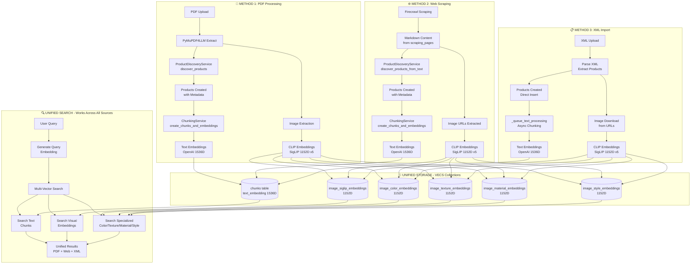

# Unified Product Generation Flow

Complete documentation for all three product generation methods and their unified search architecture.

> **📚 Related Documentation:**
> - [Async Processing & Limits](./async-processing-and-limits.md) - Concurrency limits and async architecture
> - [PDF Processing Pipeline](./pdf-processing-pipeline.md) - PDF processing details
> - [Web Scraping Integration](./web-scraping-integration.md) - Web scraping details
> - [Data Import System](./data-import-system.md) - XML import details

---

## 📋 Table of Contents

1. [Overview](#overview)
2. [Architecture Diagram](#architecture-diagram)
3. [Method Comparison](#method-comparison)
4. [Unified Storage](#unified-storage)
5. [Unified Search](#unified-search)
6. [Verification Checklist](#verification-checklist)

---

## Overview

The Material Kai Vision Platform supports **three product generation methods**, all feeding into a **unified storage and search infrastructure**:

1. **📄 PDF Processing** - Extract products from PDF catalogs
2. **🌐 Web Scraping** - Scrape products from manufacturer websites
3. **📋 XML Import** - Import products from XML files

### Key Principles

✅ **Unified Pipeline**: All methods use the same AI models and services  
✅ **Same Quality**: Same metadata extraction, chunking, and embeddings  
✅ **Same Storage**: All products stored in same tables and VECS collections  
✅ **Same Search**: All products searchable via unified multi-vector search  
✅ **Same Limits**: Same concurrency limits and async processing  

---

## Architecture Diagram



---

## Method Comparison

### Feature Comparison

| Feature | 📄 PDF Processing | 🌐 Web Scraping | 📋 XML Import |
|---------|------------------|-----------------|---------------|
| **Product Discovery** | ✅ `ProductDiscoveryService.discover_products()` | ✅ `ProductDiscoveryService.discover_products_from_text()` | ✅ Direct creation from XML |
| **Text Chunks** | ✅ `ChunkingService.create_chunks_and_embeddings()` | ✅ `ChunkingService.create_chunks_and_embeddings()` | ✅ `_queue_text_processing()` (async) |
| **Text Embeddings** | ✅ OpenAI 1536D → `chunks.text_embedding` | ✅ OpenAI 1536D → `chunks.text_embedding` | ✅ OpenAI 1536D → `chunks.text_embedding` |
| **Image Processing** | ✅ Extract from PDF pages | ✅ Extract from scraped pages | ✅ Download from URLs |
| **CLIP Embeddings** | ✅ SigLIP 1152D x5 types | ✅ SigLIP 1152D x5 types | ✅ SigLIP 1152D x5 types |
| **VECS Storage** | ✅ All 6 collections | ✅ All 6 collections | ✅ All 6 collections |
| **Searchable** | ✅ Via unified search | ✅ Via unified search | ✅ Via unified search |

---

### Detailed Flow Verification

#### **METHOD 1: PDF Processing** ✅

```python
# 1. Product Discovery
catalog = await discovery_service.discover_products(
    pdf_content=pdf_bytes,
    pdf_text=markdown_text,
    categories=["products"]
)

# 2. Products Created → products table
# 3. Chunks Created → chunks table
chunks_result = await chunking_service.create_chunks_and_embeddings(
    document_id=document_id,
    extracted_text=pdf_text,
    product_ids=product_ids
)

# 4. Text Embeddings → chunks.text_embedding (1536D)
embedding = await embedding_service._generate_text_embedding(text=chunk_text)

# 5. Image Embeddings → VECS collections (1152D x5)
await vecs_service.upsert_specialized_embeddings(
    image_id=image_id,
    embeddings={
        'color_siglip_1152': [...],
        'texture_siglip_1152': [...],
        'material_siglip_1152': [...],
        'style_siglip_1152': [...],
        'visual_siglip_1152': [...]
    }
)
```

---

#### **METHOD 2: Web Scraping** ✅

```python
# 1. Product Discovery from Markdown
catalog = await discovery_service.discover_products_from_text(
    markdown_text=scraped_markdown,
    source_type="web_scraping",
    categories=["products"]
)

# 2. Products Created → products table
created_products = await self._create_products_in_database(
    catalog=catalog,
    workspace_id=workspace_id,
    session_id=session_id
)

# 3. Chunks Created → chunks table
# 4. Text Embeddings → chunks.text_embedding (1536D)
# (Same ChunkingService as PDF)

# 5. Image Embeddings → VECS collections (1152D x5)
# (Same ImageProcessingService as PDF)
```

---

#### **METHOD 3: XML Import** ✅

```python
# 1. Products Created Directly → products table
product_record = {
    "name": product_name,
    "description": description,
    "properties": {...},
    "metadata": {...}
}
insert_response = supabase.table('products').insert(product_record).execute()

# 2. Async Chunking & Embeddings
await self._queue_text_processing(
    product_id=product_id,
    product_data=product_data,
    workspace_id=workspace_id
)

# 3. Chunks Created → chunks table
chunk_record = {
    'document_id': product_id,
    'text': description,
    'workspace_id': workspace_id
}

# 4. Text Embeddings → chunks.text_embedding (1536D)
await async_queue.queue_ai_analysis_jobs(
    chunks=[{'id': chunk_id}],
    analysis_type='embedding_generation'
)

# 5. Image Embeddings → VECS collections (1152D x5)
# (Same ImageProcessingService as PDF)
```

---

## Unified Storage

All three methods store data in the **same tables and VECS collections**:

### 1. PostgreSQL Tables

| Table | Purpose | Used By |
|-------|---------|---------|
| **products** | Product records | PDF, Web, XML |
| **chunks** | Text chunks with embeddings | PDF, Web, XML |
| **document_images** | Image metadata | PDF, Web, XML |
| **documents** | Source documents | PDF, Web, XML |

---

### 2. VECS Collections

All three methods store embeddings in the same VECS collections:

#### **Text Embeddings**

| Collection | Dimension | Model | Used By |
|-----------|-----------|-------|---------|
| **chunks.text_embedding** | 1536D | OpenAI text-embedding-3-small | PDF, Web, XML |

#### **Visual Embeddings**

| Collection | Dimension | Model | Used By |
|-----------|-----------|-------|---------|
| **image_siglip_embeddings** | 1152D | SigLIP | PDF, Web, XML |
| **image_color_embeddings** | 1152D | SigLIP (color-focused) | PDF, Web, XML |
| **image_texture_embeddings** | 1152D | SigLIP (texture-focused) | PDF, Web, XML |
| **image_material_embeddings** | 1152D | SigLIP (material-focused) | PDF, Web, XML |
| **image_style_embeddings** | 1152D | SigLIP (style-focused) | PDF, Web, XML |

---

## Unified Search

All products are searchable via the **same unified search service**, regardless of source:

### Frontend: UnifiedSearchService

```typescript
// Search across ALL sources (PDF + Web + XML)
const results = await UnifiedSearchService.searchMultiVector({
  query: "blue ceramic tiles",
  workspace_id: workspace_id,
  limit: 20
});
```

---

### Backend: unified_search_service.py

```python
async def search(query: str, workspace_id: str):
    # 1. Generate query embedding
    query_embedding = await embedding_service.generate_embedding(query)

    # 2. Search text chunks (PDF + Web + XML)
    text_results = await self._search_semantic(query, workspace_id)

    # 3. Search visual embeddings (PDF + Web + XML)
    visual_results = await vecs_service.search_similar_images(
        query_embedding=query_embedding,
        filters={"workspace_id": workspace_id}
    )

    # 4. Search specialized embeddings (Color, Texture, Material, Style)
    color_results = await vecs_service.search_specialized_embeddings(
        embedding_type='color',
        query_embedding=query_embedding
    )

    # 5. Combine and rank results
    return unified_results  # Contains products from ALL sources
```

---

### Search Flow

```
User Query: "blue ceramic tiles"
           ↓
Generate Query Embedding (OpenAI 1536D)
           ↓
┌──────────────────────────────────────┐
│ Multi-Vector Search (Parallel)      │
├──────────────────────────────────────┤
│ 1. Text Search (chunks table)       │
│    → Searches: PDF + Web + XML      │
│                                      │
│ 2. Visual Search (VECS)              │
│    → Searches: PDF + Web + XML      │
│                                      │
│ 3. Color Search (VECS)               │
│    → Searches: PDF + Web + XML      │
│                                      │
│ 4. Texture Search (VECS)             │
│    → Searches: PDF + Web + XML      │
│                                      │
│ 5. Material Search (VECS)            │
│    → Searches: PDF + Web + XML      │
│                                      │
│ 6. Style Search (VECS)               │
│    → Searches: PDF + Web + XML      │
└──────────────────────────────────────┘
           ↓
Combine & Rank Results
           ↓
Return Unified Results (PDF + Web + XML)
```

---

## Verification Checklist

### ✅ Product Generation

| Requirement | PDF | Web | XML | Evidence |
|-------------|-----|-----|-----|----------|
| **Products Created** | ✅ | ✅ | ✅ | `products` table |
| **Chunks Created** | ✅ | ✅ | ✅ | `chunks` table |
| **Text Embeddings** | ✅ | ✅ | ✅ | `chunks.text_embedding` (1536D) |
| **Image Embeddings** | ✅ | ✅ | ✅ | VECS collections (1152D x5) |

---

### ✅ Unified Storage

| Requirement | Status | Evidence |
|-------------|--------|----------|
| **Same Products Table** | ✅ | All methods insert to `products` |
| **Same Chunks Table** | ✅ | All methods insert to `chunks` |
| **Same VECS Collections** | ✅ | All methods use same 6 collections |
| **Same Embedding Models** | ✅ | OpenAI 1536D + SigLIP 1152D |

---

### ✅ Unified Search

| Requirement | Status | Evidence |
|-------------|--------|----------|
| **Text Search** | ✅ | Searches `chunks` table (all sources) |
| **Visual Search** | ✅ | Searches VECS collections (all sources) |
| **Multi-Vector Search** | ✅ | Combines all search types |
| **Cross-Source Results** | ✅ | Returns products from PDF + Web + XML |

---

### ✅ Async Processing

| Requirement | Status | Evidence |
|-------------|--------|----------|
| **Fully Async** | ✅ | All methods use `async/await` |
| **Same Limits** | ✅ | 5 Llama, 2 Claude, 10 uploads, 20 CLIP |
| **Same Timeouts** | ✅ | 300s discovery, 120s AI, 30s downloads |
| **Same Services** | ✅ | ImageProcessingService, RealEmbeddingsService, AsyncQueueService |

---

## Summary

✅ **All 3 methods generate products**: PDF, Web Scraping, XML Import
✅ **All use same AI models**: Claude/GPT for discovery, OpenAI for text, SigLIP for images
✅ **All create chunks**: Text chunks with embeddings
✅ **All create embeddings**: Text (1536D) + Visual (1152D x5)
✅ **All use same storage**: PostgreSQL tables + VECS collections
✅ **All searchable**: Via unified multi-vector search
✅ **All fully async**: Same concurrency limits and timeout guards

**The architecture is unified, consistent, and production-ready!** 🚀


