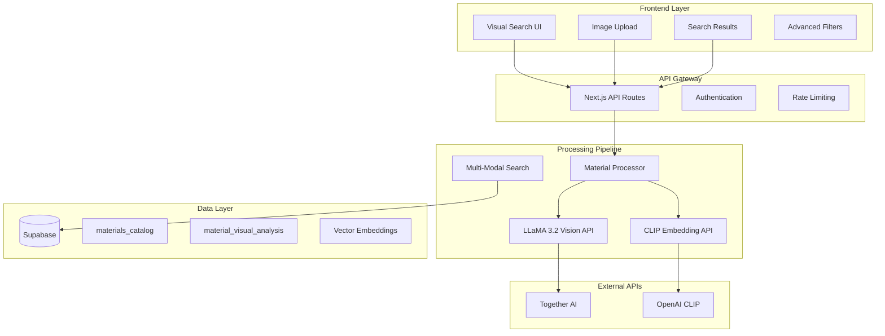

+++
# --- Basic Metadata ---
id = "LLAMA-VISUAL-SEARCH-TECH-ARCH-V1"
title = "LLaMA 3.2 Vision + CLIP Technical Architecture"
context_type = "documentation"
scope = "Technical architecture and system design for visual material search implementation"
target_audience = ["technical-architect", "dev-python", "dev-react", "lead-backend", "lead-frontend"]
granularity = "detailed"
status = "active"
last_updated = "2025-08-28"
tags = ["architecture", "llama-vision", "clip", "visual-search", "supabase", "api-design", "system-design"]
related_context = [
    "visual-search/docs/llama-visual-search-master-plan.md",
    "visual-search/docs/database-schema.md",
    "visual-search/docs/api-integration-requirements.md"
]
template_schema_doc = ".ruru/templates/toml-md/18_technical_architecture.README.md"
relevance = "Critical: Defines system architecture for visual search implementation"
+++

# LLaMA 3.2 Vision + CLIP Technical Architecture

## System Overview

The visual material search system integrates **LLaMA 3.2 Vision (90B)** for deep material understanding with **CLIP** for fast vector similarity search, leveraging existing Supabase infrastructure for storage and retrieval.

### Architecture Principles
- **API-First**: External model APIs over local inference
- **Incremental Enhancement**: Build on existing infrastructure
- **Multi-Modal Fusion**: Combine structured analysis with vector similarity
- **Cost Optimization**: Balance accuracy with operational costs
- **Scalable Design**: Support growing material catalogs

## High-Level Architecture



## Component Architecture

### 1. Frontend Components

#### Visual Search Interface
```typescript
// src/components/VisualSearch/VisualSearchInterface.tsx
interface VisualSearchProps {
  onImageUpload: (image: File) => Promise<void>;
  searchResults: VisualSearchResult[];
  isLoading: boolean;
  filters: MaterialFilters;
}

interface VisualSearchResult {
  material_id: string;
  similarity_score: number;
  llama_confidence: number;
  clip_similarity: number;
  material_properties: MaterialProperties;
  thumbnail_url: string;
  analysis_metadata: AnalysisMetadata;
}
```

#### Image Upload Component
```typescript
// src/components/VisualSearch/ImageUpload.tsx
interface ImageUploadProps {
  onUpload: (file: File, analysis_options?: AnalysisOptions) => void;
  acceptedFormats: string[];
  maxFileSize: number;
  compressionQuality: number;
}

interface AnalysisOptions {
  enable_llama_analysis: boolean;
  enable_clip_embedding: boolean;
  analysis_depth: 'basic' | 'detailed' | 'comprehensive';
}
```

### 2. Backend Services

#### Material Analysis Service
```typescript
// src/services/visualAnalysisService.ts
class VisualAnalysisService {
  async analyzeMaterial(imageBuffer: Buffer, options: AnalysisOptions): Promise<MaterialAnalysis> {
    // LLaMA 3.2 Vision analysis
    const llamaAnalysis = await this.llamaVisionAnalysis(imageBuffer);
    
    // CLIP embedding generation
    const clipEmbedding = await this.generateClipEmbedding(imageBuffer);
    
    // Structured output processing
    return this.processAnalysisResults(llamaAnalysis, clipEmbedding);
  }

  private async llamaVisionAnalysis(imageBuffer: Buffer): Promise<LlamaAnalysisResult> {
    return this.togetherAIClient.vision.analyze({
      model: "meta-llama/Llama-3.2-90B-Vision-Instruct-Turbo",
      image: imageBuffer,
      prompt: MATERIAL_ANALYSIS_PROMPT,
      structured_output: true,
      response_format: MATERIAL_SCHEMA
    });
  }

  private async generateClipEmbedding(imageBuffer: Buffer): Promise<number[]> {
    return this.openAIClient.embeddings.create({
      model: "clip-vit-base-patch32",
      input: imageBuffer,
      encoding_format: "float"
    });
  }
}
```

#### Multi-Modal Search Engine
```typescript
// src/services/multiModalSearchService.ts
class MultiModalSearchService {
  async search(query: VisualSearchQuery): Promise<SearchResults> {
    const strategies = [
      this.vectorSimilaritySearch(query.clip_embedding),
      this.structuredPropertySearch(query.llama_analysis),
      this.hybridSemanticSearch(query.description_embedding)
    ];

    const results = await Promise.all(strategies);
    return this.fuseResults(results, query.fusion_weights);
  }

  private async vectorSimilaritySearch(embedding: number[]): Promise<VectorSearchResult[]> {
    return this.supabase
      .rpc('vector_similarity_search', {
        query_embedding: embedding,
        match_threshold: 0.8,
        match_count: 50
      });
  }

  private fuseResults(results: SearchResult[][], weights: FusionWeights): SearchResults {
    // Implement weighted result fusion algorithm
    // Combine vector similarity, property matching, and semantic relevance
    return this.weightedRankFusion(results, weights);
  }
}
```

### 3. API Integration Layer

#### Together AI Integration
```typescript
// src/integrations/togetherAI.ts
class TogetherAIClient {
  private readonly baseURL = 'https://api.together.xyz/v1';
  private readonly apiKey: string;

  async analyzeImage(request: VisionAnalysisRequest): Promise<VisionAnalysisResponse> {
    const response = await fetch(`${this.baseURL}/chat/completions`, {
      method: 'POST',
      headers: {
        'Authorization': `Bearer ${this.apiKey}`,
        'Content-Type': 'application/json'
      },
      body: JSON.stringify({
        model: 'meta-llama/Llama-3.2-90B-Vision-Instruct-Turbo',
        messages: [
          {
            role: 'user',
            content: [
              { type: 'text', text: MATERIAL_ANALYSIS_PROMPT },
              { type: 'image_url', image_url: { url: request.image_url }}
            ]
          }
        ],
        temperature: 0.1,
        max_tokens: 1000,
        response_format: { type: 'json_object' }
      })
    });

    return this.parseStructuredResponse(await response.json());
  }
}
```

#### OpenAI CLIP Integration
```typescript
// src/integrations/openAI.ts
class OpenAIEmbeddingClient {
  async generateCLIPEmbedding(imageBuffer: Buffer): Promise<number[]> {
    // Note: OpenAI doesn't directly support CLIP embeddings via API
    // We'll need to use a proxy service or implement via Hugging Face
    return this.huggingFaceClipProxy(imageBuffer);
  }

  private async huggingFaceClipProxy(imageBuffer: Buffer): Promise<number[]> {
    const response = await fetch('https://api-inference.huggingface.co/models/openai/clip-vit-base-patch32', {
      method: 'POST',
      headers: {
        'Authorization': `Bearer ${process.env.HUGGING_FACE_API_KEY}`,
        'Content-Type': 'application/octet-stream'
      },
      body: imageBuffer
    });
    
    return (await response.json()).embeddings;
  }
}
```

### 4. Database Integration

#### Supabase Extensions
```sql
-- Enable vector operations
CREATE EXTENSION IF NOT EXISTS vector;

-- Custom search functions
CREATE OR REPLACE FUNCTION visual_material_search(
  query_embedding vector(512),
  llama_filters jsonb DEFAULT NULL,
  similarity_threshold float DEFAULT 0.75,
  result_limit int DEFAULT 20
) RETURNS TABLE (
  material_id uuid,
  similarity_score float,
  material_type text,
  visual_properties jsonb,
  confidence_score float
) AS $$
BEGIN
  RETURN QUERY
  SELECT 
    mva.material_id,
    (mva.clip_embedding <=> query_embedding) as similarity_score,
    mva.material_type,
    mva.structured_description as visual_properties,
    mva.analysis_confidence as confidence_score
  FROM material_visual_analysis mva
  WHERE 
    (mva.clip_embedding <=> query_embedding) < (1 - similarity_threshold)
    AND (llama_filters IS NULL OR mva.structured_description @> llama_filters)
  ORDER BY mva.clip_embedding <=> query_embedding
  LIMIT result_limit;
END;
$$ LANGUAGE plpgsql;
```

## Data Flow Architecture

### 1. Material Ingestion Pipeline
```
Raw Material Image → Image Preprocessing → LLaMA Analysis → CLIP Embedding → Database Storage
                                       ↓
                                   Structured Properties
                                       ↓
                                   Quality Validation
                                       ↓
                                   Catalog Integration
```

### 2. Search Request Flow
```
User Query Image → Image Processing → Parallel Analysis → Result Fusion → Ranked Results
                                          ↓
                                   [LLaMA Analysis]
                                   [CLIP Embedding]
                                   [Semantic Encoding]
                                          ↓
                                   Multi-Modal Search
                                          ↓
                                   Weighted Scoring
```

### 3. Real-time Processing Pipeline
```typescript
// src/services/realtimeProcessor.ts
interface ProcessingPipeline {
  stages: [
    {
      name: 'image_validation',
      processor: ImageValidator,
      timeout: 5000
    },
    {
      name: 'llama_analysis',
      processor: LlamaVisionProcessor,
      timeout: 15000,
      fallback: 'basic_analysis'
    },
    {
      name: 'clip_embedding',
      processor: CLIPEmbeddingProcessor,
      timeout: 10000,
      cache: true
    },
    {
      name: 'search_execution',
      processor: MultiModalSearchProcessor,
      timeout: 8000
    }
  ];
}
```

## Performance Optimization

### 1. Caching Strategy
```typescript
// src/services/cachingService.ts
interface CacheStrategy {
  clip_embeddings: {
    storage: 'redis',
    ttl: 86400, // 24 hours
    key_pattern: 'clip:${image_hash}'
  };
  llama_analysis: {
    storage: 'supabase',
    ttl: 604800, // 7 days
    invalidation: 'content_based'
  };
  search_results: {
    storage: 'memory',
    ttl: 300, // 5 minutes
    size_limit: 1000
  };
}
```

### 2. Request Optimization
- **Parallel Processing**: Run LLaMA and CLIP analysis concurrently
- **Progressive Loading**: Return vector results first, enhance with detailed analysis
- **Smart Batching**: Group similar requests for efficiency
- **Circuit Breakers**: Fallback mechanisms for API failures

### 3. Database Optimization
```sql
-- Optimized indexes for visual search
CREATE INDEX CONCURRENTLY idx_clip_embedding_cosine 
ON material_visual_analysis 
USING ivfflat (clip_embedding vector_cosine_ops)
WITH (lists = 100);

CREATE INDEX CONCURRENTLY idx_material_type_properties 
ON material_visual_analysis 
USING gin (structured_description);

CREATE INDEX CONCURRENTLY idx_confidence_score 
ON material_visual_analysis (analysis_confidence DESC)
WHERE analysis_confidence >= 0.8;
```

## Error Handling & Resilience

### 1. API Failure Handling
```typescript
interface FailureHandling {
  llama_api: {
    timeout: 20000,
    retries: 3,
    fallback: 'cached_similar_analysis',
    circuit_breaker: true
  };
  clip_api: {
    timeout: 15000,
    retries: 2,
    fallback: 'generic_embedding',
    rate_limit_backoff: 'exponential'
  };
}
```

### 2. Data Consistency
- **Transactional Updates**: Ensure analysis and embeddings are stored atomically
- **Validation Checks**: Verify analysis quality before storage
- **Rollback Mechanisms**: Handle partial analysis failures gracefully

### 3. Monitoring & Alerting
```typescript
interface MonitoringMetrics {
  api_response_times: ['llama_analysis', 'clip_embedding', 'search_execution'];
  error_rates: ['api_failures', 'timeout_errors', 'validation_failures'];
  business_metrics: ['search_accuracy', 'user_satisfaction', 'conversion_rate'];
  cost_tracking: ['api_usage_cost', 'storage_cost', 'compute_cost'];
}
```

## Security Considerations

### 1. API Key Management
- **Environment Variables**: Secure storage of API keys
- **Rotation Policy**: Regular key rotation schedule
- **Access Control**: Restrict API access by IP/domain
- **Usage Monitoring**: Track and alert on unusual usage patterns

### 2. Data Privacy
- **Image Processing**: No persistent storage of user-uploaded images
- **Analysis Caching**: Anonymized cache keys
- **Audit Logging**: Track access to sensitive material data

### 3. Rate Limiting
```typescript
interface RateLimiting {
  user_level: {
    requests_per_minute: 10,
    requests_per_hour: 100,
    burst_allowance: 5
  };
  api_level: {
    together_ai: {
      requests_per_minute: 60,
      token_limit_per_hour: 1000000
    };
    openai_clip: {
      requests_per_minute: 120,
      embedding_limit_per_day: 10000
    }
  };
}
```

## Deployment Architecture

### 1. Service Dependencies
```yaml
services:
  visual-search-api:
    depends_on:
      - supabase
      - redis
    environment:
      - TOGETHER_AI_API_KEY
      - HUGGING_FACE_API_KEY
      - SUPABASE_URL
      - REDIS_URL

  material-processor:
    depends_on:
      - visual-search-api
    resources:
      memory: 2GB
      cpu: 1.0

  search-engine:
    depends_on:
      - supabase
    resources:
      memory: 1GB
      cpu: 0.5
```

### 2. Scaling Strategy
- **Horizontal Scaling**: Multiple API service instances behind load balancer
- **Queue Management**: Background job processing for bulk material analysis
- **Auto-scaling**: Based on request volume and API response times
- **Geographic Distribution**: CDN for static assets, regional API deployments

---

**Document Status**: Active Technical Specification  
**Last Updated**: 2025-08-28  
**Next Review**: After Phase 1 implementation completion